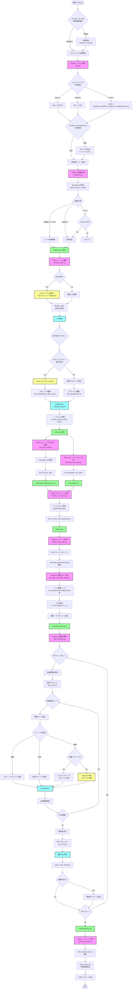

```mermaid
graph TB
    %% スタート
    Start([開始: main.py]) --> CheckDevKit{TA_DEV_KIT_DIR<br/>環境変数確認}
    CheckDevKit -->|設定済み| ProcessProject
    CheckDevKit -->|未設定| AutoDetect[自動検出<br/>export-ta_*/include]
    AutoDetect --> ProcessProject[プロジェクト処理開始]
    
    %% Phase 1: ビルド処理
    ProcessProject --> Phase1[Phase 1: ビルド処理<br/>build.py]
    Phase1 --> TryBuild{ビルドスクリプト<br/>存在確認}
    TryBuild -->|build.sh| RunBear1[bear --build.sh]
    TryBuild -->|Makefile| RunBear2[bear --make]
    TryBuild -->|CMake| RunCMake[cmake -DCMAKE_EXPORT_COMPILE_COMMANDS=ON]
    
    RunBear1 --> CheckDB{compile_commands.json<br/>生成確認}
    RunBear2 --> CheckDB
    RunCMake --> CheckDB
    
    CheckDB -->|成功| ExtractTA[TA関連エントリ抽出]
    CheckDB -->|失敗| GenDummy[ダミーDB生成<br/>*.c ファイルから]
    GenDummy --> ExtractTA
    
    %% Phase 2: 関数分類
    ExtractTA --> Phase2[Phase 2: 関数分類<br/>classifier.py]
    Phase2 --> ParseAST[libclang AST解析<br/>parse_sources_unified]
    ParseAST --> ClassifyFunc{関数分類}
    
    ClassifyFunc -->|定義あり & TA内| UserDefined[ユーザ定義関数]
    ClassifyFunc -->|宣言のみ| External[外部宣言]
    ClassifyFunc -->|マクロ| CheckMacro{TA/include内?}
    CheckMacro -->|Yes| External
    CheckMacro -->|No| Skip[スキップ]
    
    UserDefined --> SavePhase12[phase12.json保存]
    External --> SavePhase12
    
    %% Phase 3: シンク識別
    SavePhase12 --> Phase3[Phase 3: シンク識別<br/>identify_sinks.py]
    Phase3 --> InitRAG{RAG有効?}
    InitRAG -->|Yes| LoadRAG[RAGシステム初期化<br/>TEEドキュメント読み込み]
    InitRAG -->|No| DirectLLM
    
    LoadRAG --> ExtractCalled[呼び出し済み<br/>外部API抽出]
    ExtractCalled --> LLMAnalysis[LLM解析]
    
    DirectLLM[直接LLM解析] --> ExtractCalled
    
    LLMAnalysis --> ForEachAPI{各外部APIに対して}
    ForEachAPI --> CheckRAG{RAGコンテキスト<br/>取得可能?}
    CheckRAG -->|Yes| QueryRAG[search_for_sink_analysis]
    CheckRAG -->|No| StandardPrompt[標準プロンプト使用]
    
    QueryRAG --> BuildPrompt[プロンプト構築<br/>sink_identification_with_rag.txt]
    StandardPrompt --> BuildPrompt2[プロンプト構築<br/>sink_identification.txt]
    
    BuildPrompt --> CallLLM[LLM呼び出し<br/>UnifiedLLMClient]
    BuildPrompt2 --> CallLLM
    
    CallLLM --> ParseResponse[レスポンス解析<br/>function; param_index; reason]
    ParseResponse --> SaveSinks[sinks.json保存]
    
    %% Phase 3.1-3.3: 詳細解析
    SaveSinks --> Phase31[Phase 3.1: シンク呼び出し検索<br/>find_sink_calls.py]
    Phase31 --> ParseTU[Translation Unit解析]
    ParseTU --> FindCalls[find_function_calls]
    FindCalls --> SaveVD[vulnerable_destinations.json]
    
    SaveSinks --> Phase32[Phase 3.2: コールグラフ生成<br/>generate_call_graph.py]
    Phase32 --> BuildGraph[build_detailed_call_graph]
    BuildGraph --> SaveGraph[call_graph.json]
    
    SaveVD --> Phase33[Phase 3.3: チェイン生成<br/>function_call_chains.py]
    SaveGraph --> Phase33
    Phase33 --> DataFlow[データフロー解析<br/>DataFlowAnalyzer]
    DataFlow --> TraceChains[trace_chains_with_dependency]
    TraceChains --> SaveChains[chains.json]
    
    SaveChains --> Phase34[Phase 3.4: マージ処理<br/>extract_sink_calls.py]
    Phase34 --> MergeResults[VDとチェインをマージ]
    MergeResults --> UpdateVD[vulnerable_destinations.json更新]
    
    %% Phase 5: 候補フロー生成
    UpdateVD --> Phase5[Phase 5: 候補フロー生成<br/>generate_candidate_flows.py]
    Phase5 --> ParseSources[ソース関数パース<br/>TA_InvokeCommandEntryPoint等]
    ParseSources --> ExtractCDF[CDF抽出<br/>ソースから始まるチェイン]
    ExtractCDF --> FilterDup[重複・サブチェイン除去]
    FilterDup --> SaveFlows[candidate_flows.json]
    
    %% Phase 6: 脆弱性解析
    SaveFlows --> Phase6[Phase 6: 脆弱性解析<br/>taint_analyzer.py]
    Phase6 --> ForEachFlow{各フローに対して}
    ForEachFlow --> InitConv[会話履歴初期化]
    
    InitConv --> StartPrompt[開始プロンプト<br/>taint_start.txt]
    StartPrompt --> AnalyzeFunc{関数解析ループ}
    
    AnalyzeFunc --> ExtractCode[関数コード抽出]
    ExtractCode --> CheckPosition{チェーン内位置}
    
    CheckPosition -->|最初| UseStartPrompt[スタートプロンプト使用]
    CheckPosition -->|中間| UseMiddlePrompt[中間プロンプト使用]
    CheckPosition -->|最後| CheckMultiParam{複数パラメータ?}
    
    CheckMultiParam -->|Yes| UseMultiPrompt[マルチパラメータ<br/>プロンプト使用]
    CheckMultiParam -->|No| UseMiddleRAG[RAG付き中間<br/>プロンプト使用]
    
    UseStartPrompt --> CallLLM2[LLM呼び出し]
    UseMiddlePrompt --> CallLLM2
    UseMultiPrompt --> CallLLM2
    UseMiddleRAG --> CallLLM2
    
    CallLLM2 --> UpdateHistory[会話履歴更新]
    UpdateHistory --> NextFunc{次の関数?}
    NextFunc -->|Yes| AnalyzeFunc
    NextFunc -->|No| VulnAnalysis[脆弱性判定]
    
    VulnAnalysis --> EndPrompt[終了プロンプト<br/>taint_end.txt]
    EndPrompt --> FinalLLM[最終LLM判定]
    FinalLLM --> ParseVuln[parse_vuln_response]
    ParseVuln --> CheckVuln{脆弱性あり?}
    
    CheckVuln -->|Yes| AddVuln[脆弱性リストに追加]
    CheckVuln -->|No| NextFlow
    AddVuln --> NextFlow{次のフロー?}
    NextFlow -->|Yes| ForEachFlow
    NextFlow -->|No| SaveVuln[vulnerabilities.json]
    
    %% Phase 7: レポート生成
    SaveVuln --> Phase7[Phase 7: レポート生成<br/>generate_report.py]
    Phase7 --> LoadLog[taint_analysis_log.txt<br/>解析]
    LoadLog --> ParseChat[parse_taint_log<br/>対話履歴抽出]
    ParseChat --> GenHTML[HTMLレポート生成]
    GenHTML --> End([完了])
    
    %% スタイル定義
    classDef phase fill:#f9f,stroke:#333,stroke-width:2px
    classDef llm fill:#9ff,stroke:#333,stroke-width:2px
    classDef rag fill:#ff9,stroke:#333,stroke-width:2px
    classDef data fill:#9f9,stroke:#333,stroke-width:2px
    
    class Phase1,Phase2,Phase3,Phase31,Phase32,Phase33,Phase34,Phase5,Phase6,Phase7 phase
    class LLMAnalysis,CallLLM,CallLLM2,FinalLLM llm
    class LoadRAG,QueryRAG,UseMiddleRAG rag
    class SavePhase12,SaveSinks,SaveVD,SaveGraph,SaveChains,SaveFlows,SaveVuln data
```