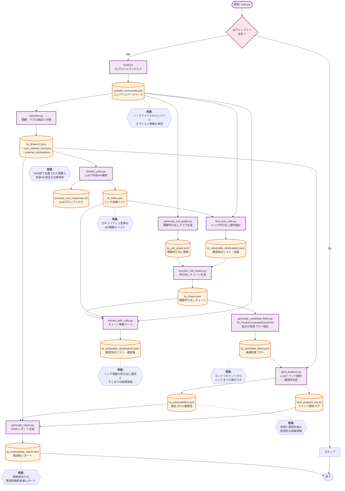

```mermaid
flowchart TB
    %% スタイル定義
    classDef inputFile fill:#e1f5fe,stroke:#01579b,stroke-width:2px
    classDef outputFile fill:#fff3e0,stroke:#e65100,stroke-width:2px
    classDef process fill:#f3e5f5,stroke:#4a148c,stroke-width:2px
    classDef decision fill:#fce4ec,stroke:#880e4f,stroke-width:2px
    
    %% 開始
    Start([開始: main.py]):::process
    
    %% Phase 0: ビルド準備
    Start --> CheckTA{ta/ディレクトリ<br/>存在？}:::decision
    CheckTA -->|No| Skip[スキップ]
    CheckTA -->|Yes| BuildTA[build.py<br/>TAプロジェクトビルド]:::process
    
    BuildTA --> CompileDB[(compile_commands.json<br/>コンパイルデータベース)]:::outputFile
    
    %% Phase 1-2: 関数分類
    CompileDB --> ClassifyFunc[classifier.py<br/>関数・マクロ抽出と分類]:::process
    ClassifyFunc --> Phase12[(ta_phase12.json<br/>・user_defined_functions<br/>・external_declarations)]:::outputFile
    
    %% Phase 3: シンク特定
    Phase12 --> IdentifySinks[identify_sinks.py<br/>LLMで外部API解析]:::process
    IdentifySinks --> Sinks[(ta_sinks.json<br/>シンク候補リスト)]:::outputFile
    IdentifySinks --> PromptsLog[(prompts_and_responses.txt<br/>LLMプロンプトログ)]:::outputFile
    
    %% Phase 3.4-3.7: 詳細解析
    Sinks --> FindCalls[find_sink_calls.py<br/>シンク呼び出し箇所抽出]:::process
    CompileDB --> FindCalls
    FindCalls --> VDRaw[(ta_vulnerable_destinations.json<br/>脆弱地点リスト・初版)]:::outputFile
    
    CompileDB --> GenCallGraph[generate_call_graph.py<br/>関数呼び出しグラフ生成]:::process
    GenCallGraph --> CallGraph[(ta_call_graph.json<br/>関数呼び出し関係)]:::outputFile
    
    CallGraph --> GenChains[function_call_chains.py<br/>呼び出しチェーン生成]:::process
    VDRaw --> GenChains
    GenChains --> Chains[(ta_chains.json<br/>関数呼び出しチェーン)]:::outputFile
    
    Chains --> ExtractSink[extract_sink_calls.py<br/>チェーン情報マージ]:::process
    Sinks --> ExtractSink
    CompileDB --> ExtractSink
    ExtractSink --> VDFinal[(ta_vulnerable_destinations.json<br/>脆弱地点リスト・最終版)]:::outputFile
    
    %% Phase 5: 危険フロー生成
    Chains --> GenFlows[generate_candidate_flows.py<br/>TA_InvokeCommandEntryPoint<br/>起点の危険フロー抽出]:::process
    GenFlows --> CandidateFlows[(ta_candidate_flows.json<br/>候補危険フロー)]:::outputFile
    
    %% Phase 6: テイント解析
    CandidateFlows --> TaintAnalyze[taint_analyzer.py<br/>LLMテイント解析<br/>脆弱性判定]:::process
    Phase12 --> TaintAnalyze
    TaintAnalyze --> Vulnerabilities[(ta_vulnerabilities.json<br/>検出された脆弱性)]:::outputFile
    TaintAnalyze --> TaintLog[(taint_analysis_log.txt<br/>テイント解析ログ)]:::outputFile
    
    %% Phase 7: レポート生成
    Vulnerabilities --> GenReport[generate_report.py<br/>HTMLレポート生成]:::process
    Phase12 --> GenReport
    TaintLog --> GenReport
    GenReport --> Report[(ta_vulnerability_report.html<br/>脆弱性レポート)]:::outputFile
    
    %% 終了
    Report --> End([終了])
    Skip --> End
    
    %% ファイル用途の説明
    CompileDB -.- CompileDBDesc{{<b>用途:</b><br/>ソースファイルのコンパイル<br/>オプション情報を保持}}
    Phase12 -.- Phase12Desc{{<b>用途:</b><br/>TA内部で定義された関数と<br/>外部API宣言を分類保存}}
    Sinks -.- SinksDesc{{<b>用途:</b><br/>セキュリティ上危険な<br/>API関数のリスト}}
    VDFinal -.- VDDesc{{<b>用途:</b><br/>シンク関数の呼び出し箇所と<br/>そこまでの経路情報}}
    CandidateFlows -.- FlowsDesc{{<b>用途:</b><br/>エントリポイントから<br/>シンクまでの実行パス}}
    Vulnerabilities -.- VulnDesc{{<b>用途:</b><br/>実際に悪用可能な<br/>脆弱性の詳細情報}}
    Report -.- ReportDesc{{<b>用途:</b><br/>開発者向けの<br/>脆弱性解析結果レポート}}
```