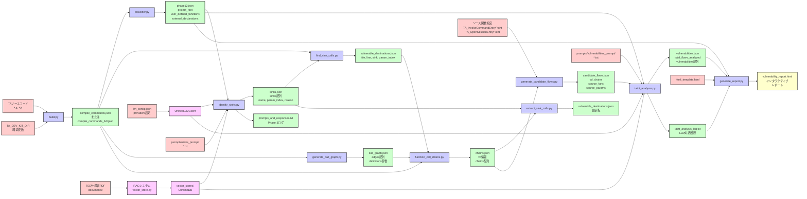

```mermaid
graph LR
    %% 入力データ
    TASource[TAソースコード<br/>*.c, *.h] --> Build[build.py]
    DevKit[TA_DEV_KIT_DIR<br/>環境変数] --> Build
    
    %% Phase 1-2: ビルドと分類
    Build --> CompileDB[compile_commands.json<br/>または<br/>compile_commands_full.json]
    CompileDB --> Classifier[classifier.py]
    
    Classifier --> Phase12JSON[phase12.json<br/>project_root<br/>user_defined_functions<br/>external_declarations]
    
    %% Phase 3: シンク識別
    Phase12JSON --> IdentifySinks[identify_sinks.py]
    TEEDocs[TEE仕様書PDF<br/>documents/] --> RAGSystem[RAGシステム<br/>vector_store.py]
    RAGSystem --> VectorDB[vector_stores/<br/>ChromaDB]
    VectorDB --> IdentifySinks
    
    LLMConfig[llm_config.json<br/>providers設定] --> LLMClient[UnifiedLLMClient]
    LLMClient --> IdentifySinks
    
    SinkPrompts[prompts/sinks_prompt/<br/>*.txt] --> IdentifySinks
    
    IdentifySinks --> SinksJSON[sinks.json<br/>sinks配列<br/>name, param_index, reason]
    
    %% Phase 3.1-3.4: 詳細解析
    CompileDB --> FindSinkCalls[find_sink_calls.py]
    SinksJSON --> FindSinkCalls
    FindSinkCalls --> VDJSON1[vulnerable_destinations.json<br/>file, line, sink, param_index]
    
    CompileDB --> GenCallGraph[generate_call_graph.py]
    GenCallGraph --> CallGraphJSON[call_graph.json<br/>edges配列<br/>definitions辞書]
    
    VDJSON1 --> FuncCallChains[function_call_chains.py]
    CallGraphJSON --> FuncCallChains
    CompileDB --> FuncCallChains
    
    FuncCallChains --> ChainsJSON[chains.json<br/>vd情報<br/>chains配列]
    
    ChainsJSON --> ExtractSinkCalls[extract_sink_calls.py]
    SinksJSON --> ExtractSinkCalls
    ExtractSinkCalls --> VDJSON2[vulnerable_destinations.json<br/>更新版]
    
    %% Phase 5: 候補フロー生成
    ChainsJSON --> GenCandidateFlows[generate_candidate_flows.py]
    SourceSpec[ソース関数指定<br/>TA_InvokeCommandEntryPoint<br/>TA_OpenSessionEntryPoint] --> GenCandidateFlows
    
    GenCandidateFlows --> CandidateFlows[candidate_flows.json<br/>vd, chains<br/>source_func<br/>source_params]
    
    %% Phase 6: 脆弱性解析
    CandidateFlows --> TaintAnalyzer[taint_analyzer.py]
    Phase12JSON --> TaintAnalyzer
    
    VulnPrompts[prompts/vulnerabilities_prompt/<br/>*.txt] --> TaintAnalyzer
    VectorDB --> TaintAnalyzer
    LLMClient --> TaintAnalyzer
    
    TaintAnalyzer --> VulnJSON[vulnerabilities.json<br/>total_flows_analyzed<br/>vulnerabilities配列]
    
    TaintAnalyzer --> TaintLog[taint_analysis_log.txt<br/>LLM対話履歴]
    
    %% Phase 7: レポート生成
    VulnJSON --> GenReport[generate_report.py]
    Phase12JSON --> GenReport
    TaintLog --> GenReport
    HTMLTemplate[html_template.html] --> GenReport
    
    GenReport --> HTMLReport[vulnerability_report.html<br/>インタラクティブ<br/>レポート]
    
    %% 中間ログファイル
    IdentifySinks --> PromptsLog1[prompts_and_responses.txt<br/>Phase 3ログ]
    
    %% スタイル定義
    classDef input fill:#fcc,stroke:#333,stroke-width:2px
    classDef process fill:#ccf,stroke:#333,stroke-width:2px
    classDef data fill:#cfc,stroke:#333,stroke-width:2px
    classDef output fill:#ffc,stroke:#333,stroke-width:2px
    classDef external fill:#fcf,stroke:#333,stroke-width:2px
    
    class TASource,DevKit,TEEDocs,LLMConfig,SinkPrompts,VulnPrompts,SourceSpec,HTMLTemplate input
    class Build,Classifier,IdentifySinks,FindSinkCalls,GenCallGraph,FuncCallChains,ExtractSinkCalls,GenCandidateFlows,TaintAnalyzer,GenReport process
    class CompileDB,Phase12JSON,SinksJSON,VDJSON1,VDJSON2,CallGraphJSON,ChainsJSON,CandidateFlows,VulnJSON,TaintLog,PromptsLog1 data
    class HTMLReport output
    class RAGSystem,VectorDB,LLMClient external
```