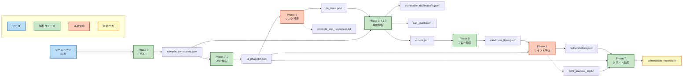

```mermaid
flowchart LR
    %% スタイル定義
    classDef source fill:#bbdefb,stroke:#1565c0,stroke-width:2px
    classDef phase fill:#c8e6c9,stroke:#2e7d32,stroke-width:2px
    classDef llm fill:#ffccbc,stroke:#d84315,stroke-width:2px
    classDef output fill:#fff9c4,stroke:#f57f17,stroke-width:2px

    %% ソースコード
    SRC[ソースコード<br/>.c/.h]:::source

    %% Phase 0-2
    SRC --> P0[Phase 0<br/>ビルド]:::phase
    P0 --> CCDB[compile_commands.json]
    CCDB --> P12[Phase 1-2<br/>AST解析]:::phase
    P12 --> P12JSON[ta_phase12.json]

    %% Phase 3 (LLM)
    P12JSON --> P3[Phase 3<br/>シンク特定]:::llm
    P3 --> SINKS[ta_sinks.json]
    P3 -.-> LOG1[prompts_and_responses.txt]

    %% Phase 3.4-3.7
    SINKS --> P34[Phase 3.4-3.7<br/>静的解析]:::phase
    CCDB --> P34
    P34 --> VD[vulnerable_destinations.json]
    P34 --> CG[call_graph.json]
    P34 --> CHAINS[chains.json]

    %% Phase 5
    CHAINS --> P5[Phase 5<br/>フロー抽出]:::phase
    P5 --> FLOWS[candidate_flows.json]

    %% Phase 6 (LLM)
    FLOWS --> P6[Phase 6<br/>テイント解析]:::llm
    P12JSON --> P6
    P6 --> VULN[vulnerabilities.json]
    P6 -.-> LOG2[taint_analysis_log.txt]

    %% Phase 7
    VULN --> P7[Phase 7<br/>レポート生成]:::phase
    P12JSON --> P7
    LOG2 --> P7
    P7 --> REPORT[vulnerability_report.html]:::output

    %% 凡例
    subgraph " "
        L1[ソース]:::source
        L2[解析フェーズ]:::phase
        L3[LLM使用]:::llm
        L4[最終出力]:::output
    end
```