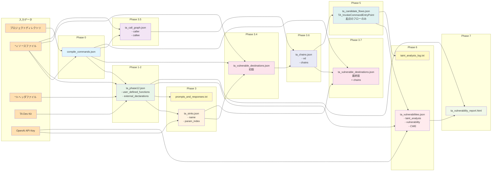

```mermaid
flowchart LR
    subgraph "入力データ"
        PROJ[プロジェクトディレクトリ]
        SRC[*.c ソースファイル]
        HDR[*.h ヘッダファイル]
        DEVKIT[TA Dev Kit]
        API[OpenAI API Key]
    end
    
    subgraph "Phase 0"
        CCDB[compile_commands.json]
        PROJ --> CCDB
        SRC --> CCDB
    end
    
    subgraph "Phase 1-2"
        P12[ta_phase12.json<br/>- user_defined_functions<br/>- external_declarations]
        CCDB --> P12
        SRC --> P12
        HDR --> P12
        DEVKIT --> P12
    end
    
    subgraph "Phase 3"
        SINKS[ta_sinks.json<br/>- name<br/>- param_index]
        P12 --> SINKS
        API --> SINKS
        PLOG1[prompts_and_responses.txt]
        P12 --> PLOG1
    end
    
    subgraph "Phase 3.4"
        VD1[ta_vulnerable_destinations.json<br/>初版]
        CCDB --> VD1
        SINKS --> VD1
        SRC --> VD1
    end
    
    subgraph "Phase 3.5"
        CG[ta_call_graph.json<br/>- caller<br/>- callee]
        CCDB --> CG
        SRC --> CG
    end
    
    subgraph "Phase 3.6"
        CHAINS[ta_chains.json<br/>- vd<br/>- chains]
        CG --> CHAINS
        VD1 --> CHAINS
    end
    
    subgraph "Phase 3.7"
        VD2[ta_vulnerable_destinations.json<br/>最終版<br/>+ chains]
        SINKS --> VD2
        CHAINS --> VD2
        CCDB --> VD2
    end
    
    subgraph "Phase 5"
        FLOWS[ta_candidate_flows.json<br/>TA_InvokeCommandEntryPoint<br/>起点のフローのみ]
        CHAINS --> FLOWS
    end
    
    subgraph "Phase 6"
        VULN[ta_vulnerabilities.json<br/>- taint_analysis<br/>- vulnerability<br/>- CWE]
        FLOWS --> VULN
        P12 --> VULN
        API --> VULN
        PLOG2[taint_analysis_log.txt]
        FLOWS --> PLOG2
    end
    
    subgraph "Phase 7"
        REPORT[ta_vulnerability_report.html]
        VULN --> REPORT
        P12 --> REPORT
    end
    
    style PROJ fill:#ffe0b2
    style SRC fill:#ffe0b2
    style HDR fill:#ffe0b2
    style DEVKIT fill:#ffe0b2
    style API fill:#ffe0b2
    style CCDB fill:#e1f5fe
    style P12 fill:#e8f5e9
    style SINKS fill:#fff3e0
    style VD1 fill:#fce4ec
    style CG fill:#f3e5f5
    style CHAINS fill:#e8eaf6
    style VD2 fill:#fce4ec
    style FLOWS fill:#e0f2f1
    style VULN fill:#ffebee
    style REPORT fill:#f1f8e9
    style PLOG1 fill:#fff9c4
    style PLOG2 fill:#fff9c4
```