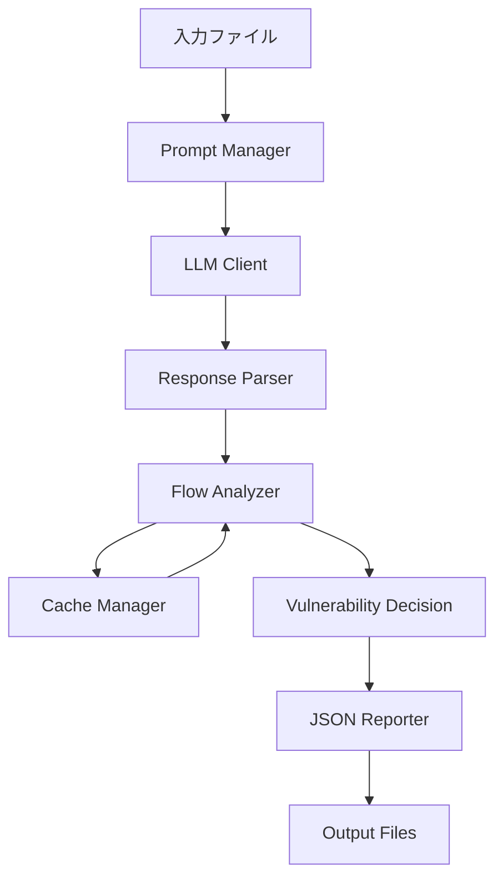
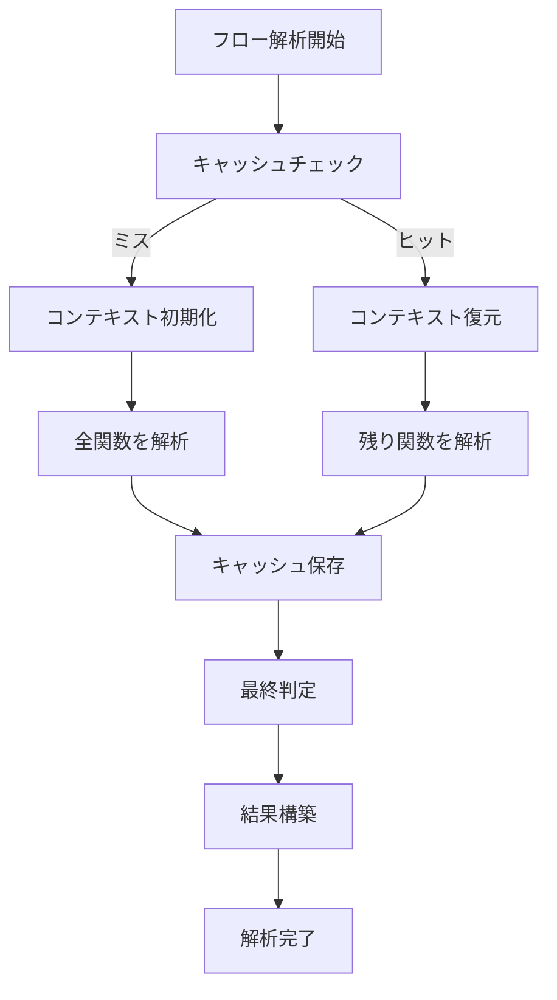
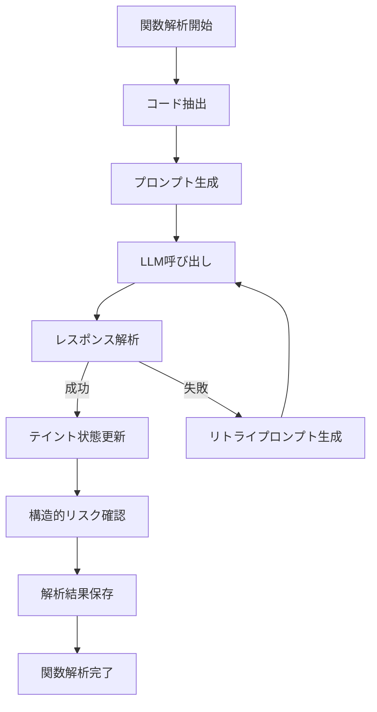
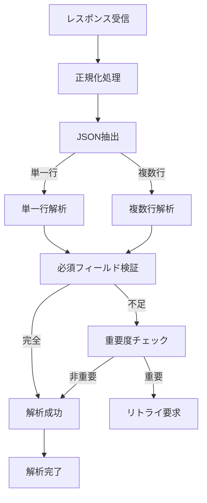
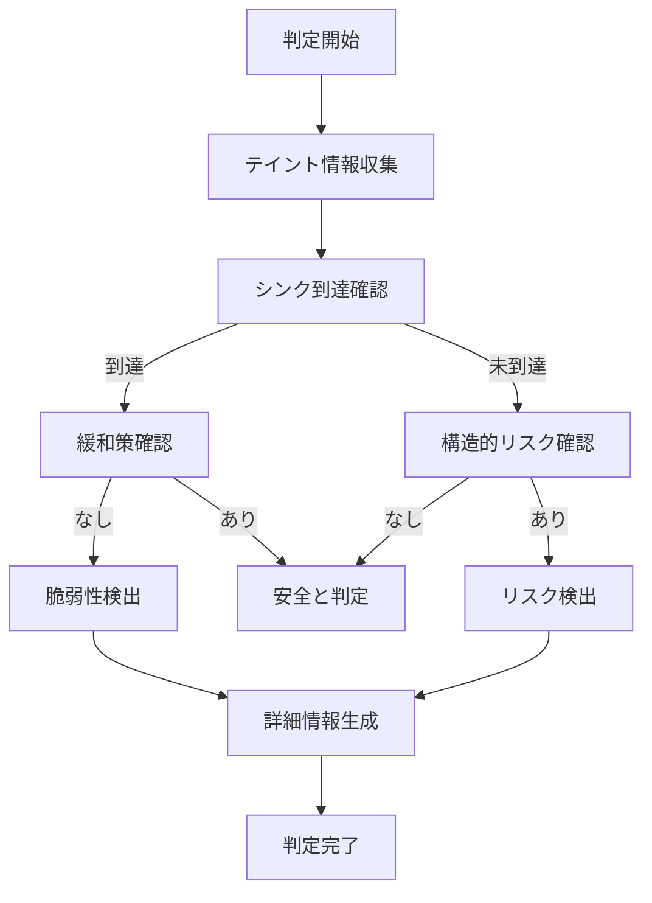
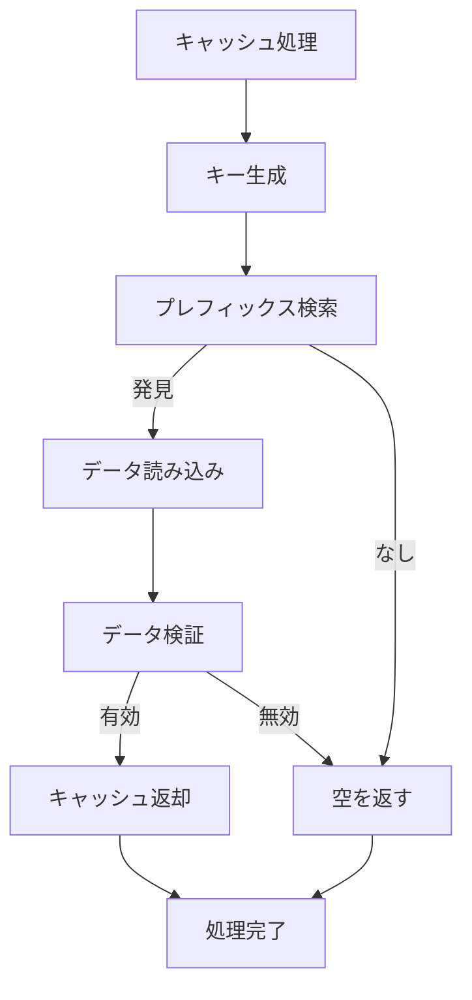

# フェーズ5: LLMベースのテイント解析システム

## 概要

フェーズ5は、LLM（Large Language Model）を活用してTEE（Trusted Execution Environment）のソースコードに対するテイント解析を実行し、脆弱性を検出するシステムです。統合パーサーにより効率的な解析を実現し、チェック機能により高精度な脆弱性判定を行います。

### 主な特徴
- **ハイブリッド解析**: LLM単体、DITING単体、またはハイブリッドモードでの解析が可能
- **プレフィックスキャッシュ**: 解析済みの関数チェーンを再利用して高速化
- **構造的リスク検出**: シンクに到達しない構造的な脆弱性も検出
- **統合レポート**: 同一行の複数の問題を統合して報告

## システムアーキテクチャ



## ディレクトリ構造

```
/workspace/src/analyze_vulnerabilities/
├── taint_analyzer.py           # メインエントリポイント
├── core/
│   ├── engine.py               # 解析エンジン
│   └── flow_analyzer.py        # フロー解析器
├── parsing/
│   └── response_parser.py      # LLMレスポンス解析
├── prompts/
│   ├── code_extractor.py       # コード抽出
│   └── prompt_manager.py       # プロンプト管理
├── llm/
│   ├── openai_client.py        # OpenAI API
│   └── conversation.py         # 会話コンテキスト管理
├── cache/
│   └── function_cache.py       # プレフィックスキャッシュ
└── output/
    ├── json_reporter.py        # JSON形式レポート生成
    └── conversation_logger.py  # 会話履歴記録
```

## 主要機能

### 1. テイント解析
- REE（Rich Execution Environment）から入力されるデータの追跡
- 関数間のデータフロー解析
- シンク関数への到達可能性判定

### 2. 脆弱性検出
- **CWE-200**: 情報漏洩（Unencrypted Output）
- **CWE-787**: バッファオーバーフロー（Out-of-bounds Write）
- **CWE-20**: 入力検証不備（Improper Input Validation）

### 3. 構造的リスク検出
- テイントされたループ境界
- ポインタ演算によるリスク
- サイズ計算の問題

## 実行方法

### 基本コマンド

```bash
python3 /workspace/src/analyze_vulnerabilities/taint_analyzer.py \
  --flows <候補フローJSON> \
  --phase12 <フェーズ1/2データJSON> \
  --output <出力ファイルパス> \
  [オプション]
```

### オプション

| オプション | 説明 | デフォルト |
|---------|------|----------|
| `--mode` | 解析モード (llm/diting/hybrid) | hybrid |
| `--rag` | RAG（Retrieval-Augmented Generation）を有効化 | 無効 |
| `--no-cache` | キャッシュを無効化 | 有効 |
| `--verbose` | 詳細ログ出力 | 無効 |
| `--llm-provider` | LLMプロバイダー (openai/anthropic) | openai |

### 実行例

```bash
# ハイブリッドモードで解析（デフォルト）
python3 taint_analyzer.py \
  --flows ta_candidate_flows.json \
  --phase12 ta_phase12.json \
  --output ta_vulnerabilities.json \
  --verbose

# LLMのみで解析
python3 taint_analyzer.py \
  --flows ta_candidate_flows.json \
  --phase12 ta_phase12.json \
  --output ta_vulnerabilities.json \
  --mode llm

# キャッシュをクリアして実行
python3 taint_analyzer.py \
  --flows ta_candidate_flows.json \
  --phase12 ta_phase12.json \
  --output ta_vulnerabilities.json \
  --no-cache
```

## 各コア機能の詳細

### 1. フロー解析プロセス



### 2. 関数解析プロセス



### 3. レスポンス解析プロセス



### 4. 脆弱性判定プロセス



### 5. キャッシュ管理プロセス



## 出力形式

### ta_vulnerabilities.json

```json
{
  "metadata": {
    "analysis_date": "2025-09-17T14:49:50",
    "mode": "hybrid",
    "llm_provider": "openai"
  },
  "statistics": {
    "total_flows_analyzed": 3,
    "vulnerabilities_found": 1,
    "structural_risks_found": 4,
    "execution_time_seconds": 333.67
  },
  "vulnerabilities": [
    {
      "vulnerability_id": "VULN-0001",
      "file": "test.c",
      "line": 64,
      "vulnerability_types": ["CWE-200"],
      "severity": "high",
      "descriptions": ["..."]
    }
  ],
  "structural_risks": [
    {
      "finding_id": "RISK-0001",
      "file": "test.c",
      "line": 115,
      "rules": ["weak_input_validation"],
      "descriptions": ["..."]
    }
  ]
}
```

## トラブルシューティング

### LLMレスポンスが不安定な場合
- `--no-cache`オプションでキャッシュをクリア
- `--verbose`で詳細ログを確認
- temperature設定を0に調整

### structural_risksが検出されない場合
- プロンプトファイルの確認
- レスポンスパーサーのデバッグモード有効化
- 会話履歴の確認（conversations.jsonl）

### パフォーマンスが遅い場合
- キャッシュが有効か確認
- バッチ処理の検討
- APIレート制限の確認

## 開発者向け情報

### 新しい脆弱性パターンの追加

1. `codeql_rules.json`に新しいルールを追加
2. プロンプトテンプレートを更新
3. パーサーの検証ルールを追加

### LLMプロバイダーの追加

1. `llm/`ディレクトリに新しいクライアントを実装
2. `LLMClientInterface`を継承
3. `prompt_manager.py`で設定を追加