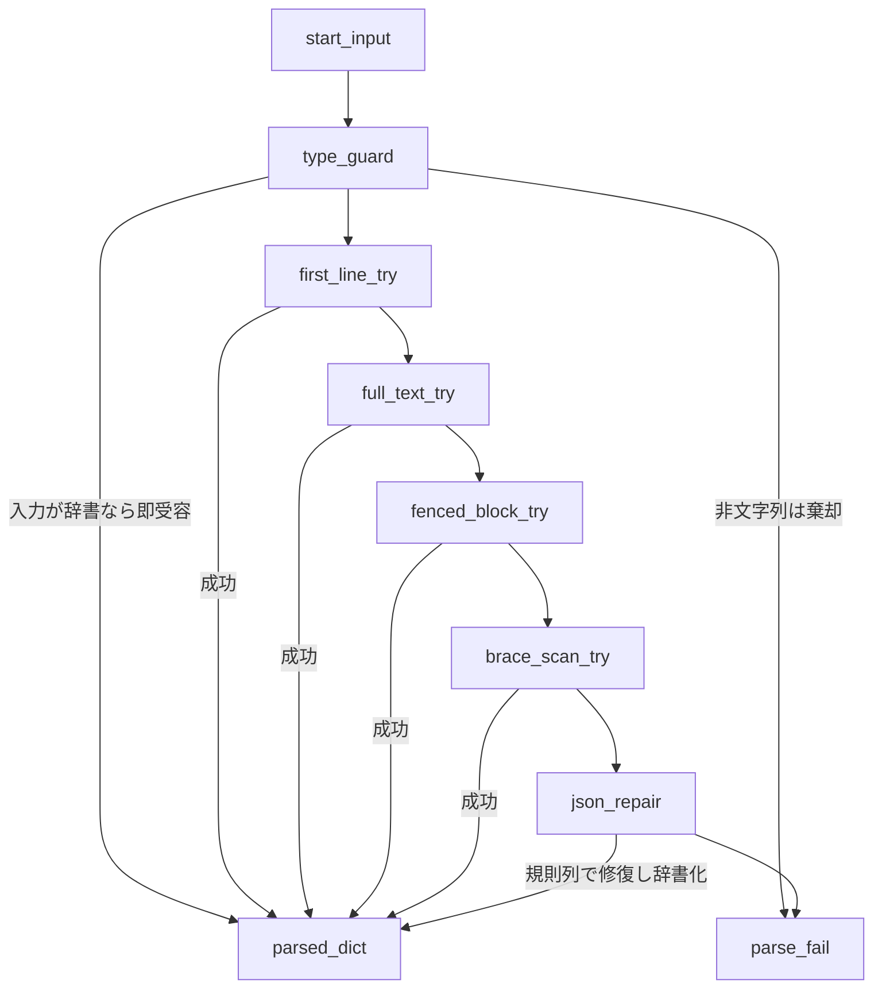
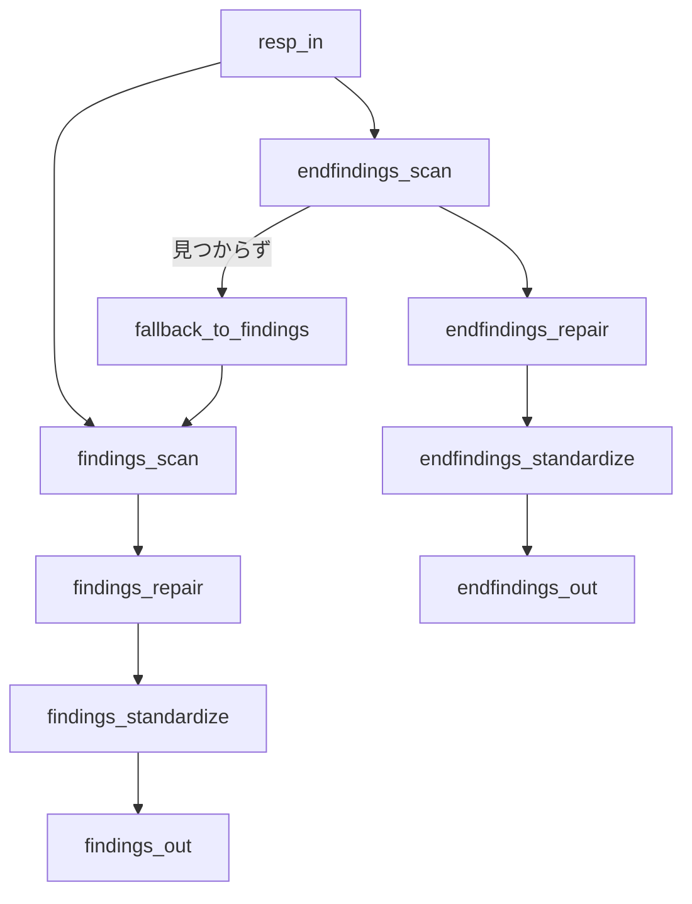
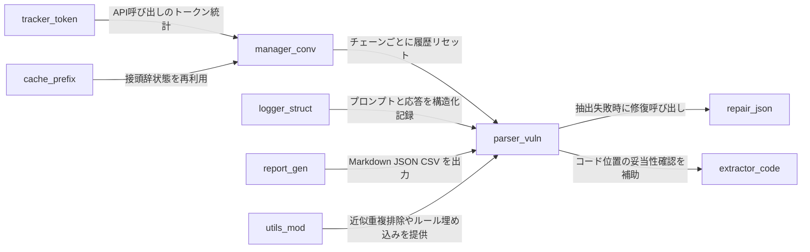

# Phase 5 README — LLM駆動テイント解析と脆弱性抽出（詳細）

本ドキュメントは、Phase 5（LLM を用いたテイント解析および脆弱性抽出）の**設計・処理手順・入出力・堅牢化機構・性能および再現性のための基盤**をまとめたものです。ここで説明する中心モジュールは **VulnerabilityParser**（抽出・標準化）、**JSONRepair**（JSON修復）、**CodeExtractor**（コード断片抽出）、**ConversationManager**（会話制御）、**StructuredLogger**（構造化ログ）、**TokenTrackingClient**（トークン計測）、**PrefixCache**（接頭辞キャッシュ）、**ReportGenerator**（レポート）、および共通 **utils** です。
以降、設計根拠として要所で実装ファイルを注記します。

---

## 1. 目的と範囲

Phase 5 の目的は、LLM 応答から**機械可読な根拠（FINDINGS・END\_FINDINGS）**と**テイント解析結果**を安定抽出し、**行番号・ファイル参照の妥当性**を緩和検証しつつ、下流（整合性判定・重複排除・レポート）へ正規化データを引き渡すことです。

* **JSON 抽出器**は、破損／形式揺れの多い LLM 応答を**型ガード付き**で受け取り、段階的フォールバックにより**辞書化**（文字列→Python dict）を成立させます。
* **修復器**は、末尾カンマ・欠落引用符・未完配列・括弧不整合・未クローズ文字列などを**規則列**で補修し、可能な限り辞書化に持ち込みます。

---

## 2. 全体アーキテクチャ（Phase 5 の位置づけ）

```
LLM応答
  └─ VulnerabilityParser.extract_json_from_response で辞書化を試行（型ガード）
        ├─ 先頭行 → 全文 → フェンス内 → 中括弧走査 → JSONRepair フォールバック
        └─ 抽出された dict を下流に供給
  ├─ FINDINGS（中間）抽出・標準化（rule_matches 正規化、安定ID付与、line緩和検証）
  └─ END_FINDINGS（最終）抽出・標準化（FINDINGS へのフォールバックあり）
        └─ 行番号の現実性を緩和検査 失格時は vd.line へ補正し meta に記録
```

* **抽出・標準化**は VulnerabilityParser が担い、修復は JSONRepair を呼び出します。
* **コード断片**や**呼び出しコンテキスト**は CodeExtractor が行番号付きで抽出し、ヒト検証・ログ監査に資します。
* **会話履歴**は ConversationManager が**チェーンごとにリセット**し、トークン使用とメモリを抑制します。
* **ログ**は StructuredLogger が**高速バッファリング**で永続化、プロンプトと応答の再現可能性を確保します。
* **トークン計測**は TokenTrackingClient が**API呼数・トークン量**を推定集計します。
* **接頭辞キャッシュ**は PrefixCache が**同一チェーンの先頭部分**を再利用します。
* **レポート**は ReportGenerator が Markdown/JSON/CSV を生成します。

---

## 3. コアコンポーネントの仕様

### 3.1 VulnerabilityParser（抽出・標準化・検証）

* **型ガード付き JSON 抽出**
  入力が **dict** の場合はそのまま受容、**非文字列**は安全に棄却、**文字列**は ①先頭行→②全文→③`json`ブロック→④中括弧走査→⑤JSONRepair の順で辞書化を試みます。抽出可否は内部統計に記録されます。
* **二行契約の検証**
  Start/Middle 応答の形式検査 `validate_taint_response_format` は「1 行目が所定キーを持つ JSON」「2 行目が `FINDINGS=...`」であることを強制します（FINDINGS の辞書化にも JSONRepair を利用）。
* **FINDINGS 抽出**
  複数パターンで `FINDINGS=...` を抽出→JSONRepair で辞書化→**標準化**（phase・function・rule\_matches 正規化・line の型揺れ吸収・安定 ID 付与）後に返します。行番号が疑わしい場合は**警告のみ**とし、vd.line へのフォールバックで**coercion**を行い `meta.line_coerced` を記録します。
* **END\_FINDINGS 抽出**
  `END_FINDINGS` を優先抽出し、見つからない場合は **FINDINGS にフォールバック**します。最終的に `phase=end` に統一して返します。
* **行番号の緩和検証**
  対象ファイルが存在すれば行数範囲内で厳密チェック、無い場合は広い許容範囲で可とします。

### 3.2 JSONRepair（JSON 修復）

* **修復規則の直列適用**
  括弧バランス補正、末尾カンマ削除、未完配列補修、誤エスケープ訂正、**キーの引用符不足の補填**、未クローズ文字列の補修、最後に総合適用で**辞書化**を試みます。修復統計を保持し、デバッグで各規則の成否を表示可能。
* **最良マッチの選択**
  正規表現で複数抽出した JSON 断片のうち、`items` を含み**辞書化に成功**するものを優先採用します。

### 3.3 CodeExtractor（コード断片抽出）

* **関数本体抽出**
  フェーズ 1–2 のメタデータからユーザ関数の開始行を得て、括弧・文字列リテラルの状態を追跡しながら関数末尾を決定、**行番号付き**で返します（内部に LRU キャッシュあり）。
* **呼び出しコンテキスト抽出**
  外部関数シンクについては**呼び出し行周辺**を抜粋し、該当行を `>>>` でハイライトして提示します（複数行の呼び出しも対応）。

### 3.4 ConversationManager（会話制御）

* **チェーンごとに履歴をリセット**
  解析チェーンの切り替え時に履歴を初期化し、システムプロンプトを先頭に再設定。メッセージ数・概算トークン・合計文字数などを統計化します。

### 3.5 StructuredLogger（構造化ログ）

* **高速 I/O とセクション整形**
  ファイルを開いたまま保持する高速バッチ書き出しと、セクション・キー値・辞書整形出力を提供。プロンプトと応答を**人間が追いやすい形で永続化**します。

### 3.6 TokenTrackingClient（トークン計測）

* **API 呼び出しごとの推定**
  tiktoken があればエンコーディングベース、無ければ日本語と英語の**文字数比**から概算。合計・平均・入出力別トークンを集計できます。

### 3.7 PrefixCache（接頭辞キャッシュ）

* **接頭辞→解析状態**
  関数チェーンの**先頭からの部分列**に紐づけて、途中までの解析状態をキャッシュ化。ヒット率・総要求数・推定メモリサイズ等の統計を提供します。

### 3.8 ReportGenerator（レポート出力）

* **Markdown/JSON/CSV**
  解析統計・脆弱性一覧の Markdown、整形 JSON、集計 CSV を生成。辞書／文字列のいずれの解析結果にも対応します。

### 3.9 utils（補助ユーティリティ）

* **DITING ルール埋め込み・近似重複排除**
  ルール JSON の安全埋め込み、`window` 幅での行近傍を同一視する**近似重複排除**、所要のフォーマット関数を提供します。

---

## 4. データ契約（入出力）

### 4.1 LLM 応答（Start/Middle の 2 行契約の想定）

* **1 行目**: 主要キーを含む JSON
  例 `function, propagation, sanitizers, sinks, evidence, rule_matches`（抽出器が検証）
* **2 行目**: `FINDINGS = { "items": [...] }`（修復器の支援で辞書化）

### 4.2 最終判定（END の 3 行契約の想定）

* `END_FINDINGS = { "items": [...] }` が欠落しても、**FINDINGS へフォールバック**して救済抽出します。

### 4.3 標準化後の finding 項目

* `id, chain, function, sink_function, category, file, line, message, phase, rule_matches, meta`
  生成 ID は `file:function:primary_rule_id:line_bucket` ベースで安定化。

---

## 5. フロー（詳細）



* 上記は `extract_json_from_response` と `JSONRepair.safe_json_loads` の連携を示します（段階的フォールバック）。



* `extract_inline_findings` と `extract_end_findings` の関係（END→FINDINGS へのフォールバック、line の緩和検証と `meta.line_coerced`）。

---

## 6. 具体例

### 6.1 正常な 2 行応答

**入力**

```
{"function":"test","propagation":["buf <- param"],"sanitizers":[],"sinks":["TEE_MemMove"],"evidence":[],"rule_matches":{"rule_id":["weak_input_validation"],"others":[]}}
FINDINGS={"items":[{"file":"ta.c","line":65,"function":"test","sink_function":"TEE_MemMove","rule_matches":{"rule_id":["weak_input_validation"],"others":[]},"why":"length not validated"}]}
```

**結果**

* 先頭行は辞書化され（抽出器）、2 行目は JSONRepair を経て辞書化。`items` は**標準化**され、必要フィールドが補完されます。

### 6.2 破損 FINDINGS の自動修復

**入力**

```
FINDINGS = {items: [ {"file":"ta.c","line":65,} ]}
```

**結果**

* 欠落引用符と末尾カンマを修復し、`{"items":[{"file":"ta.c","line":65}]}` として**辞書化**に成功します。

### 6.3 END\_FINDINGS が無い最終応答

**入力**

```
{"vulnerability_found":"yes"}
詳細記述のみで END_FINDINGS は省略
```

**結果**

* `extract_end_findings` は **FINDINGS にフォールバック**して救済抽出します。行番号が不自然であれば `vd.line` に**coercion**し、`meta` に記録します。

---

## 7. 性能・再現性・観測性

* **ConversationManager** によりチェーン開始毎に履歴をリセット、メモリとトークンを抑制。
* **StructuredLogger** がプロンプトと応答を高速永続化、監査・再現性を確保。
* **TokenTrackingClient** が API 呼数とトークンを集計し、平均トークン/呼の把握を容易化。
* **PrefixCache** が接頭辞単位で解析状態を再利用、ヒット率・キャッシュサイズを可視化。
* **CodeExtractor** が LRU キャッシュでコード抽出を高速化。
* **utils.deduplicate\_findings** が行近傍バケットで近似重複を除去。

---

## 8. 失敗時のフォールバックと限界

* **過剰修復の回避**
  JSONRepair の規則は**最小限の補正**を意図し、修復統計・デバッグログで可視化可能。辞書化不能時はフォールバック値（`{"items":[]}` など）を返し、解析継続性を担保します。
* **行番号の不確実性**
  対象ファイルが見つからない場合は緩和検証とし、最終整合性は上流の到達性判定（別コンポーネント）に委ねます。

---

## 9. 付録：依存関係（概要）



* VulnerabilityParser（抽出・標準化）⇄ JSONRepair（修復）という**二段構え**が堅牢性の中核です。
* CodeExtractor は行番号付きコンテキストを提供し、ConversationManager・StructuredLogger・TokenTrackingClient が再現性・観測性を底支えします。
* PrefixCache と utils は性能と重複抑止に寄与します。

---

## 10. 参考実装の所在

* **VulnerabilityParser**（抽出・標準化・検証・統計）: `vulnerability_parser.py`。
* **JSONRepair**（修復規則・最良マッチ抽出・統計）: `json_repair.py`。
* **CodeExtractor**（関数本体・呼出し文脈・LRU）: `code_extractor.py`。
* **ConversationManager**（チェーン履歴・統計）: `conversation.py`。
* **StructuredLogger**（高速バッチ I/O・整形ログ）: `logger.py`。
* **TokenTrackingClient**（トークン推定・集計）: `token_tracking_client.py`。
* **PrefixCache**（接頭辞キャッシュ・統計）: `prefix_cache.py`。
* **ReportGenerator**（Markdown/JSON/CSV 出力）: `report_generator.py`。
* **utils**（ルール埋め込み・近似重複排除ほか）: `utils.py`。
