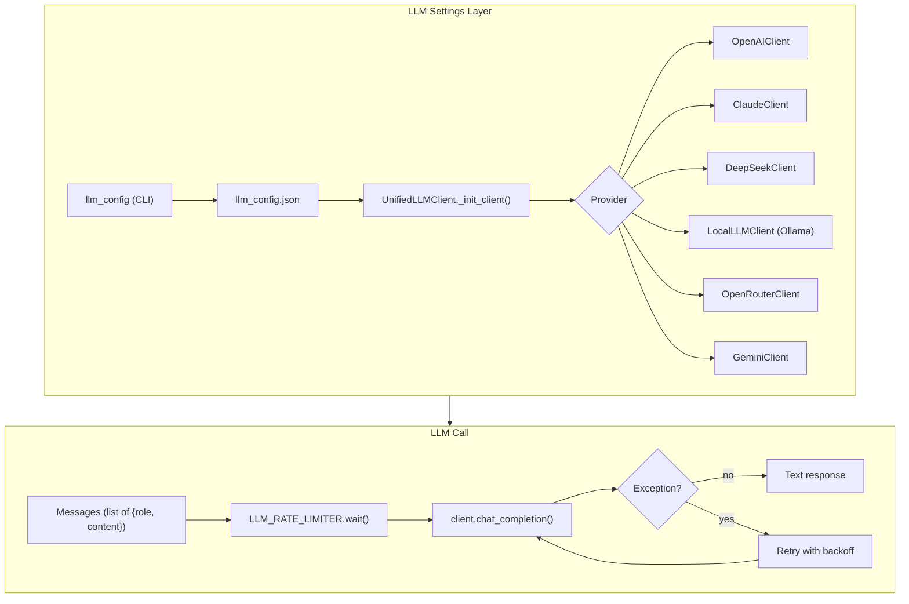
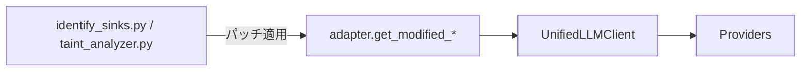
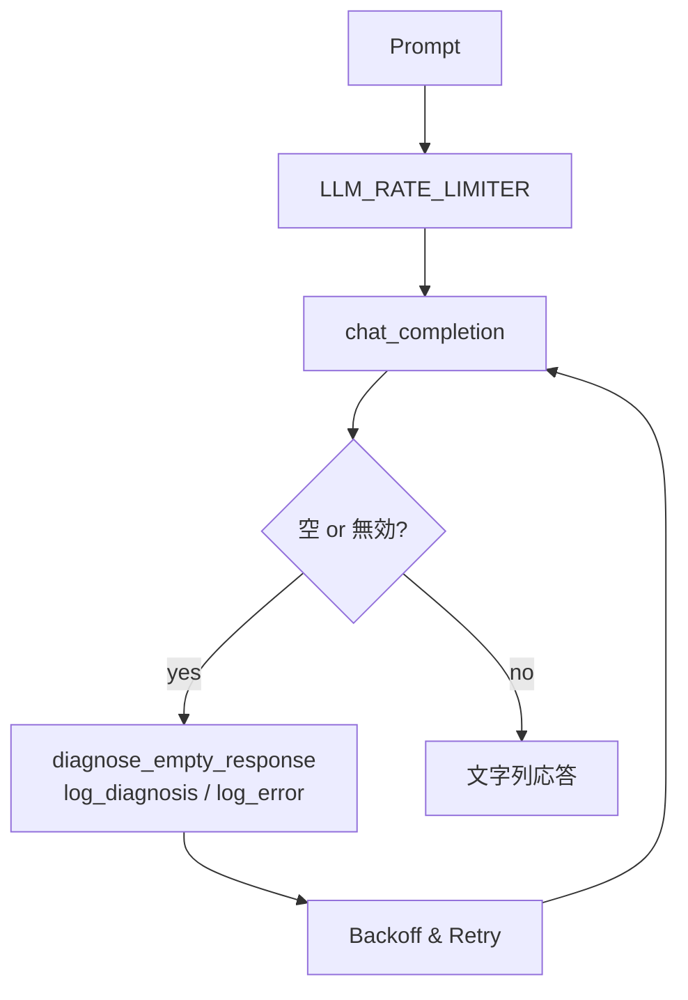

# LLM.md — LLM層 設計／使用ガイド（コード準拠）

> 本書は `src/llm_settings/` のコード（`config_manager.py` / `llm_cli.py` / `adapter.py` / `llm_error_handler.py` / `migrate_code.py` ほか）に**忠実**な、設定・切替・呼び出し・エラーハンドリングのリファレンスです。Docker のシェルラッパ（`llm_config`/`llm-setup`）が使える環境ではそれらを、ない場合は `python -m llm_settings.llm_cli` を用いてください。

---

## 🚀 クイックスタート（コード準拠）

```bash
# 1) 初期ガイド（Dockerラッパがある場合）
llm-setup

# 2) 現在の設定を確認
llm_config status             # または: python -m llm_settings.llm_cli status

# 3) プロバイダーを設定（例: OpenAI）
llm_config configure openai   # 対話的に APIキー/モデル/温度/タイムアウト等を設定

# 4) 接続テスト
llm_config test               # または: python -m llm_settings.llm_cli test
```

> **メモ**: 解析本体（Phase3/5など）からの LLM 呼び出しは、**現在のアクティブプロバイダー**を参照します。解析直前に `llm_config set <provider>` を実行して切り替えられます。

---

## 1. アーキテクチャ概要



* **UnifiedLLMClient**: アクティブなプロバイダー設定を読み込み、各ベンダーのクライアントへ委譲。
* **LLM\_RATE\_LIMITER**: 連続呼び出しを最小 0.7 秒間隔に調整（グローバル）。
* **Retry**: `UnifiedLLMClient.chat_completion()` に基本的なリトライ/バックオフを内蔵。

---

## 2. プロバイダーとデフォルト（コード既定値）

> 設定ファイルの値が存在すれば**そちらが優先**。下表は `config_manager` の**初期化時**に生成される既定値の要約です。

| Provider           | 既定モデル                     | 備考                                                     |
| ------------------ | ------------------------- | ------------------------------------------------------ |
| `openai`           | `gpt-4o-mini`             | `base_url`, `temperature`, `max_tokens`, `timeout` を保持 |
| `claude`           | `claude-3-opus-20240229`  | システムメッセージは最初のユーザー入力に結合して送信                             |
| `deepseek`         | `deepseek-chat`           | OpenAI 互換エンドポイントで呼び出し                                  |
| `local` / `ollama` | `llama3:8b`               | `http://localhost:11434` を想定（Ollama）。/api/tags で存在確認   |
| `openrouter`       | `openrouter/horizon-beta` | 参照ヘッダ（サイト情報）を付与可                                       |
| `gemini`           | `gemini-1.5-pro`          | safety settings 同梱。システム文は本文に連結して送信                     |

> **注意**: 実運用では `llm_config.json` によってモデル名/トークン上限/温度等は自由に上書きされます。

---

## 3. CLI（llm\_config）

```bash
# ステータス表示（アクティブプロバイダーと各設定の有無）
llm_config status

# アクティブ切替（例: claude / deepseek / local / openrouter / gemini）
llm_config set claude

# 詳細設定（APIキー/モデル/URL/温度/MaxTokens 等を対話で更新）
llm_config configure openai

# 接続テスト（--provider で一時指定可能）
llm_config test --provider openrouter

# 設定のエクスポート/インポート（エクスポート時はAPIキーをマスク）
llm_config export backup.json
llm_config import backup.json

# 旧 api_key.json からの移行
llm_config migrate
```

> 直接 Python を使う場合: `python -m llm_settings.llm_cli <command>`

---

## 4. プログラムから使う（推奨パターン）

### 4.1 UnifiedLLMClient 直接利用

```python
from llm_settings.config_manager import UnifiedLLMClient

client = UnifiedLLMClient()              # 現在のアクティブ設定で初期化
client.switch_provider("claude")         # その場で切替も可能

messages = [
    {"role": "system", "content": "You are a security assistant."},
    {"role": "user", "content": "Analyze this TA code snippet..."}
]
text = client.chat_completion(messages)  # 応答は str
```

### 4.2 既存コード互換（OpenAI風ラッパ）

```python
from llm_settings.adapter import init_client, ask_llm

openai_like = init_client()  # chat.completions.create(...) を提供
resp = openai_like.chat.completions.create(
    model="ignored-by-wrapper",    # 実際の設定は llm_config.json を参照
    messages=[{"role":"user","content":"Hello"}],
)
print(resp.choices[0].message.content)

# シンプル互換
text = ask_llm(openai_like, "Respond with OK")
```

### 4.3 フェーズ別スクリプトとの統合（レガシー互換）

* `identify_sinks.py` / `taint_analyzer.py` を**パッチ**して、新しい設定層を使うヘルパを提供（`adapter.get_modified_*`）。
* 既存の `init_client()`/`ask_llm()` 呼び出しを差し替えるだけで統合可能。



---

## 5. エラーハンドリング/診断/レート制御

### 5.1 基本のリトライ（既定）

* `UnifiedLLMClient.chat_completion()` は `retry_config`（既定: 最大3回、指数バックオフ）に基づき再試行。
* 連続呼び出しは `LLM_RATE_LIMITER` により**最短 0.7s 間隔**で調整。

### 5.2 追加の詳細診断（任意）

* **空レスポンス診断**: `ResponseDiagnostics.diagnose_empty_response()`
* **例外分類**: `LLMErrorAnalyzer.analyze_error()`
* **ログ**: `LLMErrorLogger` が以下を追記

  * `llm_error_details.log` / `llm_errors.json`
  * `llm_diagnosis_report.json` / `llm_diagnosis_readable.txt`
  * 致命時: `llm_fatal_error.log` / `llm_fatal_diagnosis.json`

```python
from llm_settings.llm_error_handler import create_retry_handler
from llm_settings.config_manager import UnifiedLLMClient

handler = create_retry_handler(max_retries=3)
client = UnifiedLLMClient()

prompt = "Respond with exactly 'OK'"
text = handler.execute_with_retry(client, prompt, context={"phase": "P5"})
```



---

## 6. システムメッセージの扱い（プロバイダー差）

* **Claude**: System ロールは最初の user メッセージに**前置連結**して送信。
* **Gemini**: System ロールを**本文に前置**して送信。
* **OpenAI/DeepSeek/OpenRouter/Local(Ollama)**: そのまま `messages` を送信。

> プロンプト設計時は、Claude/Gemini でも意味が破綻しないように **最終 user 入力に system 方針が前置**されることを前提にしてください。

---

## 7. 設定ファイル（`llm_config.json`）

* 主要キー: `active_provider` / `providers.{name}.{api_key, model, base_url, temperature, max_tokens, timeout}` / `retry_config`。
* **エクスポート**時は APIキーを自動マスク（`***MASKED***`）。
* **注意**: 機密情報のため VCS へはコミットしないでください。

```jsonc
// 例（抜粋・構造のみ）
{
  "active_provider": "openai",
  "providers": {
    "openai": { "api_key": "...", "model": "gpt-4o-mini", ... },
    "claude": { "api_key": "...", "model": "claude-3-opus-20240229", ... },
    "deepseek": { ... },
    "local": { ... },
    "ollama": { ... },
    "openrouter": { ... },
    "gemini": { "model": "gemini-1.5-pro", "safety_settings": [ ... ] }
  },
  "retry_config": { "max_retries": 3, "retry_delay": 2, "exponential_backoff": true }
}
```

---

## 8. 旧コードからの移行（スクリプト）

* `migrate_code.py` を使うと、

  1. `src/llm_settings/__init__.py` の生成
  2. 旧 `api_key.json` → 新 `llm_config.json` へ移行
  3. `identify_sinks.py` / `taint_analyzer.py` の `init_client`/`ask_llm` を**自動置換**（バックアップ作成）
     を実行します。

```bash
python -m llm_settings.migrate_code --src-dir src   # --dry-run も可
```

---

## 9. よくある質問（FAQ）

* **Q. 環境変数 `OPENAI_API_KEY` 等を設定すれば使われますか？**

  * A. 診断モジュールは検出しますが、**実際の呼び出しは `llm_config.json` の値**を使います。CLI の `configure` で設定するか、`LLMConfig.update_provider_config()` を使ってください。

* **Q. Phaseごとにプロバイダーを変えたい**

  * A. 実行前に `llm_config set <provider>` で切替、あるいはコード側で `UnifiedLLMClient.switch_provider()` を呼び出します。

* **Q. OpenAI 風のレスポンスオブジェクト（choices\[].message.content）が必要**

  * A. `adapter.init_client()` がラッパを提供します（互換 `create()` → `choices[0].message.content`）。

---

## 10. 付録：簡易テストコード

```python
from llm_settings.config_manager import UnifiedLLMClient
from llm_settings.llm_error_handler import diagnose_empty_response

client = UnifiedLLMClient()
client.validate_connection()  # 成功/失敗の例外を確認

resp = client.chat_completion([{ "role": "user", "content": "OK とだけ返答してください" }])
if not resp.strip():
    report = diagnose_empty_response(client, "test", context="smoke-test", response=resp)
    print(report["possible_causes"][:3])
```

---

> 本ドキュメントはコード更新に合わせて改訂します。プロバイダー追加や API 改訂があった場合は、`llm_settings/` の該当クラスに実装を追加してください。
