# TA静的解析システム - 処理フロー

## 全体処理フロー


## Phase 0: 依存関係クリーンアップ & ビルド

### 処理フロー

```mermaid
graph TB
    Start([開始]) --> CheckStale{古い依存関係ファイル<br/>存在?}
    
    CheckStale -->|Yes| ScanDeps[「*.d」ファイルをスキャン]
    CheckStale -->|No| TryBuild
    
    ScanDeps --> CheckPath{「/mnt/disk/toolschain」<br/>を含む?}
    CheckPath -->|Yes| DeleteFile[ファイル削除]
    CheckPath -->|No| NextFile[次のファイル]
    
    DeleteFile --> NextFile
    NextFile --> MoreFiles{他の.dファイル<br/>存在?}
    MoreFiles -->|Yes| CheckPath
    MoreFiles -->|No| TryBuild[ビルド試行開始]
    
    TryBuild --> CheckBuildSh{build.sh<br/>存在?}
    CheckBuildSh -->|Yes| RunBear1[bear -- ./build.sh]
    CheckBuildSh -->|No| CheckNdkBuild
    
    RunBear1 --> CheckDB1{compile_commands.json<br/>生成成功?}
    CheckDB1 -->|Yes| ExtractTA
    CheckDB1 -->|No| CheckNdkBuild
    
    CheckNdkBuild{ndk_build.sh<br/>存在?}
    CheckNdkBuild -->|Yes| RunBear2[bear -- ./ndk_build.sh]
    CheckNdkBuild -->|No| CheckMakefile
    
    RunBear2 --> CheckDB2{compile_commands.json<br/>生成成功?}
    CheckDB2 -->|Yes| ExtractTA
    CheckDB2 -->|No| CheckMakefile
    
    CheckMakefile{Makefile<br/>存在?}
    CheckMakefile -->|Yes| RunBear3[bear -- make]
    CheckMakefile -->|No| CheckTaMakefile
    
    RunBear3 --> CheckDB3{compile_commands.json<br/>生成成功?}
    CheckDB3 -->|Yes| ExtractTA
    CheckDB3 -->|No| CheckTaMakefile
    
    CheckTaMakefile{ta/Makefile<br/>存在?}
    CheckTaMakefile -->|Yes| RunBear4[bear -- make -C ta V=1]
    CheckTaMakefile -->|No| CheckCMake
    
    RunBear4 --> CheckDB4{compile_commands.json<br/>生成成功?}
    CheckDB4 -->|Yes| ExtractTA
    CheckDB4 -->|No| CheckCMake
    
    CheckCMake{CMakeLists.txt<br/>存在?}
    CheckCMake -->|Yes| RunCMake[cmake -DCMAKE_EXPORT_COMPILE_COMMANDS=ON]
    CheckCMake -->|No| GenerateDummy
    
    RunCMake --> CheckDB5{compile_commands.json<br/>生成成功?}
    CheckDB5 -->|Yes| ExtractTA
    CheckDB5 -->|No| GenerateDummy
    
    ExtractTA[TAディレクトリの<br/>エントリを抽出]
    ExtractTA --> ValidateEntries{全ての*.cファイル<br/>が含まれている?}
    
    ValidateEntries -->|Yes| SaveDB[compile_commands.json<br/>として保存]
    ValidateEntries -->|No| GenerateDummy
    
    GenerateDummy[ダミーDB生成]
    GenerateDummy --> CollectCFiles[*.c ファイル収集]
    CollectCFiles --> CreateEntries[コンパイルエントリ作成<br/>-I&#123;ta_dir&#125;<br/>-I&#123;ta_dir&#125;/include<br/>-I&#123;devkit&#125;/include]
    CreateEntries --> SaveDB
    
    SaveDB --> End([終了])
    
    style ScanDeps fill:#ffe0b2
    style TryBuild fill:#e1f5fe
    style GenerateDummy fill:#ffccbc
    style SaveDB fill:#c8e6c9
```

## Phase 1-2: データベース構築と関数分類

### 処理フロー


## Phase 3: シンク特定

### 処理フロー

```mermaid
graph TB
    Start([開始]) --> LoadPhase12[phase12.json<br/>読み込み]
    
    LoadPhase12 --> ExtractExternal[外部宣言リスト<br/>抽出]
    
    ExtractExternal --> ScanUserFuncs[ユーザ定義関数を<br/>スキャン]
    
    ScanUserFuncs --> SkipEntry{エントリポイント<br/>関数?}
    SkipEntry -->|Yes| NextUserFunc
    SkipEntry -->|No| ExtractCode[関数コード抽出]
    
    ExtractCode --> ParseCalls[関数呼び出しを<br/>正規表現で抽出]
    
    ParseCalls --> CheckExternal{外部関数<br/>呼び出し?}
    CheckExternal -->|Yes| AddToCallList[呼び出しリストに<br/>追加]
    CheckExternal -->|No| NextCall
    
    AddToCallList --> NextCall[次の呼び出し]
    NextCall --> MoreCalls{他の呼び出し<br/>ある?}
    MoreCalls -->|Yes| CheckExternal
    MoreCalls -->|No| NextUserFunc
    
    NextUserFunc[次のユーザ関数] --> MoreUserFuncs{他のユーザ<br/>関数ある?}
    MoreUserFuncs -->|Yes| SkipEntry
    MoreUserFuncs -->|No| InitAnalysis
    
    InitAnalysis[シンク解析開始]
    InitAnalysis --> CheckRAG{RAG有効?}
    
    CheckRAG -->|Yes| InitRAGClient[RAGクライアント<br/>初期化]
    CheckRAG -->|No| InitLLM
    
    InitRAGClient --> BuildIndex{インデックス<br/>構築済み?}
    BuildIndex -->|No| BuildVectorStore[ベクトルストア<br/>構築]
    BuildIndex -->|Yes| InitLLM
    
    BuildVectorStore --> InitLLM[LLMクライアント<br/>初期化]
    
    InitLLM --> ConfigureRetry[リトライハンドラー<br/>設定]
    
    ConfigureRetry --> AnalyzeLoop[各外部関数を<br/>解析]
    
    AnalyzeLoop --> UseRAG{RAG使用?}
    
    UseRAG -->|Yes| SearchRAG[RAGで関連情報<br/>検索]
    UseRAG -->|No| PreparePrompt
    
    SearchRAG --> SelectPrompt{RAG結果<br/>あり?}
    SelectPrompt -->|Yes| LoadRAGPrompt[RAG用プロンプト<br/>読み込み]
    SelectPrompt -->|No| LoadBasicPrompt[基本プロンプト<br/>読み込み]
    
    LoadRAGPrompt --> FormatPrompt[プロンプト<br/>フォーマット]
    LoadBasicPrompt --> FormatPrompt
    PreparePrompt[プロンプト準備] --> FormatPrompt
    
    FormatPrompt --> CallLLM[LLM呼び出し<br/>（リトライ付き）]
    
    CallLLM --> ParseResponse[レスポンス解析<br/>正規表現パターン<br/>マッチング]
    
    ParseResponse --> ExtractSinks[シンク情報抽出<br/>・function<br/>・param_index<br/>・reason]
    
    ExtractSinks --> RecordTime[解析時間記録]
    
    RecordTime --> NextFunc[次の外部関数]
    NextFunc --> MoreFuncs{他の関数<br/>ある?}
    MoreFuncs -->|Yes| AnalyzeLoop
    MoreFuncs -->|No| Dedup
    
    Dedup[重複排除<br/>&#40;name, param_index&#41;で<br/>ユニーク化]
    
    Dedup --> CollectStats[統計情報収集]
    
    CollectStats --> CheckTokens{トークン追跡<br/>有効?}
    CheckTokens -->|Yes| GetTokenStats[トークン使用量<br/>取得]
    CheckTokens -->|No| SaveResults
    
    GetTokenStats --> SaveResults[結果保存<br/>sinks.json]
    
    SaveResults --> End([終了])
    
    style LoadPhase12 fill:#e1f5fe
    style InitRAGClient fill:#fff3e0
    style CallLLM fill:#ffebee
    style SaveResults fill:#c8e6c9
```

## Phase 4: 候補フロー生成

### 処理フロー

```mermaid
graph TB
    Start([開始]) --> LoadData[必要データ読み込み<br/>・ta_sinks.json<br/>・ta_phase12.json<br/>・compile_commands.json]
    
    LoadData --> ExtractMacros[phase12から<br/>マクロ情報抽出]
    
    ExtractMacros --> CheckDebugMacros{デバッグマクロ<br/>を含める?}
    CheckDebugMacros -->|No| FilterMacros[デバッグマクロ除外<br/>・MSG系パターン<br/>・trace.h定義]
    CheckDebugMacros -->|Yes| KeepAllMacros[全マクロ保持]
    
    FilterMacros --> ParseSources
    KeepAllMacros --> ParseSources[全ソースファイル<br/>パース]
    
    ParseSources --> ParseLoop[各ソースファイル<br/>処理]
    ParseLoop --> AdjustArgs[コンパイル引数調整<br/>・不要オプション除去<br/>・インクルードパス追加]
    
    AdjustArgs --> BuildAST[libclangで<br/>AST構築]
    
    BuildAST --> NextSource{次のソース<br/>ある?}
    NextSource -->|Yes| ParseLoop
    NextSource -->|No| BuildCallGraph
    
    BuildCallGraph[コールグラフ構築]
    BuildCallGraph --> CollectFuncDefs[関数定義収集<br/>・位置情報<br/>・範囲情報]
    
    CollectFuncDefs --> CollectCallEdges[呼び出しエッジ収集<br/>・caller/callee<br/>・呼び出し行番号]
    
    CollectCallEdges --> DetectSinks[シンク呼び出し検出]
    
    DetectSinks --> WalkAST[AST走査]
    WalkAST --> CheckCallExpr{関数呼び出し?}
    
    CheckCallExpr -->|Yes| CheckSinkFunc{シンク関数?}
    CheckCallExpr -->|No| NextNode
    
    CheckSinkFunc -->|Yes| RecordSinkCall[シンク呼び出し記録<br/>・位置情報<br/>・含有関数<br/>・引数情報]
    CheckSinkFunc -->|No| CheckMacroExpand{マクロ展開<br/>trace_printf?}
    
    CheckMacroExpand -->|Yes| RestoreOriginal[元のマクロ名<br/>復元]
    CheckMacroExpand -->|No| NextNode
    
    RestoreOriginal --> RecordSinkCall
    RecordSinkCall --> NextNode[次のノード]
    
    NextNode --> MoreNodes{他のノード<br/>ある?}
    MoreNodes -->|Yes| CheckCallExpr
    MoreNodes -->|No| TraceChains
    
    TraceChains[チェイン追跡]
    TraceChains --> BuildReverseIndex[逆インデックス構築<br/>callee → callers]
    
    BuildReverseIndex --> TraceEachSink[各シンク呼び出し<br/>を追跡]
    
    TraceEachSink --> FindContaining[シンク含有関数<br/>特定]
    
    FindContaining --> TraceBackward[逆方向追跡<br/>（再帰的）]
    
    TraceBackward --> ReachSource{ソース関数<br/>到達?}
    ReachSource -->|Yes| RecordPath[パス記録]
    ReachSource -->|No| CheckCallers{呼び出し元<br/>ある?}
    
    CheckCallers -->|Yes| TraceBackward
    CheckCallers -->|No| DiscardPath[パス破棄]
    
    RecordPath --> ConvertToFlow[フローに変換<br/>・関数チェイン<br/>・行番号リスト]
    DiscardPath --> NextSinkCall
    
    ConvertToFlow --> NextSinkCall[次のシンク]
    NextSinkCall --> MoreSinks{他のシンク<br/>ある?}
    MoreSinks -->|Yes| TraceEachSink
    MoreSinks -->|No| OptimizeFlows
    
    OptimizeFlows[フロー最適化]
    OptimizeFlows --> MergeParams[同一シンク・同一チェインの<br/>param_indexマージ]
    
    MergeParams --> RemoveDups[重複除去]
    
    RemoveDups --> RemoveSubchains[サブチェイン除去<br/>（同一行のみ）]
    
    RemoveSubchains --> MergeSameLine[同一関数内の<br/>複数行シンクマージ]
    
    MergeSameLine --> SaveResults[結果保存<br/>candidate_flows.json]
    
    SaveResults --> End([終了])
    
    style LoadData fill:#e1f5fe
    style BuildCallGraph fill:#fff3e0
    style DetectSinks fill:#f3e5f5
    style TraceChains fill:#fce4ec
    style OptimizeFlows fill:#e8f5e9
    style SaveResults fill:#c8e6c9
```

## Phase 5: テイント解析と脆弱性検査
### 1. システム全体フロー

```mermaid
graph TB
    Start[開始: taint_analyzer.py]
    Start --> ParseArgs[コマンドライン引数解析]
    ParseArgs --> LoadInput[入力データ読み込み<br/>- flows.json<br/>- phase12.json]
    
    LoadInput --> InitLLM[LLMクライアント初期化<br/>UnifiedLLMClient]
    InitLLM --> SetupPrompt[システムプロンプト設定<br/>4つのモード対応]
    
    SetupPrompt --> InitComponents[コンポーネント初期化<br/>- CodeExtractor<br/>- VulnerabilityUtils<br/>- TaintAnalyzer]
    
    InitComponents --> AnalyzeFlows[全フロー解析開始]
    
    AnalyzeFlows --> FlowLoop{各フローを<br/>順次処理}
    
    FlowLoop --> AnalyzeSingle[単一フロー解析]
    AnalyzeSingle --> CheckCache[キャッシュチェック]
    
    CheckCache --> CacheHit{キャッシュ<br/>ヒット?}
    CacheHit -->|Yes| RestoreState[状態復元]
    CacheHit -->|No| AnalyzeFunctions[関数チェーン解析]
    
    RestoreState --> AnalyzeFunctions
    AnalyzeFunctions --> FuncLoop{各関数を<br/>順次解析}
    
    FuncLoop --> ExtractCode[関数コード抽出]
    ExtractCode --> CallLLM[LLM呼び出し<br/>テイント解析]
    CallLLM --> ParseResponse[統合パーサーで<br/>レスポンス解析]
    ParseResponse --> UpdateCache[キャッシュ更新]
    
    UpdateCache --> NextFunc{次の関数<br/>あり?}
    NextFunc -->|Yes| FuncLoop
    NextFunc -->|No| VulnAnalysis[脆弱性判定]
    
    VulnAnalysis --> ConsistencyCheck[整合性チェック]
    ConsistencyCheck --> CollectFindings[Findings収集]
    
    CollectFindings --> NextFlow{次のフロー<br/>あり?}
    NextFlow -->|Yes| FlowLoop
    NextFlow -->|No| MergeFindings[Findings統合]
    
    MergeFindings --> GenerateReport[レポート生成]
    GenerateReport --> SaveOutput[結果保存<br/>- JSON<br/>- Summary]
    SaveOutput --> End[終了]
```

### 2. プロンプト設定フロー

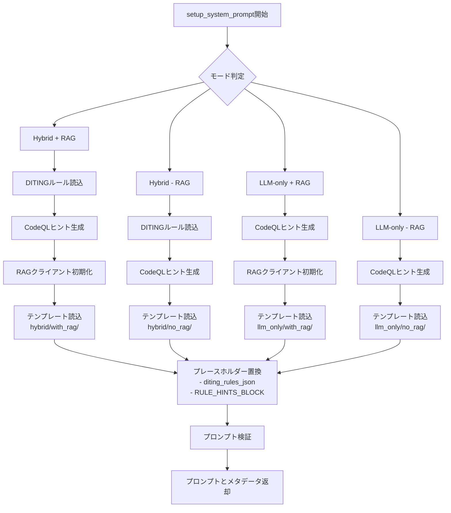

### 3. 関数解析フロー

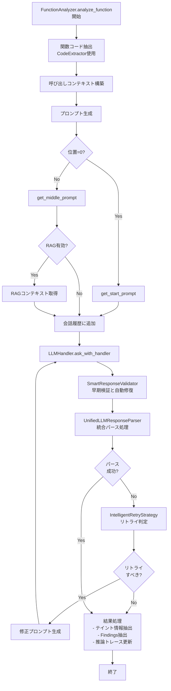

### 4. 統合パーサー処理フロー

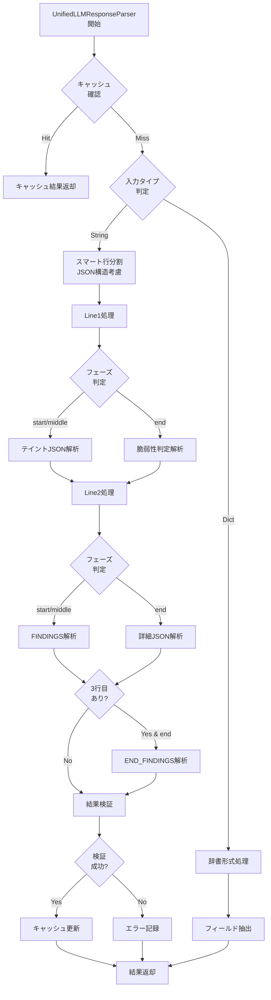

### 5. 脆弱性判定フロー

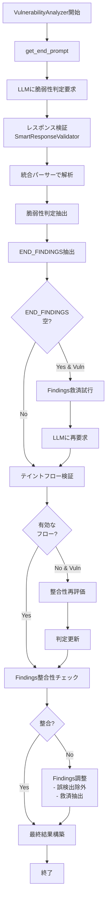

### 6. LLM通信とエラー処理フロー

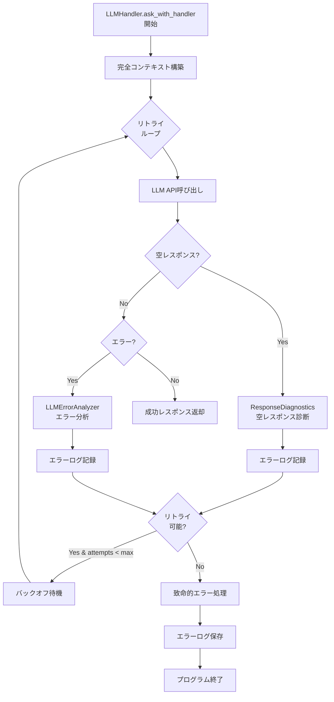

### 7. キャッシュとFindings統合フロー

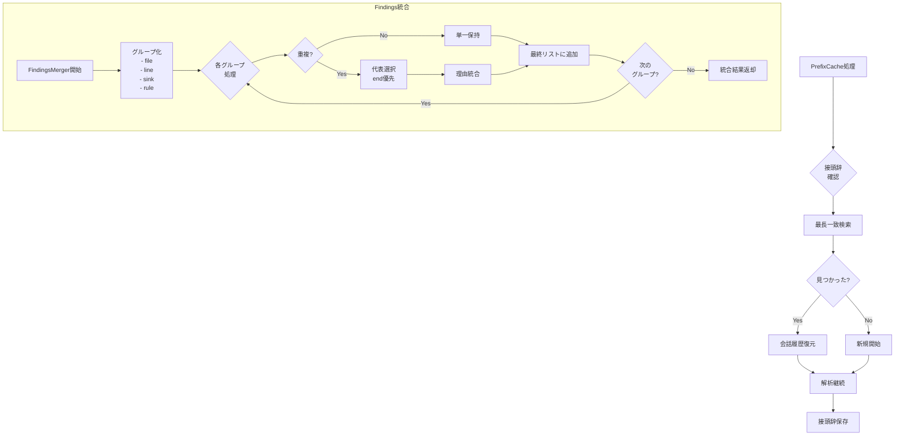

## Phase 6: HTMLレポート生成

### 処理フロー


### サブプロセス詳細

#### ログ解析プロセス
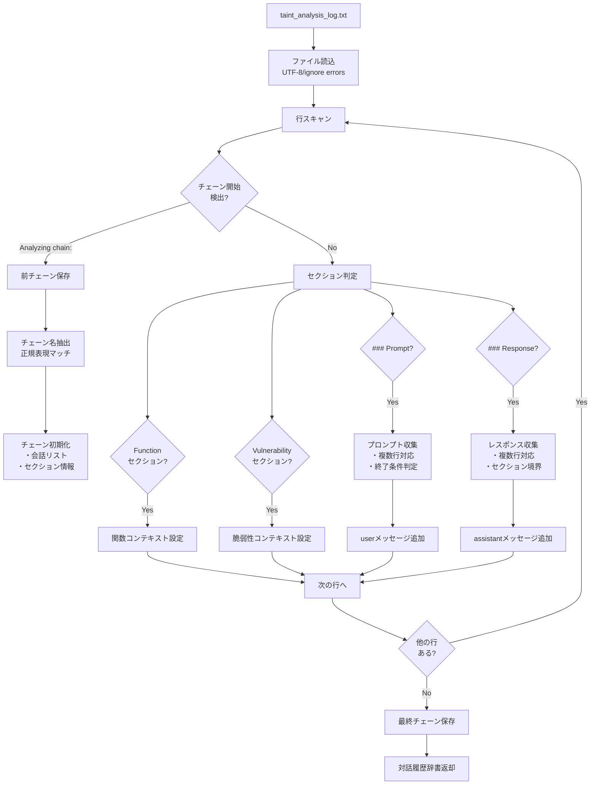

#### HTMLフォーマット処理
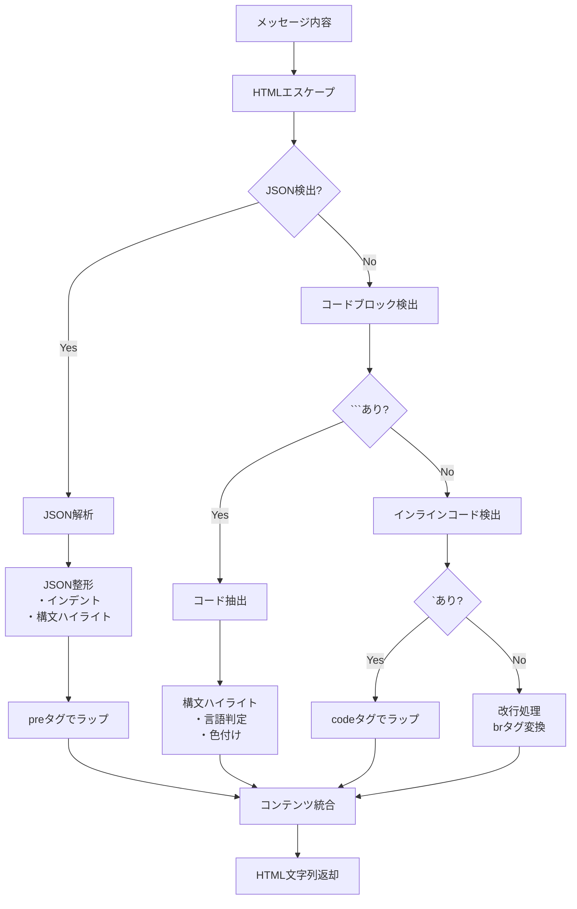

#### 統計計算プロセス
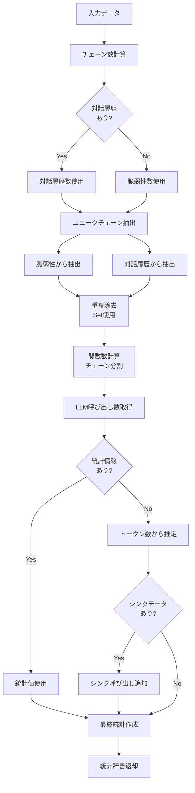

### レポート構成要素

#### 脆弱性レポート構造
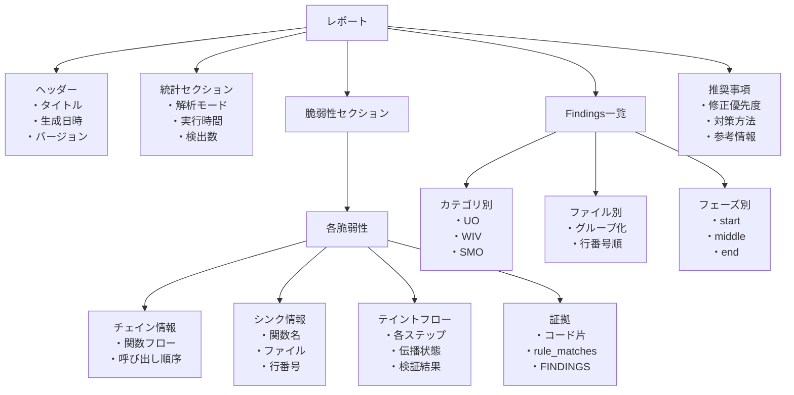

#### 統計ダッシュボード
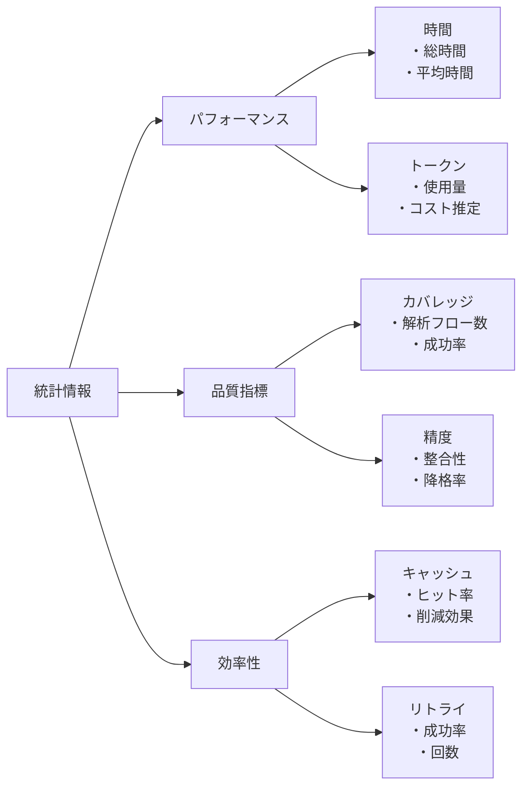

# 番外編
## RAG + LLM 処理フロー

### 1. 初期化フェーズ


### 2. インデックス構築フェーズ


### 3. RAG検索フェーズ

```mermaid
graph TB
    SearchStart([検索開始]) --> CheckSearchType{検索タイプ?}
    
    CheckSearchType -->|シンク解析| SinkAnalysis[search_for_sink_analysis]
    CheckSearchType -->|脆弱性解析| VulnAnalysis[search_for_vulnerability_analysis]
    
    %% シンク解析フロー
    SinkAnalysis --> CreateQueries1[検索クエリ生成<br/>・&quot;api_name&quot; function<br/>・api_name parameters<br/>・api_name description]
    
    CreateQueries1 --> RetrieveSink[retrieve_for_sink_identification]
    RetrieveSink --> SearchByAPI[API優先検索<br/>・search_by_api呼び出し<br/>・メタデータフィルタ]
    
    SearchByAPI --> SecurityKeywords[セキュリティキーワード検索<br/>・security<br/>・vulnerability<br/>・buffer overflow<br/>・validation]
    
    SecurityKeywords --> ScoreDocs1[文書スコアリング<br/>・API定義: +0.5<br/>・セキュリティキーワード: +0.05<br/>・パラメータ記述: +0.1]
    
    ScoreDocs1 --> SortDocs1[スコア降順ソート]
    SortDocs1 --> FilterRegex1[正規表現フィルタ<br/>・api_name完全一致のみ]
    
    FilterRegex1 --> BuildContext1[コンテキスト構築（最大3000文字）]
    BuildContext1 --> APIDef{API定義<br/>あり?}
    
    APIDef -->|Yes| AddAPISection[API定義セクション追加]
    APIDef -->|No| SecuritySection
    
    AddAPISection --> SecuritySection[セキュリティセクション追加]
    SecuritySection --> FormatContext1[コンテキスト整形<br/>・ソース情報付与<br/>・ページ番号付与]
    
    %% 脆弱性解析フロー
    VulnAnalysis --> ExtractFunctions[関数呼び出し抽出<br/>・コードスニペット解析<br/>・TEE関連関数のみ]
    
    ExtractFunctions --> CreateQueries2[複合クエリ生成]
    CreateQueries2 --> Query1[シンク詳細検索<br/>・search_by_api]
    CreateQueries2 --> Query2[パラメータ検証検索<br/>・param validation]
    CreateQueries2 --> Query3[脆弱性パターン検索<br/>・buffer overflow<br/>・integer overflow<br/>・null pointer]
    
    Query1 --> CollectResults
    Query2 --> CollectResults
    Query3 --> CollectResults
    
    CollectResults[結果収集]
    CollectResults --> ScoreDocs2[文書スコアリング<br/>・シンク言及: +0.3<br/>・呼び出し関数: +0.1<br/>・脆弱性キーワード: +0.05<br/>・CWE参照: +0.2]
    
    ScoreDocs2 --> Dedup[重複除去<br/>・ファイル名/ページ番号]
    
    Dedup --> WindowExtract[ウィンドウ抽出<br/>・シンク周辺±500文字]
    
    WindowExtract --> BuildContext2[コンテキスト構築（最大3000文字）]
    BuildContext2 --> SinkInfo{シンク情報<br/>あり?}
    
    SinkInfo -->|Yes| AddSinkSection[シンク情報セクション]
    SinkInfo -->|No| ParamSection
    
    AddSinkSection --> ParamSection[パラメータ検証セクション]
    ParamSection --> VulnPatternSection[脆弱性パターンセクション]
    
    VulnPatternSection --> FormatContext2[コンテキスト整形]
    
    FormatContext1 --> ReturnContext[コンテキスト返却]
    FormatContext2 --> ReturnContext
    
    ReturnContext --> SearchEnd([検索完了])
    
    style SearchStart fill:#e1f5fe
    style SinkAnalysis fill:#fff3e0
    style VulnAnalysis fill:#f3e5f5
    style SearchEnd fill:#c8e6c9
```

### 4. LLM問い合わせフェーズ

```mermaid
graph TB
    LLMStart([LLM処理開始]) --> InitClient[UnifiedLLMClient初期化]
    
    InitClient --> LoadConfig[ConfigManager初期化<br/>・llm_config.json読み込み<br/>・プロバイダー設定確認]
    
    LoadConfig --> CheckProvider{アクティブ<br/>プロバイダー?}
    
    CheckProvider -->|OpenAI| InitOpenAI[OpenAIClient生成]
    CheckProvider -->|Claude| InitClaude[ClaudeClient生成]
    CheckProvider -->|DeepSeek| InitDeepSeek[DeepSeekClient生成]
    CheckProvider -->|Gemini| InitGemini[GeminiClient生成]
    CheckProvider -->|Ollama| InitOllama[LocalLLMClient生成]
    
    InitOpenAI --> BuildPrompt
    InitClaude --> BuildPrompt
    InitDeepSeek --> BuildPrompt
    InitGemini --> BuildPrompt
    InitOllama --> BuildPrompt
    
    BuildPrompt[プロンプト構築]
    BuildPrompt --> SystemPrompt[システムプロンプト]
    BuildPrompt --> RAGContext[RAGコンテキスト挿入]
    BuildPrompt --> UserQuery[ユーザークエリ/コード]
    
    SystemPrompt --> CreateMessages
    RAGContext --> CreateMessages
    UserQuery --> CreateMessages
    
    CreateMessages[メッセージ配列作成<br/>role: system/user/assistant]
    
    CreateMessages --> InitRetry[LLMRetryHandler初期化<br/>・最大リトライ: 3<br/>・基本遅延: 2秒]
    
    InitRetry --> RateLimiter[レート制限待機<br/>・最小間隔: 0.7秒]
    
    RateLimiter --> CallLLM[LLM API呼び出し]
    
    CallLLM --> CheckResponse{レスポンス<br/>検証}
    
    CheckResponse -->|成功| ValidResponse[有効レスポンス]
    CheckResponse -->|空/None| DiagnoseEmpty
    CheckResponse -->|エラー| AnalyzeError
    
    ValidResponse --> ReturnResponse[レスポンス返却]
    
    DiagnoseEmpty[空レスポンス診断]
    DiagnoseEmpty --> ResponseAnalysis[レスポンス分析<br/>・型チェック<br/>・長さ確認<br/>・16進ダンプ]
    DiagnoseEmpty --> PromptAnalysis[プロンプト分析<br/>・文字数<br/>・トークン推定<br/>・特殊文字]
    DiagnoseEmpty --> EnvAnalysis[環境分析<br/>・APIキー確認<br/>・プロバイダー設定<br/>・メモリ使用量]
    DiagnoseEmpty --> APITest[API接続テスト<br/>・簡単なプロンプト送信<br/>・応答時間測定]
    
    ResponseAnalysis --> GenerateDiagnosis
    PromptAnalysis --> GenerateDiagnosis
    EnvAnalysis --> GenerateDiagnosis
    APITest --> GenerateDiagnosis
    
    GenerateDiagnosis[診断レポート生成<br/>・原因リスト<br/>・推奨事項]
    
    AnalyzeError[エラー分析]
    AnalyzeError --> CheckErrorType{エラータイプ?}
    
    CheckErrorType -->|TIMEOUT| TimeoutError[タイムアウト処理]
    CheckErrorType -->|RATE_LIMIT| RateError[レート制限処理]
    CheckErrorType -->|TOKEN_LIMIT| TokenError[トークン制限処理]
    CheckErrorType -->|AUTH_ERROR| AuthError[認証エラー処理]
    CheckErrorType -->|CONTENT_FILTER| ContentError[コンテンツフィルタ処理]
    CheckErrorType -->|その他| UnknownError[不明エラー処理]
    
    GenerateDiagnosis --> CheckRetry
    TimeoutError --> CheckRetry
    RateError --> CheckRetry
    TokenError --> NoRetry
    AuthError --> NoRetry
    ContentError --> NoRetry
    UnknownError --> CheckRetry
    
    CheckRetry{リトライ<br/>判定}
    CheckRetry -->|可能| CalculateDelay[遅延計算<br/>・指数バックオフ<br/>・最大60秒]
    CheckRetry -->|不可| NoRetry
    
    NoRetry[リトライ中止]
    
    CalculateDelay --> WaitDelay[遅延待機]
    WaitDelay --> IncrementAttempt[試行回数+1]
    
    IncrementAttempt --> CheckMaxRetry{最大試行<br/>到達?}
    CheckMaxRetry -->|No| RateLimiter
    CheckMaxRetry -->|Yes| FatalError
    
    NoRetry --> FatalError[致命的エラー処理]
    
    FatalError --> LogError[エラーログ記録<br/>・詳細ログ<br/>・JSON形式<br/>・診断レポート]
    
    LogError --> DisplayError[エラー表示<br/>・エラー履歴<br/>・診断ファイル情報]
    
    DisplayError --> Exit([プログラム終了])
    ReturnResponse --> LLMEnd([LLM処理完了])
    
    style LLMStart fill:#e1f5fe
    style BuildPrompt fill:#fff3e0
    style CallLLM fill:#f3e5f5
    style DiagnoseEmpty fill:#fce4ec
    style FatalError fill:#ffcdd2
    style LLMEnd fill:#c8e6c9
```

### 5. プロバイダー別処理詳細

```mermaid
graph TB
    Provider[プロバイダー処理] --> CheckType{プロバイダー<br/>タイプ?}
    
    CheckType -->|OpenAI系| OpenAIFlow[OpenAI互換処理]
    CheckType -->|Claude| ClaudeFlow[Claude処理]
    CheckType -->|Gemini| GeminiFlow[Gemini処理]
    CheckType -->|Local| LocalFlow[ローカル処理]
    
    %% OpenAI系処理
    OpenAIFlow --> OpenAIClient[OpenAI Client使用]
    OpenAIClient --> CreateCompletion[chat.completions.create&#40;&#41;]
    CreateCompletion --> OpenAIParams[パラメータ設定<br/>・model<br/>・temperature: 0.0<br/>・max_tokens: 4096<br/>・timeout: 60]
    
    %% Claude処理
    ClaudeFlow --> ClaudeClient[Anthropic Client使用]
    ClaudeClient --> ConvertMessages[メッセージ変換<br/>・systemをuserに統合]
    ConvertMessages --> CreateMessage[messages.create&#40;&#41;]
    CreateMessage --> ClaudeParams[パラメータ設定<br/>・model<br/>・temperature: 0.0<br/>・max_tokens: 4096]
    
    %% Gemini処理
    GeminiFlow --> GeminiClient[GenerativeModel使用]
    GeminiClient --> StartChat[start_chat&#40;&#41;初期化]
    StartChat --> MergeSystem[システムメッセージ統合<br/>・最初のuserに結合]
    MergeSystem --> SendMessage[send_message&#40;&#41;]
    SendMessage --> GeminiParams[パラメータ設定<br/>・temperature: 0.0<br/>・max_output_tokens: 8192<br/>・safety_settings]
    
    %% ローカル処理
    LocalFlow --> LocalClient[REST API直接呼び出し]
    LocalClient --> PreparePayload[ペイロード準備<br/>・model<br/>・messages<br/>・stream: false]
    PreparePayload --> PostRequest[POST /api/chat]
    PostRequest --> LocalParams[パラメータ設定<br/>・temperature: 0.0<br/>・num_predict: 4096<br/>・timeout: 120]
    
    OpenAIParams --> ExtractContent
    ClaudeParams --> ExtractContent
    GeminiParams --> ExtractContent
    LocalParams --> ExtractContent
    
    ExtractContent[コンテンツ抽出]
    ExtractContent --> ReturnText[テキスト返却]
    
    style Provider fill:#e1f5fe
    style ExtractContent fill:#c8e6c9
```

### 6. エラー処理とリカバリフロー

```mermaid
graph TB
    ErrorOccur([エラー発生]) --> ErrorAnalyzer[LLMErrorAnalyzer]
    
    ErrorAnalyzer --> CheckException{例外タイプ?}
    
    CheckException -->|HTTPエラー| HTTPAnalysis[HTTP分析<br/>・ステータスコード<br/>・レスポンステキスト]
    CheckException -->|その他| PatternMatch[パターンマッチング]
    
    HTTPAnalysis --> StatusMap{ステータス<br/>コード?}
    
    StatusMap -->|429| CreateRateLimit[RATE_LIMIT生成]
    StatusMap -->|408/504| CreateTimeout[TIMEOUT生成]
    StatusMap -->|401| CreateAuth[AUTH_ERROR生成]
    StatusMap -->|400| Check400{内容確認}
    StatusMap -->|500-503| CreateServer[SERVER_ERROR生成]
    
    Check400 -->|content_filter| CreateFilter[CONTENT_FILTER生成]
    Check400 -->|その他| CreateBadRequest[BAD_REQUEST生成]
    
    PatternMatch --> MatchPatterns{パターン<br/>一致?}
    
    MatchPatterns -->|timeout| CreateTimeout2[TIMEOUT生成]
    MatchPatterns -->|rate/limit| CreateRateLimit2[RATE_LIMIT生成]
    MatchPatterns -->|token/context| CreateTokenLimit[TOKEN_LIMIT生成]
    MatchPatterns -->|filter/blocked| CreateFilter2[CONTENT_FILTER生成]
    MatchPatterns -->|connection| CreateNetwork[NETWORK_ERROR生成]
    MatchPatterns -->|unauthorized| CreateAuth2[AUTH_ERROR生成]
    MatchPatterns -->|なし| CreateUnknown[UNKNOWN_ERROR生成]
    
    CreateRateLimit --> LLMError
    CreateTimeout --> LLMError
    CreateAuth --> LLMError
    CreateFilter --> LLMError
    CreateBadRequest --> LLMError
    CreateServer --> LLMError
    CreateTimeout2 --> LLMError
    CreateRateLimit2 --> LLMError
    CreateTokenLimit --> LLMError
    CreateFilter2 --> LLMError
    CreateNetwork --> LLMError
    CreateAuth2 --> LLMError
    CreateUnknown --> LLMError
    
    LLMError[LLMErrorオブジェクト<br/>・error_type<br/>・message<br/>・details<br/>・timestamp]
    
    LLMError --> ErrorLogger[LLMErrorLogger]
    
    ErrorLogger --> LogDetail[詳細ログ記録<br/>llm_error_details.log]
    ErrorLogger --> LogJSON[JSON記録<br/>llm_errors.json]
    ErrorLogger --> LogDiagnosis[診断記録<br/>llm_diagnosis_report.json]
    
    LogDetail --> RetryDecision
    LogJSON --> RetryDecision
    LogDiagnosis --> RetryDecision
    
    RetryDecision{リトライ<br/>戦略?}
    
    RetryDecision -->|NO_RETRY| StopTypes{エラータイプ?}
    StopTypes -->|AUTH_ERROR| NoRetryAuth[認証エラー<br/>リトライ不可]
    StopTypes -->|TOKEN_LIMIT| NoRetryToken[トークン制限<br/>リトライ不可]
    StopTypes -->|CONTENT_FILTER| NoRetryContent[コンテンツ<br/>リトライ不可]
    
    RetryDecision -->|RETRY| RetryTypes{エラータイプ?}
    RetryTypes -->|TIMEOUT| TimeoutStrategy[タイムアウト戦略<br/>・最大2回]
    RetryTypes -->|RATE_LIMIT| RateStrategy[レート制限戦略<br/>・指数バックオフ<br/>・最大60秒]
    RetryTypes -->|SERVER_ERROR| ServerStrategy[サーバーエラー戦略<br/>・長め遅延<br/>・最大30秒]
    RetryTypes -->|その他| DefaultStrategy[デフォルト戦略<br/>・基本遅延2秒]
    
    NoRetryAuth --> Fatal
    NoRetryToken --> Fatal
    NoRetryContent --> Fatal
    
    TimeoutStrategy --> ExecuteRetry
    RateStrategy --> ExecuteRetry
    ServerStrategy --> ExecuteRetry
    DefaultStrategy --> ExecuteRetry
    
    ExecuteRetry[リトライ実行]
    ExecuteRetry --> Success{成功?}
    
    Success -->|Yes| RecoverSuccess[正常復帰]
    Success -->|No| CheckAttempts{試行回数<br/>チェック}
    
    CheckAttempts -->|残りあり| ExecuteRetry
    CheckAttempts -->|上限到達| Fatal
    
    Fatal[致命的エラー]
    Fatal --> FatalLog[致命的エラーログ<br/>llm_fatal_error.log<br/>llm_fatal_diagnosis.json]
    
    FatalLog --> DisplaySummary[サマリー表示<br/>・エラー履歴<br/>・診断ファイル一覧]
    
    DisplaySummary --> SystemExit[sys.exit&#40;1&#41;]
    RecoverSuccess --> Continue[処理継続]
    
    style ErrorOccur fill:#ffcdd2
    style LLMError fill:#fff3e0
    style Fatal fill:#ef5350
    style RecoverSuccess fill:#c8e6c9
```
