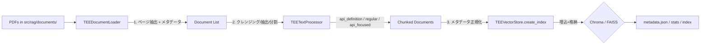

# RAG.md — Retrieval‑Augmented Generation 設計／実装リファレンス

> 本書は `src/rag/` の実装に忠実に、**インデックス構築**・**検索/再ランク**・**LLM 連携用コンテキスト生成**の内部仕様をまとめたものです。設定やビルド方法は割愛し、RAG の機能面に特化します。

---

## 1. コンポーネント概要

* **TEEDocumentLoader** (`document_loader.py`)

  * PDF 読み込み（優先: pdfplumber / 代替: PyPDF2）
  * ページ単位の `Document` 化と **メタデータ付与**（`source`, `page`, `document_type`, `section`, `file_name`, `extraction_method` 等）
  * **API 関数検出**（`TEE_*`, `TEEC_*`, `TA_*`）→ `api_functions`（カンマ区切り）/ `api_count` / `has_api_definitions`
  * **キャッシュ**（`.document_cache.json`）

* **TEETextProcessor** (`text_processor.py`)

  * テキスト **クレンジング**（空白正規化、ヘッダ/フッタの軽除去 等）
  * チャンク分割（RecursiveCharacterTextSplitter）
  * **API 定義チャンク抽出**（`chunk_type=api_definition`、`api_name`/`api_description`/`api_param_count`/`api_return`）
  * **通常チャンク**（`chunk_type=regular`、`api_ref_count`/`referenced_apis`）
  * **重複除去**（内容ハッシュ）

* **TEEVectorStore** (`vector_store.py`)

  * 埋め込み: HuggingFace（`all‑MiniLM‑L6‑v2`）
  * ストア: **Chroma（既定）/ FAISS**
  * **メタデータ正規化**（Chroma 制約: `str/int/float/bool/None`）
  * 保存/読込（`vector_stores/` 以下, `metadata.json` に統計とインデックス情報）
  * **メタデータインデックス**（`api_functions`/`document_types`/`sections`）

* **TEERetriever** (`retriever.py`)

  * 検索戦略: `SIMILARITY` / `API_FOCUSED` / `HYBRID` / `CONTEXTUAL`
  * Sink 同定／脆弱性解析向けの **特化検索**と **再ランク**

* **TEERAGClient** (`rag_client.py`)

  * RAG の **統合クライアント**（読み込み→処理→インデックス化→検索→LLM コンテキスト生成）
  * Phase3/5 用: `search_for_sink_analysis()` / `search_for_vulnerability_analysis()`

---

## 2. インデックス構築パイプライン



### 2.1 ドキュメント読み込み（Loader）

* `pdfplumber` 優先（失敗時 `PyPDF2`）
* `document_type` 推定（ファイル名）
* `section` 推定（先頭 20 行の章/節パターン）
* API 名抽出 → `api_functions`（カンマ区切り）
* 読み込み結果は **キャッシュ**（ページ毎内容＋メタデータ）

### 2.2 テキスト処理（TextProcessor）

* クレンジング（空白正規化・ヘッダ/フッタ等の軽除去）
* **API 定義ブロック抽出**（関数宣言～次の API 開始直前）
* **通常チャンク分割**（オーバーラップあり）
* チャンク内 API 参照抽出 → `referenced_apis`（カンマ区切り）
* 例外時フォールバック（`chunk_type=error_fallback`）

### 2.3 ベクトル化/保存（VectorStore）

* 既定 **Chroma**：前回インデックスを削除し、`doc_000001` 形式で ID 発行
* **FAISS**：`FAISS_ALLOW_DANGEROUS_DESERIALIZATION=true` を環境変数でセット（安全な読込フラグに合わせ）
* `metadata.json` へ統計保存（`total_chunks`, `created_at`, `document_types` など）

---

## 3. メタデータ仕様（主要フィールド）

| フィールド                                                       | 由来        | 型       | 説明                                                              |
| ----------------------------------------------------------- | --------- | ------- | --------------------------------------------------------------- |
| `source`/`file_name`                                        | Loader    | str     | PDFパス / ファイル名                                                   |
| `page`/`total_pages`                                        | Loader    | int     | ページ番号 / 総ページ数                                                   |
| `document_type`                                             | Loader    | str     | `TEE_Internal_API`/`TEE_Client_API`/`GlobalPlatform_Spec`/他     |
| `section`                                                   | Loader    | str     | ページ冒頭の章/節行（無ければ `Page N`）                                       |
| `api_functions`                                             | Loader    | str     | ページに出現した API 名（カンマ区切り）                                          |
| `chunk_type`                                                | Processor | str     | `api_definition` / `regular` / `api_focused` / `error_fallback` |
| `api_name`/`api_description`/`api_param_count`/`api_return` | Processor | str/int | API 定義チャンク用の付加情報                                                |
| `referenced_apis`/`api_ref_count`                           | Processor | str/int | 通常チャンク内で参照された API 名と件数                                          |

> **Chroma 互換**のため、リストは **カンマ区切り文字列**で保存し、辞書は主要フィールドのみに展開。

---

## 4. 検索戦略と再ランク（Retriever）

### 4.1 戦略

* `SIMILARITY`: 純粋な類似度検索（任意の `filter_document_type`）
* `API_FOCUSED`: クエリから API 名抽出 → `search_by_api()` で **API 定義を優先**
* `HYBRID`: 類似度 ＋ API 検索を統合・再ランク
* `CONTEXTUAL`: HYBRID の結果＋**前後ページ**の補助文脈を追加

### 4.2 特化検索

* **シンク同定向け** `retrieve_for_sink_identification(api)`

  * `search_by_api(api)` ＋ `"{api} security"` 等の **セキュリティ系クエリ**
  * 重複除去 → `api_definition` を先頭に再ランク
* **脆弱性解析向け** `retrieve_for_vulnerability_analysis(code, sink, param_idx)`

  * コードから **関数呼出抽出**
  * `search_by_api(sink)` / `"{sink} parameter {idx} validation"` / 関数列パターン / 既知脆弱性語
  * 再ランク要因: sink/呼出し関数/CWE/キーワード（overflow/validation等）

### 4.3 フィルタリング

* **Chroma**: `$in` 等を含む **ネイティブフィルタ**構築
* **FAISS**: 検索後に **手動フィルタ**（`filter_dict` の条件一致）

---

## 5. クエリ実行と結果の後処理（VectorStore/Retriever）

```mermaid
flowchart TD
  Q[query/filter_dict] --> VS{StoreType}
  VS -- Chroma --> CF[convert_to_chroma_filter]\n(similarity_search with filter)
  VS -- FAISS --> SF[similarity_search (k×3) → 手動フィルタ]
  CF --> R1[結果]
  SF --> R1
  R1 --> PP[post_process]\n(api_definitionを先頭へ)
  PP --> TOPK[Top-K返却]
```

* `search_by_api(name)` は類似度で拾った結果から **`api_functions` に name を含むもの**を優先並べ替え。
* 後処理は常に **API 定義チャンクを先頭**へ配置。

---

## 6. LLM 連携用コンテキスト生成（RAGClient）

### 6.1 Sink 解析用 `search_for_sink_analysis(api_name)`

```mermaid
flowchart LR
  A[API名] --> B[複数クエリ生成\n"name"/parameters/description]
  B --> C[Retriever.retrieve_for_sink_identification]
  C --> D[API名の厳密一致でフィルタ]\n(正規表現)
  D --> E[api_definition 優先 + security情報抽出]
  E --> F[上限3000文字\nソース/ページ付与]
  F --> G[\n=== TEE API Documentation for X ===\n## API Definition ...\n## Security Considerations ...\n]
```

* **厳密一致**（`API_NAME`）でノイズ除去
* 先に **API 定義**、続けて **Security Considerations**（overflow/validation 等を含む断片）
* 文字数上限（約 3000 chars）

### 6.2 テイント解析用 `search_for_vulnerability_analysis(code, sink, idx)`

```mermaid
flowchart TD
  A[code, sink, param_idx] --> B[Retriever.retrieve_for_vulnerability_analysis]
  B --> C[別名マップ + 正規表現\nmemmove/snprintf 等]
  C --> D[スコアリング\n(sink/param語/CWE/overflow/validation)]
  D --> E[カテゴリ分割\n sink_docs/param_docs/vuln_docs]
  E --> F[重複除去\n(file_name,page)]
  F --> G[ウィンドウ抽出\n±500 around sink]
  G --> H[上限3000文字\nセクション別連結]
  H --> I[\n=== TEE Security Documentation (RAG) ===\n- Use ONLY the following context ...\n## sink Security Information:\n...]
```

* **未初期化時は空文字**（プロンプト汚染を避ける）
* 断片には **\[Source: file, Page N]** を付記

---

## 7. 永続化・統計

* `vector_stores/metadata.json` に保存される統計例

  * `store_type`, `embedding_model`, `total_chunks`, `index_created_at/last_updated_at`
  * メタデータインデックス: `api_functions`/`document_types`/`sections`（キー→ドキュメントID群）
* `TEERAGClient.get_statistics()` は Loader の概要（ファイル数・ページ数・API 検出数）と VectorStore 統計を集約

---

## 8. 例外・フォールバック

* Loader: pdfplumber 失敗 → PyPDF2／失敗時は空
* TextProcessor: 処理失敗 → `error_fallback` チャンクを 1 つ作成
* VectorStore: 検索例外 → 空配列返却
* RAGClient: 未初期化 → sink 用はエラーメッセージ、vuln 用は空文字（静かに失敗）

---

## 9. 制約・設計ノート

* **Chroma 互換**重視：メタデータはプリミティブ／カンマ区切り文字列に正規化
* 既定で **CPU 推論**（必要に応じ `device='cuda'` に変更可）
* コンテキストは **最大約 3000 文字**で切詰め（LLM 入力の安定性を優先）
* 再ランクは **セキュリティ語**・**CWE**・**sink/関数列一致**を重視

---

### 付録: 主な API（擬似シグネチャ）

```text
TEEDocumentLoader.load_all_documents() -> List[Document]
TEETEXTProcessor.process_documents(docs) -> List[Document]
TEEVectorStore.create_index(chunks) -> None
TEEVectorStore.similarity_search(query, k, filter_dict) -> List[Document]
TEEVectorStore.search_by_api(api_name, k) -> List[Document]
TEERetriever.retrieve(query, SearchConfig) -> List[Document]
TEERetriever.retrieve_for_sink_identification(api_name) -> List[Document]
TEERetriever.retrieve_for_vulnerability_analysis(code, sink, idx) -> List[Document]
TEERAGClient.search_for_sink_analysis(api_name) -> str
TEERAGClient.search_for_vulnerability_analysis(code, sink, idx) -> str
TEERAGClient.get_statistics() -> Dict
```

---

## 10. 運用ノート（RAG\_SETUP.md の要点反映）

**メタデータ正規化（Chroma互換）**

* Chroma は `str/int/float/bool/None` のみ受理。**リストや辞書は保存不可**のため、格納前に正規化します。

  * 例: `api_functions: ["TEE_Malloc","TEE_Free"] → "TEE_Malloc,TEE_Free"`
  * 例: `api_info: {description: "..."} → api_info_description: "..."`
* 実装上は `sanitize_metadata_for_chroma()` で変換してから `Chroma.from_documents()` へ渡します。

**エラーハンドリング強化**

* Loader/Processor/Indexer 各段に try/except を追加。**失敗時も解析継続**し、フォールバックチャンクや空配列を返します。

**デフォルト・ストアの選定**

* 既定を **Chroma** に設定（メタデータフィルタが強力で運用安定）。
* FAISS→Chroma へ移行時は **旧インデックスを削除**して再構築が必要。

**コード差分の代表例**（要旨）

```python
# document_loader.py
# doc.metadata["api_functions"] = list(found_apis)
# →
doc.metadata["api_functions"] = ",".join(sorted(found_apis))

# text_processor.py
# metadata["referenced_apis"] = list(api_refs)
# →
metadata["referenced_apis"] = ",".join(sorted(api_refs))

# vector_store.py（格納直前）
sanitized = sanitize_metadata_for_chroma(doc.metadata)
self.vector_store = Chroma.from_documents([...Document(metadata=sanitized)...])

# rag_client.py（デフォルト）
store_type = "chroma"
```

---

## 11. デプロイ/検証チェックリスト（参考）

**インデックスのリセット**

* 旧 `vector_stores/` を削除してから再構築。

**RAGクライアント単体検証（期待ログ）**

```
[INFO] Initializing embedding model: sentence-transformers/all-MiniLM-L6-v2
[INFO] No existing index found. Run build_index() to create one.
[INFO] Building RAG index...
[INFO] Created Chroma vector store with X documents
[INFO] Index built successfully in X.X seconds
```

**システム統合時（期待ログ）**

```
[INFO] RAG mode enabled. Initializing RAG system...
[INFO] Loaded existing vector index  # or Building RAG index...
```

**成功判定**

* Chromaの型エラーが出ない（`Expected metadata value to be a str...` が**出ない**）
* 解析プロンプトに `## RAG Context:` が含まれる

**トラブルシュート**

* Chroma バージョン確認（`chromadb>=0.4.0` 推奨）
* メタデータの型をデバッグ出力で点検
* `documents/` 配下に PDF が存在するか確認

**移行の注意**

* FAISS→Chroma 移行ではインデックス互換なし。**再構築必須**
* 初回構築は数分要する場合あり／ChromaのDBは数十MB程度

