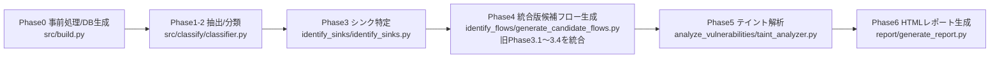

System_README.mdをProcess_Flow.mdの最新の構成に合わせて更新します。主な変更点は、Phase3.1〜3.7がPhase4に統合されたことと、細かな処理フローの変更です。

# System README — OP-TEE TA LLM Taint Analysis (Phases 0–6)

> 本書は **各フェーズの処理・機能・出力・フェーズ間フロー**を、アップロードされた実装に忠実に説明する内部仕様ドキュメントです。セットアップ手順やクイックビルドなどの手引きは含めません。

---

## 0. 全体アーキテクチャ（概観）

### データフロー（E2E）



### 生成物（主な中間/最終成果）

* `ta/compile_commands.json`
* `ta/results/<TA>_phase12.json`
* `ta/results/<TA>_sinks.json`
* `ta/results/<TA>_vulnerabilities.json`
* `ta/results/<TA>_vulnerability_report.html`
* `ta/results/time.txt`（実行時間記録）

> 用語: **CDF (Candidate Data Flows)** = 指定ソース関数から sink までの候補チェーン（最小集合）。

---

## Phase0 — 依存関係クリーンアップ & DB構築（`src/build.py`）

### 目的

* 古い依存ファイル（`.d`、`.o`）を削除してビルド不整合を回避
* 解析の基盤となる `compile_commands.json` を **TA ディレクトリに限定**した形で用意

### 主な処理

* **依存関係クリーンアップ**: `clean_project_dependencies(proj_path, verbose)`
  * プロジェクト全体の `.d` ファイルを走査
  * 古いツールチェーンパス（`/mnt/disk/toolschain`）を含むファイルを削除
  * `.o` ファイルも削除
  * 各ディレクトリで `make clean` を試行（エラーは無視）

* **DB生成**: `ensure_ta_db(ta_dir, project_root, devkit, verbose)`
  * 複数のビルドコマンドを優先順で試行:
    1. `build.sh` があれば `bear -- ./build.sh`
    2. `ndk_build.sh` があれば `bear -- ./ndk_build.sh`
    3. `Makefile` があれば `bear -- make`
    4. `ta/Makefile` があれば `bear -- make -C ta V=1`
    5. CMake設定があれば cmake でコンパイルDB生成
  * 失敗時はダミーDB生成（全 `.c` ファイルから合成）

### 出力

* `ta/compile_commands.json`（TA限定）

---

## Phase1-2 — 関数分類（`src/classify/classifier.py`）

### 目的

* プロジェクト内の **ユーザ定義関数** と **外部宣言/マクロ** を厳密に分離

  ### 主な処理
  
  * **対象APIの絞込**: Phase1–2の結果から **実際にユーザ関数内で呼ばれている外部関数のみ**を候補に。
  * **判定モード**:
  
    * 既定: **ハイブリッド**（既知シンクはルール/パターンで確定、未知/曖昧はLLMへ）
    * `--llm-only`: ルールを用いず**LLM単独**。
  * **RAG**: 任意で有効化可能。OP‑TEE API 仕様PDFなどのベクトル検索で**根拠片**をプロンプトに添付。
  * **LLM呼出**: `llm_settings/*`（プロバイダ抽象化） + `llm_error_handler.py`（リトライ/診断）。
  * **出力**: `*_sinks.json`
  
  ```json
  {
    "sinks": [
      {"name": "TEE_MemMove", "param_index": 1, "reason": "destination may overflow", "by": "llm|rule"},
      ...
    ],
    "analysis_mode": "hybrid|llm_only",
    "token_usage": {"input": 1234, "output": 567}
  }
  ```

  ---

## Phase3 — シンク特定（`src/identify_sinks/identify_sinks.py`）

### 目的

* ユーザコードから呼び出される外部関数のうち、セキュリティ上重要な**シンク関数**を特定

### 主な処理

* **実際に呼ばれる外部関数の抽出**: Phase1-2の結果から使用中の関数のみ候補に
* **LLM判定**: 
  * 常に `--llm-only` モードで実行（main.pyのデフォルト）
  * RAGオプション（`--rag` / `--no-rag`）
  * トークン追跡オプション（`--track-tokens` / `--no-track-tokens`）

### 出力（`<TA>_sinks.json`）

```json
{
  "sinks": [
    {"function": "TEE_MemMove", "param_index": 0, "reason": "..."},
    ...
  ],
  "statistics": {...}
}
```

---

## Phase4 — 統合版候補フロー生成（`src/identify_flows/generate_candidate_flows.py`）

### 目的

* **旧Phase3.1～3.4を統合**した新実装
* ソース関数からシンクまでの呼び出しチェーンを効率的に生成

### 主な処理（統合版）

1. **初期化と入力読み込み**:
   * `compile_commands.json`、`sinks.json`、`phase12.json` を読み込み
   * デバッグマクロの扱い（`--include-debug-macros` オプション）

2. **ASTベースのコード解析**:
   * libclangで全ソースファイルをパース
   * 関数定義と呼び出し関係を抽出
   * マクロ展開の処理（`trace_printf` → 元のマクロ名復元）

3. **シンク呼び出しの検出**:
   * 各関数内でシンク関数の呼び出しを検出
   * 呼び出し位置（ファイル、行番号）を記録

4. **コールグラフ構築と逆方向探索**:
   * callee → callers の逆インデックスを構築
   * シンクを含む関数から逆方向にトレース
   * ソース関数（エントリポイント）に到達するパスを探索

5. **フロー最適化**:
   * 同一シンク・同一チェーンの `param_index` をマージ（`param_indices`）
   * 重複除去
   * サブチェーン除去（同じ行のみ）
   * 同一関数内の複数行シンクをマージ

### デバッグマクロの扱い

* デフォルトでは除外（DMSG、IMSG、EMSG、FMSG など）
* `--include-debug-macros` オプションで含める

### 出力（`<TA>_candidate_flows.json`）

```json
[
  {
    "chain": ["TA_InvokeCommandEntryPoint", "process_cmd", "TEE_MemMove"],
    "file": "ta/user_ta.c",
    "line": 120,
    "sink_function": "TEE_MemMove",
    "param_indices": [0, 1]
  }
]
```

---

## Phase5 — テイント解析 / 脆弱性判定（`src/analyze_vulnerabilities/taint_analyzer.py`）

  ### 目的
  
  * CDF（Candidate Data Flows）を入力に、**関数チェーンを start → middle → end の段階解析**で追跡し、各ステップで **二行契約（Two‑line contract）**に従う構造化出力を取得。
  * 途中の **FINDINGS** を逐次収集し、末尾で **END_FINDINGS を優先**してマージ。:contentReference[oaicite:1]{index=1}
  * ハイブリッド（**DITING ルール + CodeQL 由来ヒント**）/ LLM‑only、および **RAG 有無**の 4 構成に対応。:contentReference[oaicite:2]{index=2} :contentReference[oaicite:3]{index=3} :contentReference[oaicite:4]{index=4}

### 主な処理

1. **初期設定**:
   * 解析モード設定（hybrid/llm_only × rag有無）
   * プロンプトテンプレート読み込み
   * LLMクライアント初期化

2. **フロー単位の解析**:
   * 各候補フローを関数チェーンとして解析
   * 関数コード抽出
   * LLMによる段階的テイント追跡
   * JSON形式の構造化レスポンス取得

3. **整合性チェック**:
   * テイントフローの検証
   * Findings の一貫性確認
   * 誤検出の除去

4. **結果統合**:
   * Findings のマージ（END優先）
   * 重複除去
   * 統計情報の集計

  ### ディレクトリ構成（抜粋）
  ```bash
  src/analyze_vulnerabilities/
  ├── taint_analyzer.py          # フェーズドライバ（CLI）
  ├── core/                      # 解析中核（分割）
  │   ├── taint_analyzer_core.py
  │   ├── function_analyzer.py
  │   ├── findings_merger.py
  │   ├── consistency_checker.py
  │   └── llm_handler.py
  ├── parsing/                   # パーサ/JSON修復
  │   ├── vulnerability_parser.py
  │   ├── json_repair.py
  │   └── code_extractor.py
  ├── io_handlers/               # 会話/ログ/Markdown要約
  │   ├── conversation.py
  │   ├── logger.py
  │   └── report_generator.py
  ├── optimization/              # 接頭辞キャッシュ/トークン計測
  │   ├── chain_tree.py
  │   ├── prefix_cache.py
  │   └── token_tracking_client.py
  └── prompts/                   # 4モードのテンプレ管理
      └── prompts.py
  ```
  
  * **会話管理**はチェーン毎に履歴をリセット（トークン削減）し、system→user→assistant の履歴を最小構成で維持します。:contentReference[oaicite:5]{index=5}
  * **ロガー**は高速バッチ書き込み＋長文セクション出力に対応しています。:contentReference[oaicite:6]{index=6}
  * **トークン計測**は `TokenTrackingClient` を介して**推定**し、総トークン/呼び出し回数を集計します。:contentReference[oaicite:7]{index=7}
  
  ### 実行エントリ（CLI）
  
  * `src/analyze_vulnerabilities/taint_analyzer.py`
    * 主要引数: `--flows`（CDF）, `--phase12`, `--output`, `--provider`, `--no-diting-rules`, `--no-enhanced-prompts`, `--no-rag`, `--track-tokens`, `--no-cache` 等。:contentReference[oaicite:8]{index=8}
    * モード切替: `set_analysis_mode("hybrid"|"llm_only", use_rag)` / `set_rag_enabled(...)`。テンプレは `/prompts/vulnerabilities_prompt/<mode>/<no_rag|with_rag>/*.txt` からロード。:contentReference[oaicite:9]{index=9}
  
  ### DITING ルール＆CodeQL ヒントの注入
  
  * **DITING ルール JSON**と**ルールヒントブロック**を **system.txt** に埋め込み。`codeql_rules.json` にある `detection_rules[*].rule_id` は**ホワイトリスト**として扱い、各応答の `rule_matches.rule_id` は原則この集合（＋`other`）に制限。:contentReference[oaicite:10]{index=10} :contentReference[oaicite:11]{index=11} :contentReference[oaicite:12]{index=12}
  * 具体的な注入処理は `setup_diting_rules_enhanced()` 内で行い、`{diting_rules_json}` と `{RULE_HINTS_BLOCK}` を system テンプレに展開。:contentReference[oaicite:13]{index=13}
  
  ### プロンプトの 4 構成とロード
  
  * `hybrid/llm_only × with_rag/no_rag` の 4 組合せを `PromptManager` が切替。`get_start_prompt / get_middle_prompt / get_middle_prompt_multi_params / get_end_prompt` を経由してテンプレ読み込み＆変数展開。:contentReference[oaicite:14]{index=14}
  * RAG 有効時は、最終シンク関数・引数に基づき検索した**根拠断片**を `rag_context` として middle 系プロンプトに注入します。:contentReference[oaicite:15]{index=15}
  
  ### 出力**契約**（二行プロトコル）
  
  * **start / middle** ステップ  
    **1行目**：  
    `{"function":"<name>","propagation":[],"sanitizers":[],"sinks":[],"evidence":[],"rule_matches":{"rule_id":[],"others":[]}}`  
    **2行目**：  
    `FINDINGS={"items":[{...}]}`（空なら `[]`）は，   
      - 中間検出として出力する。
      - シンク関数に到達しない脆弱性（例: forループによる境界不備）も含めて列挙する。
      - Recall（見逃し防止）を優先して、候補を広めに拾ってよい。
    * ガードレール：`TEE_Malloc/TEE_Free` は **非シンク**、`TEE_GenerateRandom` の出力は**機微でない**等。:contentReference[oaicite:16]{index=16} :contentReference[oaicite:17]{index=17} :contentReference[oaicite:18]{index=18}
    * **multi‑params** 版も同契約（解析対象パラメータを独立追跡）。:contentReference[oaicite:19]{index=19} :contentReference[oaicite:20]{index=20}
  * **end** ステップ  
    **1行目**：`{"vulnerability_found":"yes"|"no"}`  
    **2行目**：`yes` の場合は CWE/Severity/Flow/Exploitability 等を含む **厳密 JSON**、`no` の場合は否定根拠＋有効化されたサニタイザ一覧等。  
    **3行目**：`END_FINDINGS={"items":[...]}`は `FINDINGS` と同様。
      - **最終出力の簡潔なリスト**。
      - **シンクに到達する脆弱性は含めない**。  
        → それらは詳細 JSON（CWE 番号や taint_flow_summary などを含む大きい方）でのみ報告する。  
      - **シンクに到達しない脆弱性だけを列挙する**。  
        例: 固定長配列への無限コピー、ループによる境界不備、境界チェック欠如など。
      - Precision（誤検出抑制）を意識して記述する。
  
  > **system.txt** には OP‑TEE/TrustZone 固有の前提とガードレール、`rule_matches` の必須性/順序、DITING パーティショニングルールが明示されています（**変更禁止の機械可読ブロック**）。:contentReference[oaicite:22]{index=22}
  
  実行フロー（関数ステップのシーケンス図）
  ```mermaid
  sequenceDiagram
    participant Core as TaintAnalyzerCore
    participant CE as CodeExtractor
    participant PM as PromptManager
    participant CM as ConversationManager
    participant LLM as LLM Provider
    participant VP as VulnerabilityParser
  
    loop for each chain (prefix-cached)
      Core->>CM: start_new_chain()
      Core->>CE: 関数/シンク周辺コードの抽出
      Core->>PM: 該当テンプレ読込 + RAG文脈(任意)
      PM-->>Core: system/start|middle|end プロンプト
      Core->>CM: user メッセージ追加
      CM->>LLM: chat.completion（リトライ/診断付き）
      LLM-->>CM: 応答（two-line contract）
      Core->>VP: 1行目JSON + FINDINGS抽出/修復
      Note right of Core: FINDINGS を逐次蓄積
    end
    Core->>LLM: endプロンプト送信（最終判定）
    LLM-->>Core: vulnerability_found + END_FINDINGS
    Core->>VP: END_FINDINGS抽出
    Note right of Core: END を優先して FINDINGS 統合
  ```
  
  * 会話管理はチェーン毎に履歴を最小化（system + 当該プロンプトのみ）。
  * ロギングはバッチ/長文に強い StructuredLogger を使用。
  * CLI/モード/プロンプト読込は taint_analyzer.py と prompts/prompts.py による。
  
  ### 出力（<TA>_vulnerabilities.json 概略）

  ```json
{
  "statistics": {
    "analysis_date": "...",
    "analysis_time_formatted": "...",
    "llm_provider": "...",
    "analysis_mode": "hybrid|llm_only",
    "rag_enabled": true,
    "cache_enabled": true,
    "total_chains_analyzed": 42,
    "functions_analyzed": 99,
    "llm_calls": 120,
    "cache_stats": {"hits": 12, "misses": 30, "hit_rate": "28.6%"},
    "findings_stats": {"total_collected": 10, "end_findings": 3, ...},
    "token_usage": {"total_tokens": 39656, ...}
  },
  "total_flows_analyzed": 8,
  "vulnerabilities_found": 3,
  "vulnerabilities": [
    {
      "vd": {"file":"ta/a.c","line":120,"sink":"TEE_MemMove","param_index":1},
      "chain": ["TA_InvokeCommandEntryPoint","process","copy_buf","TEE_MemMove"],
      "taint_analysis": [{"function":"...","analysis":"<two-line text>", "..."}],
      "vulnerability": "<end step raw>",
      "vulnerability_details": {"details":{"vulnerability_type":"CWE-787","...":"..."}},
      "reasoning_trace": [{"taint_state": {...}, "risk_indicators": ["..."]}],
      "inline_findings": [{"id":"...","rule":"...","file":"...","line":120}]
    }
  ],
  "inline_findings": [ { "...": "merged (END優先)" } ]
}

  ```
  * `statistics`（日時、モード、RAG、キャッシュ、LLM 呼数、トークン、Findings 集計など）  
  * `vulnerabilities`（チェイン単位の決定・詳細・トレース・FINDINGS）  
  * `inline_findings`（全体横断の統合済み FINDINGS）  
  （保存は `taint_analyzer.py` が担当）:contentReference[oaicite:29]{index=29}
  
  ---

## Phase6 — HTMLレポート生成（`src/report/generate_report.py`）

### 目的

* 解析結果を人間が読みやすいHTMLレポートに変換

### 主な処理

1. **入力ファイル読み込み**:
   * `vulnerabilities.json`（または `_with_macros` 版）
   * `phase12.json`
   * `sinks.json`（オプション）
   * `taint_analysis_log.txt`（会話履歴）

2. **ログ解析**:
   * LLMとの会話履歴を抽出
   * チェーン名でグループ化
   * プロンプト/レスポンスのペアを整形

3. **統計情報計算**:
   * 解析チェーン数
   * 検出脆弱性数
   * LLM呼び出し回数

4. **HTML生成**:
   * テンプレートにデータを埋め込み
   * 折りたたみ可能なセクション
   * 視覚的なダッシュボード

### 出力

* `ta/results/<TA>_vulnerability_report.html`

---

## 実行時間記録

各プロジェクトの解析完了後、`ta/results/time.txt` に以下の情報を記録:

* プロジェクト名・TA名
* 解析モード（Hybrid/LLM-only、RAG有無、マクロ含有）
* 開始・終了時刻
* 総実行時間
* 各フェーズの実行時間と割合

---

## 付録A — 主要な設定オプション

### main.py のオプション

```bash
# 基本実行
python3 main.py -p benchmark/project

# 解析モード変更
python3 main.py -p benchmark/project --llm-only        # LLMのみ
python3 main.py -p benchmark/project --rag             # RAG有効化
python3 main.py -p benchmark/project --include-debug-macros  # マクロ含む

# その他
python3 main.py -p benchmark/project --skip-clean      # クリーンアップスキップ
python3 main.py -p benchmark/project --no-track-tokens  # トークン追跡無効化
```

### 解析モードの組み合わせ

| オプション | 解析モード | RAG | デバッグマクロ |
|-----------|-----------|-----|--------------|
| (デフォルト) | Hybrid | No | 除外 |
| `--rag` | Hybrid | Yes | 除外 |
| `--llm-only` | LLM-only | No | 除外 |
| `--llm-only --rag` | LLM-only | Yes | 除外 |
| `--include-debug-macros` | Hybrid | No | 含む |
| `--llm-only --rag --include-debug-macros` | LLM-only | Yes | 含む |

---

## 付録B — エラーハンドリング

各フェーズでエラーが発生した場合:

1. エラーメッセージを表示
2. verboseモードでは詳細なスタックトレース
3. 適切な終了コードで終了
4. 部分的な結果は保存される

---

> 本ドキュメントは実装の変更に応じて随時更新されます。