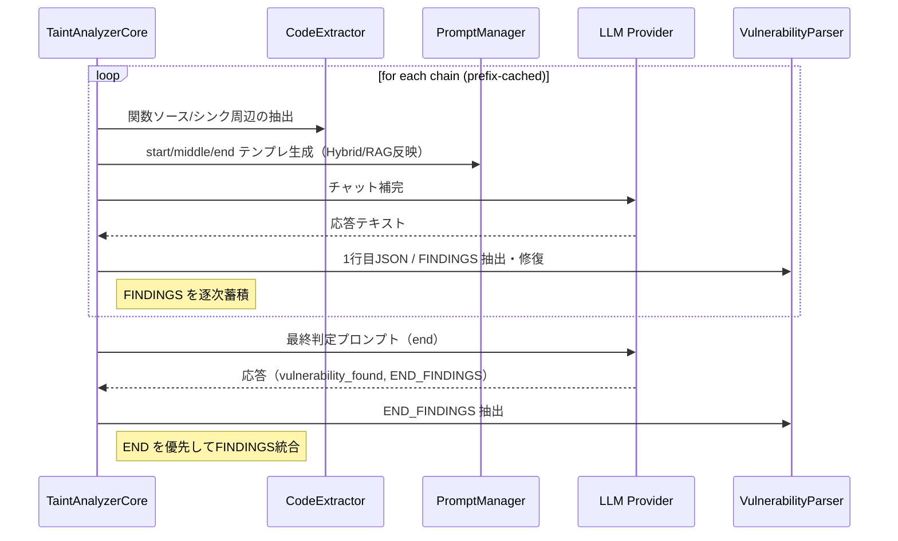

# System README — OP‑TEE TA LLM Taint Analysis (Phases 0–6)

> 本書は **各フェーズの処理・機能・出力・フェーズ間フロー**を、アップロードされた実装に忠実に説明する内部仕様ドキュメントです。セットアップ手順やクイックビルドなどの手引きは含めません。

---

## 0. 全体アーキテクチャ（概観）

### データフロー（E2E）

```mermaid
flowchart LR
  A[Phase0 事前処理/DB生成<br/>src/build.py] --> B[Phase1–2 抽出/分類<br/>src/classify/classifier.py]
  B --> C1[Phase3.1 シンク同定<br/>identify_sinks.py]
  C1 --> C2[Phase3.2 シンク呼出抽出<br/>find_sink_calls.py]
  C2 --> C3[Phase3.3 呼出グラフ生成<br/>generate_call_graph.py]
  C3 --> C4[Phase3.4–3.6 関数列チェーン生成<br/>function_call_chains.py]
  C4 --> C5[Phase3.7 VDとチェーンの結合<br/>extract_sink_calls.py]
  C5 --> D[Phase4 候補フロー生成 (CDF)<br/>identify_flows/generate_candidate_flows.py]
  D --> E[Phase5 テイント解析/脆弱性判定<br/>analyze_vulnerabilities/taint_analyzer.py]
  E --> F[Phase6 レポート生成<br/>report/generate_report.py]
```

### 生成物（主な中間/最終成果）

* `ta/compile_commands.json`
* `ta/results/<TA>_phase12.json`（ユーザ定義/外部宣言）
* `ta/results/<TA>_sinks.json`
* `ta/results/<TA>_vulnerable_destinations.json`（VD；最終はチェーン結合後の構造）
* `ta/results/<TA>_call_graph.json`
* `ta/results/<TA>_chains.json`
* `ta/results/<TA>_candidate_flows.json`（CDF）
* `ta/results/<TA>_vulnerabilities.json`
* `ta/results/<TA>_vulnerability_report.html`

> 用語: **VD (Vulnerable Destination)** = `{file,line,sink,param_index}` で一意なシンク到達点。**CDF** = 指定ソース関数から sink までの候補チェーン（最小集合）。

---

## Phase0 — 事前処理 / コンパイルDB生成（`src/build.py`）

### 目的

* 解析の基盤となる `compile_commands.json` を **TA ディレクトリに限定**した形で用意し、以降のAST解析を安定化。
* 古い依存ファイル（`.d`）や `.o` の掃除でビルド不整合を回避。

### 主な処理

* **依存ファイル掃除**: `clean_stale_dependencies(base)`

  * `base` 以下の `.d` を走査し、内容に古いツールチェーン痕跡（例: `/mnt/disk/toolschain`）を含むものを削除。
* **DB生成（優先順）**: `_try_build(base)`

  * `bear -- make` / `bear -- make -C ta` / `bear -- ./build.sh` / CMake などを順に試行。
  * 成功した場所の `compile_commands.json` を採用。
* **ダミー生成**: `_gen_dummy(ta_dir, target, devkit)`

  * `ta_dir` 配下の `*.c` から **最低限のエントリ**を合成。
  * 実DBの件数が `ta/*.c` より少なければ**ダミーで補完**。
* **TA限定DBの保存**: `ensure_ta_db(ta_dir, project_root, devkit)`

  * ルート/`ta/` のどちらで得た DB でも、**`ta_dir` 相対のエントリのみ抽出**して `ta/compile_commands.json` に保存。

### 出力

* `ta/compile_commands.json`（TA限定）。

---

## Phase1–2 — 機能抽出/分類（`src/classify/classifier.py` + `src/parsing/*`）

### 目的

* プロジェクト内の **ユーザ定義関数** と **外部宣言/マクロ** を厳密に分離。

### 主な処理

* **AST抽出**: `parsing.parse_sources_unified()` が `compile_commands.json` を読み、libclang でTUを生成（`-I ta/include` / `-I <DEVKIT>/include` などを前処理で整える）。
* **関数・マクロ列挙**: `parsing.extract_functions()` / `parsing` 内部の走査で宣言/定義/マクロを収集。
* **識別子の一意化**: `static` 関数は `name@file`、非staticは `name` でキー化。
* **前方宣言の扱い**: 同名の**定義がプロジェクト内にある宣言**は外部扱いにしない（=スキップ）。
* **マクロの扱い**: `ta/include` 直下のマクロは外部群へ、それ以外の定数マクロはノイズとして無視（関数マクロのみ反映）。

### 出力（`<TA>_phase12.json` の概略スキーマ）

```json
{
  "users": [
    {"kind": "function", "name": "foo", "file": "ta/a.c", "line": 42, "is_definition": true, "static": false, ...},
    ...
  ],
  "externals": [
    {"kind": "function", "name": "TEE_Invoke", "file": "ta/include/...", "line": 10, "is_definition": false, ...},
    {"kind": "macro", "name": "TEE_PARAM_TYPES", "file": "ta/include/...", "args": 4, ...}
  ]
}
```

---

## Phase3 — シンク特定〜チェーン生成（`src/identify_sinks/*` + `src/parsing/*`）

> Phase3 は 3.1–3.7 のサブフェーズに分割され、**LLM と ルール のハイブリッド**、**RAG（任意）**、および **AST/DF解析** が有機的に連携します。

### 3.1 シンク同定（`identify_sinks.py`）

* **対象APIの絞込**: Phase1–2の結果から **実際にユーザ関数内で呼ばれている外部関数のみ**を候補に。
* **判定モード**:

  * 既定: **ハイブリッド**（既知シンクはルール/パターンで確定、未知/曖昧はLLMへ）
  * `--llm-only`: ルールを用いず**LLM単独**。
* **RAG**: 任意で有効化可能。OP‑TEE API 仕様PDFなどのベクトル検索で**根拠片**をプロンプトに添付。
* **LLM呼出**: `llm_settings/*`（プロバイダ抽象化） + `llm_error_handler.py`（リトライ/診断）。
* **出力**: `*_sinks.json`

```json
{
  "sinks": [
    {"name": "TEE_MemMove", "param_index": 1, "reason": "destination may overflow", "by": "llm|rule"},
    ...
  ],
  "analysis_mode": "hybrid|llm_only",
  "token_usage": {"input": 1234, "output": 567}
}
```

### 3.2 シンク呼び出し抽出（`find_sink_calls.py`）

* `compile_commands.json` からTUを作り、**シンク名集合**をキーに `CALL_EXPR` を探索。
* **`param_index` を展開**: 同一呼び出しに対して、複数 `param_index` があれば**行単位で複製**。
* **重複除去キー**: `(file, line, sink, param_index)`。
* **出力**（初期VDリスト）: `*_vulnerable_destinations.json`

```json
[
  {"file":"ta/a.c","line":120,"sink":"TEE_MemMove","param_index":1},
  ...
]
```

### 3.3 呼び出しグラフ生成（`generate_call_graph.py`）

* 全関数の**定義位置**を先に走査して辞書化（`definitions[func] = {file,line}`）。
* 各関数本体から `CALL_EXPR` を列挙して **有向エッジ** を作成。
* **エッジ要素**: `caller, caller_file, caller_line, callee, call_file, call_line`（重複は6要素でユニーク化）。
* **出力**: `*_call_graph.json`

```json
{
  "edges": [
    {"caller":"foo","caller_file":"ta/a.c","caller_line":80,
     "callee":"bar","call_file":"ta/a.c","call_line":95},
    ...
  ],
  "definitions": {"foo": {"file":"ta/a.c","line":60}, ...}
}
```

### 3.4–3.6 関数列チェーン生成（`function_call_chains.py`）

* **VDの属する関数**を特定し、その関数内で**該当 `param_index` に係る変数**を**後方データフロー**で推定（保守的近似）。
* 呼び出しグラフを **callee→caller** 方向に逆引きDFSし、**エントリへ向かう関数列**を構築。
* **完全版解析**では簡易的な**関数サマリ**（パラメータ→出力/戻り値・グローバル読書き・ポインタ更新の有無）を作って伝播精度を改善。簡易版にフォールバック可能。
* **出力**: `*_chains.json`

```json
[
  {
    "vd": {"file":"ta/a.c","line":120,"sink":"TEE_MemMove","param_index":1},
    "chains": [
      ["TA_InvokeCommandEntryPoint","process","copy_buf","TEE_MemMove"],
      ...
    ]
  },
  ...
]
```

### 3.7 VDとチェーンの結合（`extract_sink_calls.py`）

* 3.2 の初期VDと 3.4–3.6 のチェーンを **同一キー `(file,line,sink,param_index)`** でマージし、**最終版VDリスト**として書き戻し（上書き）。
* **出力**（最終）: `*_vulnerable_destinations.json`

```json
[
  {"vd": {"file":"ta/a.c","line":120,"sink":"TEE_MemMove","param_index":1},
   "chains": [["TA_InvokeCommandEntryPoint","process","copy_buf","TEE_MemMove"]]}
]
```

---

## Phase4 — 候補フロー生成（CDF；`src/identify_flows/generate_candidate_flows.py`）

### 目的

* Phase3の関数列から、**指定ソース関数**（例: `TA_InvokeCommandEntryPoint`, `TA_OpenSessionEntryPoint`）を起点にした**有効サフィックス**のみを残し、**冗長/重複**を削って **最小集合の候補フロー**を得る。

### 主な処理

1. **サフィックス抽出**: 各チェーンで**最初に現れるソース**から末尾（sink）までを1本の候補に。
2. **最長優先**: 同一 `(file,line,sink,param_index,source_func)` グループでは**最長サフィックス**のみ採用。
3. **サブチェーン除去**: 同一VD内で他候補の**部分列**になっているチェーンを削除。
4. **`param_indices` 統合**: `(file,line,sink,chain)` が同じ候補は、複数 `param_index` を **`param_indices`** にまとめる（互換用に `param_index` は代表値で残す）。

### 入出力（`<TA>_candidate_flows.json`）

```json
[
  {
    "vd": {"file":"ta/a.c","line":120,"sink":"TEE_MemMove","param_index":1, "param_indices":[1,2]},
    "chains": [["TA_InvokeCommandEntryPoint","process","copy_buf","TEE_MemMove"]],
    "source_func": "TA_InvokeCommandEntryPoint",
    "source_params": []
  }
]
```

> 備考: `--sources` は**トップレベルでカンマ区切り**、要素内でセミコロン区切りや `func:arg1,arg2` 表記を許容（現行ロジックでは `source_params` は付帯情報でフィルタには未使用）。

---

## Phase5 — テイント解析/脆弱性判定（`src/analyze_vulnerabilities/*`）

### 目的

* CDFを入力に**チェーンを関数ごと**に段階解析（start → middle → end）し、**途中のFindingsを逐次収集**しつつ、末尾で **脆弱性有無を確定**。
* ハイブリッド（DITINGルール併用）/ LLM-only、RAG有無に対応。**接頭辞キャッシュ**で重複解析を抑制し、**トークン計測**を任意で有効化。

### 主要コンポーネント

* **`taint_analyzer.py`**（オーケストレータ）

  * 入力: `flows.json`（CDF）, `phase12.json`。
  * オプション: `--no-diting-rules`（= LLM-only）, `--no-rag`, `--track-tokens`, `--generate-summary`, `--no-cache`（非推奨）。
  * 役割: 実行設定/統計初期化 → チェーン解析実行 → 結果JSON保存（必要に応じてMarkdownサマリ）。

* **`taint_analyzer_core.py`**（解析コア）

  * \*\*チェーン木（prefix tree）\*\*を構築し、**接頭辞キャッシュ**で同一部分の再解析を回避。
  * 各関数ステップで **プロンプト生成**（`prompts.py`）→ **LLM呼出**（プロバイダ抽象＋リトライ）→ **応答保存**。
  * **FINDINGS/END\_FINDINGS** を抽出して蓄積。チェーン末尾で `{"vulnerability_found":"yes|no"}` を読み取り、**END優先でマージ**。

* **`prompts.py`**（テンプレ管理）

  * 構成: `hybrid/llm_only × with_rag/no_rag × (system, taint_start, taint_middle, taint_middle_multi_params, taint_end)`。
  * Hybrid 時は **DITINGルール/ヒント**を system prompt 等へ注入。

* **`code_extractor.py`**（コードコンテキスト抽出）

  * 関数定義/シンク周辺の **必要最小限のソース** を行番号付きで切り出してプロンプトへ埋め込み。

* **`conversation.py`**（会話管理）

  * **チェーンごとに履歴をリセット**し、必要プロンプトだけを連結してトークン増加を抑制。

* **`vulnerability_parser.py` + `json_repair.py`**（応答パース/修復）

  * 1行目JSON（`propagation/sanitizers/sinks/rule_matches` など）と、本文中の `FINDINGS = {...}` / `END_FINDINGS = {...}` を**緩い正規表現 + JSON修復**で抽出。
  * `phase` 正規化（start/middle/end）、`file/line/function/sink_function` 欠損を補完、**行バケット**や `rule_id` から **12桁ハッシュID** を採番。

* **`token_tracking_client.py`**（トークン計測; 任意）

  * 入出力トークン数/呼数の集計と統計出力。

* **`logger.py`**（構造化ログ）

  * 高頻度I/Oでも落ちにくい書き出し方式、チェーン/関数ステップ単位のイベントを追跡。

* **`utils.py`**（整形/集計ユーティリティ）

  * `format_time_duration`, `truncate_string`, `deduplicate_findings`（近接行での重複統合）など。

### 処理フロー（関数ステップのループ）



### 出力（`<TA>_vulnerabilities.json` 概略スキーマ）

```json
{
  "statistics": {
    "started_at": "...", "elapsed": "...",
    "mode": "hybrid|llm_only", "rag": true,
    "calls": {"count": 42},
    "tokens": {"input": 12345, "output": 6789},
    "cache": {"enabled": true, "hits": 12, "misses": 30}
  },
  "total_flows_analyzed": 8,
  "vulnerabilities_found": 3,
  "vulnerabilities": [
    {
      "vd": {"file":"ta/a.c","line":120,"sink":"TEE_MemMove","param_index":1},
      "chain": ["TA_InvokeCommandEntryPoint","process","copy_buf","TEE_MemMove"],
      "decision": {"vulnerability_found": "yes", "explanation": "..."},
      "inline_findings": [{"id":"abc123...","rule":"...","file":"...","line":120,"why":"..."}],
      "llm_responses": {"start":"...","middle":["..."],"end":"..."}
    }
  ],
  "inline_findings": [
    {"id":"abc123...","category":"...","rule":"...","file":"...","line":120,"function":"copy_buf","why":"..."}
  ]
}
```

---

## Phase6 — HTMLレポート生成（`src/report/generate_report.py` + `html_template.html`）

### 目的

* Phase5の結果JSONとログを取りまとめ、**ダッシュボード形式のHTML**に整形。

### 主な処理

* **テンプレ適用**: `html_template.html` を読み込み、統計・カード・表を埋め込み。
* **サマリ**: 総解析件数、検出件数、Severity別件数、関数数、**トークン使用量**（Sink/TA別と合計）、**キャッシュ統計**。
* **脆弱性カード**: 関数列（ソース→…→sink）・CWE/Severity・**シンク行前後のコード抜粋**（該当行ハイライト）・説明・タイムライン（存在時）・Judge/Refuterメタ（存在時）。
* **Inline Findings 表**: 途中検出の横断リスト。`utils.deduplicate_findings` の近接行統合に対応。
* **対話履歴の取り込み**: `<vulnerabilities.json>` 同ディレクトリの `taint_analysis_log.txt` を自動パースし、**チェーンごとのLLM対話**を折りたたみで表示。

### 出力

* `ta/results/<TA>_vulnerability_report.html`

---

## 付録A — AST/DF 解析ユニット（`src/parsing/*`）

* **`parse_sources_unified()`**: `compile_commands.json` を前処理し、`-I ta/include` と `<DEVKIT>/include` を適切に注入。`--target=armv7a-none-eabi` 等も整え、**エラー診断を出しつつTUを返す**（可能な限り継続）。
* **`find_function_calls(tu, targets)`**: 関数本体から `CALL_EXPR` を列挙し、`targets`（関数名集合）に一致する呼出し地点を抽出。
* **`DataFlowAnalyzer`**: 関数内の**後方データフロー**。代入・関数呼出・メンバ/配列/単項演算を保守的に扱い、**シンクに影響する形のパラメータ**を推定。
* **関数間解析（`function_call_chains.py`）**: callee→caller で逆引きDFS、簡易**関数サマリ**で伝播を補強、最大深さや循環検出を備える。

---

## 付録B — LLM/RAG/ルールの役割（実装内での使われ方）

* **LLM**: Phase3（シンク同定）と Phase5（テイント解析）で利用。プロンプトは `prompts/` に分割配置され、**モード（Hybrid/LLM-only）×RAG有無**で切り替え。
* **RAG**: 任意機能。OP‑TEEのAPI仕様PDFをベクトル化して**根拠片**を近傍検索し、プロンプトへ添付。
* **ルール（DITING/CodeQL）**: Phase3で**既知シンクの確定**、Phase5で**system prompt のヒント**に注入（Hybrid）。
* **エラーハンドリング**: `llm_error_handler.py` が**再試行/診断**を統一実装。空応答・レート制限・タイムアウト時の処置を標準化。

---

## 付録C — 重複と途中検出の扱い

* **途中検出**: 各関数ステップの応答から `FINDINGS = {...}` を逐次抽出して蓄積。
* **最終確定**: 末尾の `END_FINDINGS` と `{"vulnerability_found":"yes|no"}` を採り、**END優先で**Findings を統合。
* **LLM計算の重複回避**: チェーンの**接頭辞キャッシュ**で同一部分の再問い合わせをスキップ。
* **表示重複の抑制**: `utils.deduplicate_findings` により、近接行（例: line±2）を同一グループとして集計。

---

## 付録D — 出力契約（まとめ）

* **`<TA>_phase12.json`**: `users[]`, `externals[]`。
* **`<TA>_sinks.json`**: `sinks[]`, `analysis_mode`, `token_usage`（任意）。
* **`<TA>_vulnerable_destinations.json`**（初期）: `[{file,line,sink,param_index}]`。
* **`<TA>_call_graph.json`**: `edges[]`, `definitions{}`。
* **`<TA>_chains.json`**: `[{vd:{...}, chains:[[...], ...]}]`。
* **`<TA>_candidate_flows.json`**: `[{vd:{...}, chains:[[...]], source_func, source_params}]`（`param_indices` を含む場合あり）。
* **`<TA>_vulnerabilities.json`**: `statistics`, `total_flows_analyzed`, `vulnerabilities_found`, `vulnerabilities[]`, `inline_findings[]`。
* **`<TA>_vulnerability_report.html`**: 画面表示用HTML（テンプレ+データ埋め込み）。

---

## 付録E — 出力ファイル依存関係（フローチャート）

> 生成物間の**前後関係と依存**を示します（実装に基づく）。`--sources` は設定入力（ファイルではない）として破線で示しています。

```mermaid
flowchart LR
  subgraph P0[Phase0 事前処理 / DB生成]
    CC[ta/compile_commands.json]
  end

  subgraph P12[Phase1–2 抽出/分類]
    PH12[<TA>_phase12.json]
  end

  subgraph P3[Phase3 シンク〜チェーン]
    SINKS[<TA>_sinks.json]
    VD0[<TA>_vulnerable_destinations.json
(initial)]
    CG[<TA>_call_graph.json]
    CHAINS[<TA>_chains.json]
    VDF[<TA>_vulnerable_destinations.json
(final)]
  end

  subgraph P4[Phase4 候補フロー（CDF）]
    CDF[<TA>_candidate_flows.json]
    SOURCES([--sources 指定])
  end

  subgraph P5[Phase5 テイント解析]
    VULN[<TA>_vulnerabilities.json]
    LOG[taint_analysis_log.txt]
  end

  subgraph P6[Phase6 レポート]
    REP[<TA>_vulnerability_report.html]
  end

  CC --> PH12
  PH12 --> SINKS
  CC --> VD0
  SINKS --> VD0
  CC --> CG
  CC --> CHAINS
  VD0 --> CHAINS
  CG --> CHAINS
  CHAINS --> VDF
  SINKS --> VDF
  CHAINS --> CDF
  SOURCES -.-> CDF
  PH12 -.-> VULN
  CDF --> VULN
  VULN --> LOG
  VULN --> REP
  PH12 --> REP
  SINKS --> REP
  LOG --> REP
```

**メモ**

* `extract_sink_calls.py` が `VD(initial)` と `chains` を結合し、**`VD(final)` に上書き**します。
* `generate_candidate_flows.py` は `chains` と `--sources` から **最長 & 非部分列**のチェーンのみ採用し、`param_indices` を統合します。
* `taint_analyzer.py` は `candidate_flows.json` と `phase12.json`（関数定義情報）を参照して解析します。
* `generate_report.py` は `vulnerabilities.json` / `phase12.json` / `sinks.json` と同ディレクトリの `taint_analysis_log.txt` を読み込み、HTMLを生成します。

---

## 付録F — LLMの使用フロー（フローチャート）

> LLMは **Phase3（シンク同定）** と **Phase5（テイント解析）** で利用されます。RAGは任意機能、Hybrid時のみDITINGルールを注入します。**現行の `main.py` は Phase3 を既定で `--llm-only` で呼び出します**（必要に応じて切替可能な実装）。

### F-1. Phase3: シンク同定のLLMフロー

```mermaid
flowchart LR
  A[開始: シンク同定 identify_sinks.py] --> B{モード}
  B -- Hybrid --> R[ルール/パターン照合
(DITING/CodeQL)]
  R -- ヒット --> S1[シンク集合へ追加]
  R -- ミス --> P1
  B -- LLM-only --> P1[PromptManager: sinks_prompt
(with/without RAG)]
  P1 --> C{RAG 有効?}
  C -- はい --> RC[RAG Client -> Retriever -> VectorStore
→ コンテキスト断片]
  C -- いいえ --> N[外部文脈なし]
  RC --> M
  N --> M[メッセージ構築 (system+user)
+ ルールヒント(必要に応じ)]
  M --> U[Unified LLM Client
(config_manager.py)]
  U --> E[llm_error_handler: リトライ/診断]
  E --> X[LLM応答]
  X --> O[抽出: 関数名 + param_index
(正規表現/JSONパース)]
  O --> S1
  S1 --> Z[<TA>_sinks.json]
```

### F-2. Phase5: テイント解析のLLMフロー

```mermaid
flowchart TD
  A[開始: CDFごと] --> T{接頭辞キャッシュに
ヒット?}
  T -- はい --> NXT[未解析部分のみへ]
  T -- いいえ --> NXT
  NXT --> L[ループ: チェーンの各関数]
  L --> CE[CodeExtractor: 関数/シンク周辺の
ソース抽出]
  CE --> PM[PromptManager: start/middle/end
テンプレ選択 + Hybrid/RAG反映]
  PM --> RAG{RAG 有効?}
  RAG -- はい --> RC[RAG Client -> Retriever -> VectorStore
→ コンテキスト断片]
  RAG -- いいえ --> NO[外部文脈なし]
  RC --> MSG
  NO --> MSG[ConversationManager: 履歴最小化
+ メッセージ構築]
  MSG --> U[Unified LLM Client]
  U --> EH[llm_error_handler: リトライ/診断]
  EH --> RESP[LLM応答]
  RESP --> VP[VulnerabilityParser: 1行目JSON + FINDINGS抽出]
  VP --> L
  L --> END{チェーン末尾?}
  END -- いいえ --> L
  END -- はい --> EP[最終プロンプト(end)の送信]
  EP --> ER[最終応答: vulnerability_found
+ END_FINDINGS]
  ER --> MER[END優先でFINDINGS統合
+ 重複除去]
  MER --> OUT[チェーン結果に保存]
  OUT --> AGG[全チェーン集約 → <TA>_vulnerabilities.json]
```

**補足**

* **トークン計測**は `TokenTrackingClient` が LLM呼出の周縁で計測（オプション）。
* **Hybrid時のルール注入**は `prompts/system.txt` に DITING/CodeQL ヒントを埋め込みます。
* **Docker想定の絶対パス**（`/workspace/prompts/...`）とローカル実行時の相対パスの差異に注意（実装は両対応のフォールバックあり）。

---

> 本付録は、コード変更に応じて随時更新します。
