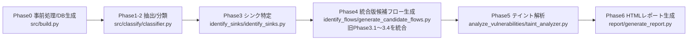
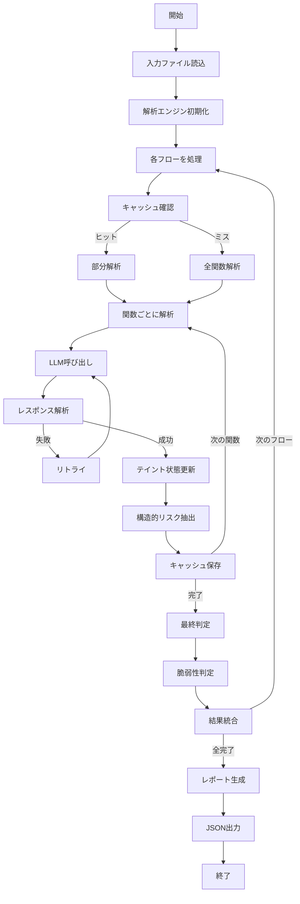

System_README.mdをProcess_Flow.mdの最新の構成に合わせて更新します。主な変更点は、Phase3.1〜3.7がPhase4に統合されたことと、細かな処理フローの変更です。

# System README — OP-TEE TA LLM Taint Analysis (Phases 0–6)

> 本書は **各フェーズの処理・機能・出力・フェーズ間フロー**を、アップロードされた実装に忠実に説明する内部仕様ドキュメントです。セットアップ手順やクイックビルドなどの手引きは含めません。

---

## 0. 全体アーキテクチャ（概観）

### データフロー（E2E）



### 生成物（主な中間/最終成果）

* `ta/compile_commands.json`
* `ta/results/<TA>_phase12.json`
* `ta/results/<TA>_sinks.json`
* `ta/results/<TA>_vulnerabilities.json`
* `ta/results/<TA>_vulnerability_report.html`
* `ta/results/time.txt`（実行時間記録）

> 用語: **CDF (Candidate Data Flows)** = 指定ソース関数から sink までの候補チェーン（最小集合）。

---

## Phase0 — 依存関係クリーンアップ & DB構築（`src/build.py`）

### 目的

* 古い依存ファイル（`.d`、`.o`）を削除してビルド不整合を回避
* 解析の基盤となる `compile_commands.json` を **TA ディレクトリに限定**した形で用意

### 主な処理

* **依存関係クリーンアップ**: `clean_project_dependencies(proj_path, verbose)`
  * プロジェクト全体の `.d` ファイルを走査
  * 古いツールチェーンパス（`/mnt/disk/toolschain`）を含むファイルを削除
  * `.o` ファイルも削除
  * 各ディレクトリで `make clean` を試行（エラーは無視）

* **DB生成**: `ensure_ta_db(ta_dir, project_root, devkit, verbose)`
  * 複数のビルドコマンドを優先順で試行:
    1. `build.sh` があれば `bear -- ./build.sh`
    2. `ndk_build.sh` があれば `bear -- ./ndk_build.sh`
    3. `Makefile` があれば `bear -- make`
    4. `ta/Makefile` があれば `bear -- make -C ta V=1`
    5. CMake設定があれば cmake でコンパイルDB生成
  * 失敗時はダミーDB生成（全 `.c` ファイルから合成）

### 出力

* `ta/compile_commands.json`（TA限定）

---

## Phase1-2 — 関数分類（`src/classify/classifier.py`）

### 目的

* プロジェクト内の **ユーザ定義関数** と **外部宣言/マクロ** を厳密に分離

  ### 主な処理
  
  * **対象APIの絞込**: Phase1–2の結果から **実際にユーザ関数内で呼ばれている外部関数のみ**を候補に。
  * **判定モード**:
  
    * 既定: **ハイブリッド**（既知シンクはルール/パターンで確定、未知/曖昧はLLMへ）
    * `--llm-only`: ルールを用いず**LLM単独**。
  * **RAG**: 任意で有効化可能。OP‑TEE API 仕様PDFなどのベクトル検索で**根拠片**をプロンプトに添付。
  * **LLM呼出**: `llm_settings/*`（プロバイダ抽象化） + `llm_error_handler.py`（リトライ/診断）。
  * **出力**: `*_sinks.json`
  
  ```json
  {
    "sinks": [
      {"name": "TEE_MemMove", "param_index": 1, "reason": "destination may overflow", "by": "llm|rule"},
      ...
    ],
    "analysis_mode": "hybrid|llm_only",
    "token_usage": {"input": 1234, "output": 567}
  }
  ```

  ---

## Phase3 — シンク特定（`src/identify_sinks/identify_sinks.py`）

### 目的

* ユーザコードから呼び出される外部関数のうち、セキュリティ上重要な**シンク関数**を特定

### 主な処理

* **実際に呼ばれる外部関数の抽出**: Phase1-2の結果から使用中の関数のみ候補に
* **LLM判定**: 
  * 常に `--llm-only` モードで実行（main.pyのデフォルト）
  * RAGオプション（`--rag` / `--no-rag`）
  * トークン追跡オプション（`--track-tokens` / `--no-track-tokens`）

### 出力（`<TA>_sinks.json`）

```json
{
  "sinks": [
    {"function": "TEE_MemMove", "param_index": 0, "reason": "..."},
    ...
  ],
  "statistics": {...}
}
```

---

## Phase4 — 統合版候補フロー生成（`src/identify_flows/generate_candidate_flows.py`）

### 目的

* **旧Phase3.1～3.4を統合**した新実装
* ソース関数からシンクまでの呼び出しチェーンを効率的に生成

### 主な処理（統合版）

1. **初期化と入力読み込み**:
   * `compile_commands.json`、`sinks.json`、`phase12.json` を読み込み
   * デバッグマクロの扱い（`--include-debug-macros` オプション）

2. **ASTベースのコード解析**:
   * libclangで全ソースファイルをパース
   * 関数定義と呼び出し関係を抽出
   * マクロ展開の処理（`trace_printf` → 元のマクロ名復元）

3. **シンク呼び出しの検出**:
   * 各関数内でシンク関数の呼び出しを検出
   * 呼び出し位置（ファイル、行番号）を記録

4. **コールグラフ構築と逆方向探索**:
   * callee → callers の逆インデックスを構築
   * シンクを含む関数から逆方向にトレース
   * ソース関数（エントリポイント）に到達するパスを探索

5. **フロー最適化**:
   * 同一シンク・同一チェーンの `param_index` をマージ（`param_indices`）
   * 重複除去
   * サブチェーン除去（同じ行のみ）
   * 同一関数内の複数行シンクをマージ

### デバッグマクロの扱い

* デフォルトでは除外（DMSG、IMSG、EMSG、FMSG など）
* `--include-debug-macros` オプションで含める

### 出力（`<TA>_candidate_flows.json`）

```json
[
  {
    "chain": ["TA_InvokeCommandEntryPoint", "process_cmd", "TEE_MemMove"],
    "file": "ta/user_ta.c",
    "line": 120,
    "sink_function": "TEE_MemMove",
    "param_indices": [0, 1]
  }
]
```

---

# Phase5 — テイント解析 / 脆弱性判定（`src/analyze_vulnerabilities`）

## 目的

LLMを活用してTrusted Application（TA）のソースコードに対するテイント解析を実行し、REE（Rich Execution Environment）とTEE（Trusted Execution Environment）間のデータフローにおける脆弱性を検出する。

### 検出対象
- **CWE-200**: 情報漏洩（Unencrypted Output to REE）
- **CWE-787**: バッファオーバーフロー（Out-of-bounds Write）
- **CWE-20**: 入力検証不備（Weak Input Validation）
- **構造的リスク**: テイントされたループ境界、ポインタ演算など

## 主な処理

1. **フロー解析**: Phase3で特定された関数チェーンを順次解析
2. **テイント追跡**: REEから入力されたデータの伝播を追跡
3. **脆弱性判定**: シンク関数への到達と緩和策の有無を評価
4. **キャッシュ活用**: プレフィックスキャッシュによる解析の高速化
5. **統合レポート**: 同一行の複数問題を統合して報告

## フォルダ構造

```
.
├── __init__.py
├── cache
│   ├── __init__.py
│   └── function_cache.py        # プレフィックスキャッシュ管理
├── core
│   ├── __init__.py
│   ├── engine.py                # メイン解析エンジン
│   └── flow_analyzer.py         # 単一フロー解析器
├── llm
│   ├── __init__.py
│   └── conversation.py          # LLM会話コンテキスト管理
├── output
│   ├── __init__.py
│   ├── conversation_logger.py   # 会話履歴記録
│   └── json_reporter.py         # JSON形式レポート生成
├── parsing
│   ├── __init__.py
│   └── response_parser.py       # LLMレスポンス解析
├── prompts
│   ├── __init__.py
│   ├── code_extractor.py        # ソースコード抽出
│   └── prompts.py               # プロンプトテンプレート管理
└── taint_analyzer.py            # エントリポイント
```

## 出力契約

### 入力
- `ta_candidate_flows.json`: Phase3で抽出された候補フロー
- `ta_phase12.json`: Phase1/2の解析データ（AST情報など）

### 出力: `ta_vulnerabilities.json`

```json
{
  "metadata": {
    "analysis_date": "ISO8601形式",
    "mode": "llm|diting|hybrid",
    "llm_provider": "openai|anthropic"
  },
  "statistics": {
    "total_flows_analyzed": "解析フロー数",
    "vulnerabilities_found": "検出脆弱性数",
    "structural_risks_found": "構造的リスク数",
    "execution_time_seconds": "実行時間"
  },
  "vulnerabilities": [
    {
      "vulnerability_id": "VULN-XXXX",
      "file": "ファイルパス",
      "line": "行番号",
      "consolidated": true,
      "vulnerability_types": ["CWE-XXX"],
      "severity": "critical|high|medium|low",
      "rule_ids": ["ルールID配列"],
      "descriptions": ["説明配列"],
      "chains": [["関数チェーン"]],
      "taint_flow_summaries": [{}],
      "exploitation_analyses": [{}],
      "missing_mitigations": [{}]
    }
  ],
  "structural_risks": [
    {
      "finding_id": "RISK-XXXX",
      "file": "ファイルパス",
      "line": "行番号",
      "consolidated": true,
      "rules": ["ルール配列"],
      "phases": ["検出フェーズ"],
      "descriptions": ["説明配列"]
    }
  ]
}
```

### 会話ログ: `conversations.jsonl`
各LLMとのやり取りをJSONL形式で記録

## 実行フロー



### 実行コマンド

```bash
# 基本実行
python3 taint_analyzer.py \
  --flows ta_candidate_flows.json \
  --phase12 ta_phase12.json \
  --output ta_vulnerabilities.json

# 詳細ログ付き
python3 taint_analyzer.py \
  --flows ta_candidate_flows.json \
  --phase12 ta_phase12.json \
  --output ta_vulnerabilities.json \
  --verbose

# キャッシュクリア
python3 taint_analyzer.py \
  --flows ta_candidate_flows.json \
  --phase12 ta_phase12.json \
  --output ta_vulnerabilities.json \
  --no-cache
```

### 主要パラメータ

| パラメータ | 説明 | デフォルト |
|-----------|------|------------|
| `--mode` | 解析モード（llm/diting/hybrid） | hybrid |
| `--rag` | RAG有効化 | False |
| `--no-cache` | キャッシュ無効化 | False |
| `--verbose` | 詳細出力 | False |
  ---

## Phase6 — HTMLレポート生成（`src/report/generate_report.py`）

### 目的

* 解析結果を人間が読みやすいHTMLレポートに変換

### 主な処理

1. **入力ファイル読み込み**:
   * `vulnerabilities.json`（または `_with_macros` 版）
   * `phase12.json`
   * `sinks.json`
   * `conversations.jsonl`（会話履歴）

2. **ログ解析**:
   * LLMとの会話履歴を抽出
   * チェーン名でグループ化
   * プロンプト/レスポンスのペアを整形

3. **統計情報計算**:
   * 解析チェーン数
   * 検出脆弱性数
   * LLM呼び出し回数

4. **HTML生成**:
   * テンプレートにデータを埋め込み
   * 折りたたみ可能なセクション
   * 視覚的なダッシュボード

### 出力

* `ta/results/<TA>_vulnerability_report.html`

---

## 実行時間記録

各プロジェクトの解析完了後、`ta/results/time.txt` に以下の情報を記録:

* プロジェクト名・TA名
* 解析モード（Hybrid/LLM-only、RAG有無、マクロ含有）
* 開始・終了時刻
* 総実行時間
* 各フェーズの実行時間と割合

---

## 付録A — 主要な設定オプション

### main.py のオプション

```bash
# 基本実行
python3 main.py -p benchmark/project

# 解析モード変更
python3 main.py -p benchmark/project --llm-only        # LLMのみ
python3 main.py -p benchmark/project --rag             # RAG有効化
python3 main.py -p benchmark/project --include-debug-macros  # マクロ含む

# その他
python3 main.py -p benchmark/project --skip-clean      # クリーンアップスキップ
python3 main.py -p benchmark/project --no-track-tokens  # トークン追跡無効化
```

### 解析モードの組み合わせ

| オプション | 解析モード | RAG | デバッグマクロ |
|-----------|-----------|-----|--------------|
| (デフォルト) | Hybrid | No | 除外 |
| `--rag` | Hybrid | Yes | 除外 |
| `--llm-only` | LLM-only | No | 除外 |
| `--llm-only --rag` | LLM-only | Yes | 除外 |
| `--include-debug-macros` | Hybrid | No | 含む |
| `--llm-only --rag --include-debug-macros` | LLM-only | Yes | 含む |

---

## 付録B — エラーハンドリング

各フェーズでエラーが発生した場合:

1. エラーメッセージを表示
2. verboseモードでは詳細なスタックトレース
3. 適切な終了コードで終了
4. 部分的な結果は保存される

---

> 本ドキュメントは実装の変更に応じて随時更新されます。