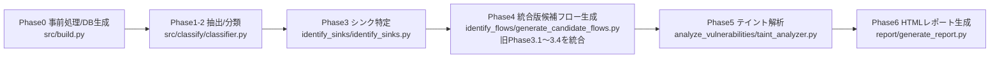

System_README.mdをProcess_Flow.mdの最新の構成に合わせて更新します。主な変更点は、Phase3.1〜3.7がPhase4に統合されたことと、細かな処理フローの変更です。

# System README — OP-TEE TA LLM Taint Analysis (Phases 0–6)

> 本書は **各フェーズの処理・機能・出力・フェーズ間フロー**を、アップロードされた実装に忠実に説明する内部仕様ドキュメントです。セットアップ手順やクイックビルドなどの手引きは含めません。

---

## 0. 全体アーキテクチャ（概観）

### データフロー（E2E）



### 生成物（主な中間/最終成果）

* `ta/compile_commands.json`
* `ta/results/<TA>_phase12.json`
* `ta/results/<TA>_sinks.json`
* `ta/results/<TA>_candidate_flows.json`
* `ta/results/<TA>_vulnerabilities.json`
* `ta/results/<TA>_vulnerability_report.html`
* `ta/results/conversations.jsonl`（Phase5 の LLM 対話ログ）
* `ta/results/time.txt`（実行時間記録）

> 用語: **CDF (Candidate Data Flows)** = 指定ソース関数から sink までの候補チェーン（最小集合）。

---

## Phase0 — 依存関係クリーンアップ & DB構築（`src/build.py`）

### 目的

* 古い依存ファイル（`.d`、`.o`）を削除してビルド不整合を回避
* 解析の基盤となる `compile_commands.json` を **TA ディレクトリに限定**した形で用意

### 主な処理

* **依存関係クリーンアップ**: `clean_project_dependencies(proj_path, verbose)`
  * プロジェクト全体の `.d` ファイルを走査
  * 古いツールチェーンパス（`/mnt/disk/toolschain`）を含むファイルを削除
  * `.o` ファイルも削除
  * 各ディレクトリで `make clean` を試行（エラーは無視）

* **DB生成**: `ensure_ta_db(ta_dir, project_root, devkit, verbose)`
  * 複数のビルドコマンドを優先順で試行:
    1. `build.sh` があれば `bear -- ./build.sh`
    2. `ndk_build.sh` があれば `bear -- ./ndk_build.sh`
    3. `Makefile` があれば `bear -- make`
    4. `ta/Makefile` があれば `bear -- make -C ta V=1`
    5. CMake設定があれば cmake でコンパイルDB生成
  * 失敗時はダミーDB生成（全 `.c` ファイルから合成）

### 出力

* `ta/compile_commands.json`（TA限定）

---

## Phase1-2 — 関数分類（`src/classify/classifier.py`）

### 目的

* プロジェクト内で **定義されている関数/マクロ** と、宣言のみ存在する **外部宣言/マクロ** を分離（LLM は未使用）

  ### 主な処理
  
  * `compile_commands.json` を読み込み、libclang で全ソースをパース
  * **定義の抽出**: プロジェクト配下で定義されている関数を収集（static はファイルパス込みで識別）
  * **宣言の分類**:
    * プロジェクト外の宣言、`include/` 配下のマクロ、関数マクロは外部扱い
    * 同名の前方宣言や重複マクロは情報が多い方を採用してユニーク化
  * **出力**: `*_phase12.json`（`user_defined_functions` と `external_declarations` を保持）

  ---

## Phase3 — シンク特定（`src/identify_sinks/identify_sinks.py`）

### 目的

* ユーザコードから呼び出される外部関数のうち、セキュリティ上重要な**シンク関数**を特定

### 主な処理

* **実際に呼ばれる外部関数の抽出**: Phase1-2の結果から使用中の関数のみ候補に
* **LLM判定**: 
  * 常に `--llm-only` モードで実行（main.pyのデフォルト）
  * RAGオプション（`--rag` / `--no-rag`）
  * トークン追跡オプション（`--track-tokens` / `--no-track-tokens`）

### 出力（`<TA>_sinks.json`）

```json
{
  "sinks": [
    {"function": "TEE_MemMove", "param_index": 0, "reason": "..."},
    ...
  ],
  "statistics": {...}
}
```

---

## Phase4 — 統合版候補フロー生成（`src/identify_flows/generate_candidate_flows.py`）

### 目的

* **旧Phase3.1～3.4を統合**した新実装
* ソース関数からシンクまでの呼び出しチェーンを効率的に生成

### 主な処理（統合版）

1. **初期化と入力読み込み**:
   * `compile_commands.json`、`sinks.json`、`phase12.json` を読み込み
   * デバッグマクロの扱い（`--include-debug-macros` オプション）

2. **ASTベースのコード解析**:
   * libclangで全ソースファイルをパース
   * 関数定義と呼び出し関係を抽出
   * マクロ展開の処理（`trace_printf` → 元のマクロ名復元）

3. **シンク呼び出しの検出**:
   * 各関数内でシンク関数の呼び出しを検出
   * 呼び出し位置（ファイル、行番号）を記録

4. **コールグラフ構築と逆方向探索**:
   * callee → callers の逆インデックスを構築
   * シンクを含む関数から逆方向にトレース
   * ソース関数（エントリポイント）に到達するパスを探索

5. **フロー最適化**:
   * 同一シンク・同一チェーンの `param_index` をマージ（`param_indices`）
   * 重複除去
   * サブチェーン除去（同じ行のみ）
   * 同一関数内の複数行シンクをマージ

### デバッグマクロの扱い

* デフォルトでは除外（DMSG、IMSG、EMSG、FMSG など）
* `--include-debug-macros` オプションで含める

### 出力（`<TA>_candidate_flows.json`）

```json
[
  {
    "chain": ["TA_InvokeCommandEntryPoint", "process_cmd", "TEE_MemMove"],
    "file": "ta/user_ta.c",
    "line": 120,
    "sink_function": "TEE_MemMove",
    "param_indices": [0, 1]
  }
]
```

---

# Phase5 — LLMテイント解析 / 脆弱性判定（`src/analyze_vulnerabilities`）

## 目的

Trusted Application (TA) の関数チェーンを GPT-5 系 LLM で逐次解析し、REE → TEE 間のデータフローに潜む脆弱性と構造的リスクを JSON 形式で抽出する。Responses API による単一 JSON 応答を前提とした最新フローに対応。

### 主な検出カテゴリ
- **CWE-200**: Unencrypted Output（平文での Normal World 露出）
- **CWE-787**: Shared/TEE Memcpy 系の境界超過
- **CWE-20**: Weak Input Validation（長さ・サイズの不備）
- **構造的リスク**: tainted loop bound / pointer arithmetic / size 計算など、シンクに届かない場合も記録

## 処理パイプライン

1. **入力読込**: `ta_candidate_flows.json` と `ta_phase12.json` をロード。
2. **コード抽出 (`prompts/code_extractor.py`)**: 各関数の本体と呼び出し元の全呼び出し箇所を取得し、該当行に >>> を付与したコンテキストを生成。
3. **プロンプト生成 (`prompts/prompts.py`)**: CodeQL ルールから抽出した `RULE_IDS` と sink 情報 (`target_sink_lines`, `target_params`, `sink_function`) を START/MIDDLE/END テンプレートへ注入し、単一 JSON 応答を要求するプロンプトを構築。
4. **LLM 呼び出し (`core/flow_analyzer.py`)**: START → MIDDLE（関数ごと）→ END の順で GPT-5 Responses API を実行。必要に応じて RAG コンテキストと会話キャッシュを利用。
5. **応答解析 (`parsing/response_parser.py`)**: 受信 JSON をバリデーションし、必須フィールドが欠落していれば不足分のみを再試行。START/MIDDLE では `taint_analysis` と `structural_risks`、END では `evaluated_sink_lines`・`vulnerability_decision` を必須とする。
6. **最終判定 (`core/flow_analyzer.py`)**: END 応答から行別判定・脆弱性詳細を組み立て、START/MIDDLE で収集した構造的リスクを統合。
7. **レポート生成 (`output/json_reporter.py`)**: フロー単位の結果を結合し、`ta_vulnerabilities.json` と LLM 会話ログを出力。

## 主要モジュール

```
.
├── taint_analyzer.py            # CLI エントリポイント
├── core/
│   ├── engine.py                # 複数フローの制御
│   └── flow_analyzer.py         # 単一チェーン解析と最終判定
├── prompts/
│   ├── code_extractor.py        # コード抽出 + 呼び出し箇所マーキング
│   └── prompts.py               # RULE_IDS・sink情報注入付きプロンプト生成
├── parsing/response_parser.py   # 単一 JSON 応答の検証＆再試行
├── cache/function_cache.py      # プレフィックスキャッシュ
├── llm/conversation.py          # メッセージ履歴とトークン管理
└── output/json_reporter.py      # 最終 JSON 生成・統計出力
```

## 入出力仕様

### 入力
- `ta_candidate_flows.json`: `chains.function_chain` と sink 情報（行番号・パラメータ）
- `ta_phase12.json`: 関数 AST、ファイルパス、行番号など

### 出力 (`ta_vulnerabilities.json` の概略)

```json
{
  "metadata": {
    "analysis_date": "2025-09-28T00:00:00Z",
    "mode": "hybrid",
    "llm_provider": "openai",
    "rag_enabled": false
  },
  "flows": [
    {
      "flow_index": 0,
      "chain": ["TA_InvokeCommandEntryPoint", "random_number_generate", "TEE_MemMove"],
      "is_vulnerable": false,
      "vulnerability_details": {
        "why_no_vulnerability": "...",
        "effective_sanitizers": [...],
        "argument_safety": [...],
        "confidence_factors": {"confidence_level": "medium"}
      },
      "evaluated_sink_lines": [
        {
          "line": 67,
          "status": "safe",
          "sink_function": "TEE_MemMove",
          "rule_id": "weak_input_validation",
          "why": "len sanitized"
        }
      ],
      "structural_risks": [
        {
          "file": "random_example_ta.c",
          "line": 90,
          "rule": "shared_memory_overwrite",
          "why": "tainted index"
        }
      ]
    }
  ],
  "statistics": {
    "analyzed_flows": 3,
    "llm_calls": 42,
    "cache_hits": 2
  }
}
```

- `prompts_and_responses.txt` / `conversations.jsonl`: 送受信プロンプトと LLM 応答の履歴（再試行含む）。

## キャッシュとリトライ

- **プレフィックスキャッシュ**: 同一チェーンの先頭が再解析された場合、過去の START/MIDDLE 結果と会話履歴を復元して LLM 呼び出し回数を削減。
- **部分的な再試行**: 必須フィールドが不足している場合に限り、レスポンスを補完する追加プロンプトを送出。
- **会話ログ**: `conversations.jsonl` に START/MIDDLE/END のプロンプト・応答と付帯メタデータを逐次追記。
# Phase6 — HTMLレポート生成（`src/report/generate_report.py`）

### 目的

* 解析結果を人間が読みやすいHTMLレポートに変換

### 主な処理

1. **入力ファイル読み込み**:
   * `vulnerabilities.json`（または `_with_macros` 版）
   * `phase12.json`
   * `sinks.json`
   * `conversations.jsonl`（会話履歴）

2. **ログ解析**:
   * LLMとの会話履歴を抽出
   * チェーン名でグループ化
   * プロンプト/レスポンスのペアを整形

3. **統計情報計算**:
   * 解析チェーン数
   * 検出脆弱性数
   * LLM呼び出し回数

4. **HTML生成**:
   * テンプレートにデータを埋め込み
   * 折りたたみ可能なセクション
   * 視覚的なダッシュボード

### 出力

* `ta/results/<TA>_vulnerability_report.html`

---

## 実行時間記録

各プロジェクトの解析完了後、`ta/results/time.txt` に以下の情報を記録:

* プロジェクト名・TA名
* 解析モード（Hybrid/LLM-only、RAG有無、マクロ含有）
* 開始・終了時刻
* 総実行時間
* 各フェーズの実行時間と割合

---

## 付録A — 主要な設定オプション

### main.py のオプション

```bash
# 基本実行
python3 main.py -p benchmark/project

# 解析モード変更
python3 main.py -p benchmark/project --llm-only        # LLMのみ
python3 main.py -p benchmark/project --rag             # RAG有効化
python3 main.py -p benchmark/project --include-debug-macros  # マクロ含む

# その他
python3 main.py -p benchmark/project --skip-clean      # クリーンアップスキップ
python3 main.py -p benchmark/project --no-track-tokens  # トークン追跡無効化
```

### 解析モードの組み合わせ

| オプション | 解析モード | RAG | デバッグマクロ |
|-----------|-----------|-----|--------------|
| (デフォルト) | Hybrid | No | 除外 |
| `--rag` | Hybrid | Yes | 除外 |
| `--llm-only` | LLM-only | No | 除外 |
| `--llm-only --rag` | LLM-only | Yes | 除外 |
| `--include-debug-macros` | Hybrid | No | 含む |
| `--llm-only --rag --include-debug-macros` | LLM-only | Yes | 含む |

---

## 付録B — エラーハンドリング

各フェーズでエラーが発生した場合:

1. エラーメッセージを表示
2. verboseモードでは詳細なスタックトレース
3. 適切な終了コードで終了
4. 部分的な結果は保存される

---

> 本ドキュメントは実装の変更に応じて随時更新されます。
