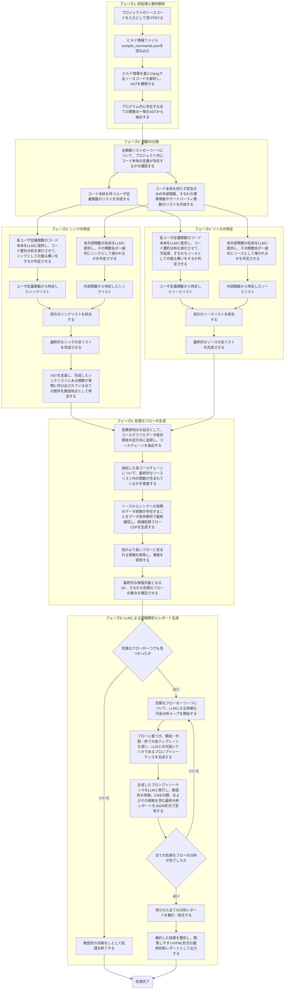

```mermaid
graph TD
    subgraph フェーズ1: 前処理と静的解析
        A1[プロジェクトのソースコードを入力として受け付ける] --> A2[ビルド情報ファイルcompile_commands.jsonを読み込む];
        A2 --> A3[ビルド情報を基にClangで全ソースコードを解析し、ASTを構築する];
        A3 --> A4[プログラム内に存在する全ての関数の一覧をASTから抽出する];
    end

    subgraph フェーズ2: 関数の分類
        A4 --> B1[全関数リストの一つ一つについて、プロジェクト内にコード本体の定義が存在するかを確認する];
        B1 --> B2[コード本体を持つユーザ定義関数のリストを作成する];
        B1 --> B3[コード本体を持たず宣言のみの外部関数、すなわち標準関数やサードパーティ関数のリストを作成する];
    end

    subgraph フェーズ3: シンクの特定
        B2 --> C1[各ユーザ定義関数のコード本体をLLMに提供し、コード要約分析を実行させて、シンクとしての振る舞いをするか判定させる];
        B3 --> C2[各外部関数の名前をLLMに提供し、その関数名が一般的にシンクとして使われるかを判定させる];
        C1 --> C3[ユーザ定義関数から特定したシンクリスト];
        C2 --> C4[外部関数から特定したシンクリスト];
        C3 --> C5[両方のシンクリストを統合する];
        C4 --> C5;
        C5 --> C6[最終的なシンクの全リストを完成させる];
        C6 --> C7[ASTを走査し、完成したシンクリストにある関数が実際に呼び出されている全ての箇所を脆弱地点として特定する];
    end

    subgraph フェーズ4: ソースの特定
        B2 --> D1[各ユーザ定義関数のコード本体をLLMに提供し、コード要約分析を実行させて、汚染源、すなわちソースとしての振る舞いをするか判定させる];
        B3 --> D2[各外部関数の名前をLLMに提供し、その関数名が一般的にソースとして使われるかを判定させる];
        D1 --> D3[ユーザ定義関数から特定したソースリスト];
        D2 --> D4[外部関数から特定したソースリスト];
        D3 --> D5[両方のソースリストを統合する];
        D4 --> D5;
        D5 --> D6[最終的なソースの全リストを完成させる];
    end

    subgraph フェーズ5: 危険なフローの生成
        C7 --> E1;
        D6 --> E1;
        E1[各脆弱地点を起点として、コールグラフとデータ依存関係を逆方向に追跡し、コールチェーンを抽出する];
        E1 --> E2[抽出した各コールチェーンについて、最終的なソースリスト内の関数が含まれているかを検査する];
        E2 --> E3[ソースからシンクへの実際のデータ経路が存在することをデータ依存解析で最終確認し、候補危険フローCDFを生成する];
        E3 --> E4[他のより長いフローに含まれる候補を削除し、重複を排除する];
        E4 --> E5[最終的な検査対象となるDF、すなわち危険なフローの集合を確定させる];
    end

    subgraph フェーズ6: LLMによる詳細解析とレポート生成
        E5 --> F1{危険なフローが一つでも見つかったか};
        F1 -- いいえ --> G1[脆弱性の兆候なしとして処理を終了する];
        F1 -- はい --> F2[危険なフローの一つ一つについて、LLMによる詳細な汚染分析ループを開始する];
        F2 --> F3[フローに基づき、開始・中間・終了の各テンプレートを使い、LLMとの対話シナリオであるプロンプトシーケンスを生成する];
        F3 --> F4[生成したプロンプトシーケンスをLLMと実行し、脆弱性の有無、CWE分類、およびその根拠を含む最終分析レポートをJSON形式で受信する];
        F4 --> F5{全ての危険なフローの分析が完了したか};
        F5 -- いいえ --> F2;
        F5 -- はい --> F6[得られた全ての分析レポートを集約・統合する];
        F6 --> F7[集約した結果を整形し、閲覧しやすいHTML形式の最終診断レポートとして出力する];
    end

    G1 --> Z(処理完了);
    F7 --> Z;
```