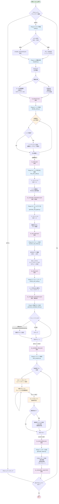

```mermaid
flowchart TB
    Start([開始: main.py実行]) --> CheckProject{プロジェクト<br/>ディレクトリ確認}
    
    CheckProject -->|ta/なし| SkipProject[プロジェクトスキップ]
    CheckProject -->|ta/あり| Phase0[Phase 0: ビルド準備<br/>build.py]
    
    SkipProject --> NextProject{次のプロジェクト<br/>あり？}
    
    Phase0 --> TryBuild{ビルド試行<br/>bear -- make}
    TryBuild -->|成功| ExtractDB[compile_commands.json<br/>抽出]
    TryBuild -->|失敗| GenDummy[ダミーDB生成<br/>*.c ファイルから]
    
    ExtractDB --> Phase1
    GenDummy --> Phase1
    
    Phase1[Phase 1-2: 関数分類<br/>classifier.py] --> ParseAST[libclangで<br/>AST解析]
    ParseAST --> ClassifyFunc{関数分類}
    
    ClassifyFunc --> UserDef[ユーザ定義関数<br/>- 定義あり<br/>- TAディレクトリ内]
    ClassifyFunc --> External[外部宣言<br/>- 関数宣言<br/>- マクロ定義]
    
    UserDef --> SavePhase12[ta_phase12.json<br/>保存]
    External --> SavePhase12
    
    SavePhase12 --> Phase3[Phase 3: シンク特定<br/>identify_sinks.py]
    
    Phase3 --> LLMAnalysis{各関数を<br/>LLMで解析}
    LLMAnalysis --> IsSink{シンク候補？}
    IsSink -->|Yes| AddSink[シンクリストに追加<br/>関数名 + パラメータ番号]
    IsSink -->|No| NextFunc1[次の関数へ]
    AddSink --> NextFunc1
    NextFunc1 --> LLMAnalysis
    NextFunc1 -->|全関数完了| SaveSinks[ta_sinks.json<br/>保存]
    
    SaveSinks --> Phase34[Phase 3.4: シンク呼び出し検索<br/>find_sink_calls.py]
    
    Phase34 --> ParseSources1[ソースファイル<br/>再パース]
    ParseSources1 --> FindCalls[シンク関数の<br/>呼び出し箇所検索]
    FindCalls --> SaveVD1[ta_vulnerable_destinations.json<br/>保存（初版）]
    
    SaveVD1 --> Phase35[Phase 3.5: コールグラフ生成<br/>generate_call_graph.py]
    
    Phase35 --> ParseSources2[ソースファイル<br/>再パース]
    ParseSources2 --> BuildGraph[関数呼び出し<br/>グラフ構築]
    BuildGraph --> SaveGraph[ta_call_graph.json<br/>保存]
    
    SaveGraph --> Phase36[Phase 3.6: チェーン生成<br/>function_call_chains.py]
    
    Phase36 --> ReverseGraph[逆方向グラフ構築<br/>callee → caller]
    ReverseGraph --> GenChains[各シンクから<br/>エントリポイントまで<br/>のチェーン生成]
    GenChains --> SaveChains[ta_chains.json<br/>保存]
    
    SaveChains --> Phase37[Phase 3.7: チェーンマージ<br/>extract_sink_calls.py]
    
    Phase37 --> MergeData[シンク呼び出し箇所と<br/>チェーンをマージ]
    MergeData --> SaveVD2[ta_vulnerable_destinations.json<br/>保存（最終版）]
    
    SaveVD2 --> Phase5[Phase 5: 候補フロー生成<br/>generate_candidate_flows.py]
    
    Phase5 --> FilterChains{チェーンフィルタ}
    FilterChains -->|開始点が<br/>TA_InvokeCommandEntryPoint| AddFlow[候補フローに追加]
    FilterChains -->|その他| SkipChain[スキップ]
    AddFlow --> NextChain[次のチェーン]
    SkipChain --> NextChain
    NextChain --> FilterChains
    NextChain -->|全チェーン完了| SaveFlows[ta_candidate_flows.json<br/>保存]
    
    SaveFlows --> Phase6[Phase 6: テイント解析<br/>taint_analyzer.py]
    
    Phase6 --> ProcessFlow{各候補フロー<br/>処理}
    ProcessFlow --> TaintStart[スタートプロンプト<br/>エントリポイント解析]
    
    TaintStart --> TaintMiddle[中間プロンプト<br/>チェーン上の各関数解析]
    TaintMiddle --> TaintMiddle
    TaintMiddle -->|チェーン完了| TaintEnd[エンドプロンプト<br/>脆弱性判定]
    
    TaintEnd --> CheckVuln{脆弱性あり？}
    CheckVuln -->|Yes| AddVuln[脆弱性リストに追加<br/>- CWE分類<br/>- 重要度評価]
    CheckVuln -->|No| NextFlow
    AddVuln --> NextFlow[次のフロー]
    NextFlow --> ProcessFlow
    NextFlow -->|全フロー完了| SaveVuln[ta_vulnerabilities.json<br/>保存]
    
    SaveVuln --> Phase7[Phase 7: レポート生成<br/>generate_report.py]
    
    Phase7 --> GenHTML[HTMLレポート生成<br/>- 統計情報<br/>- 脆弱性詳細<br/>- フローチャート]
    GenHTML --> SaveReport[ta_vulnerability_report.html<br/>保存]
    
    SaveReport --> NextProject
    NextProject -->|Yes| CheckProject
    NextProject -->|No| End([終了])
    
    style Start fill:#e1f5e1
    style End fill:#ffe1e1
    style Phase0 fill:#e3f2fd
    style Phase1 fill:#e3f2fd
    style Phase3 fill:#e3f2fd
    style Phase34 fill:#e3f2fd
    style Phase35 fill:#e3f2fd
    style Phase36 fill:#e3f2fd
    style Phase37 fill:#e3f2fd
    style Phase5 fill:#e3f2fd
    style Phase6 fill:#e3f2fd
    style Phase7 fill:#e3f2fd
    style LLMAnalysis fill:#fff3e0
    style TaintStart fill:#fff3e0
    style TaintMiddle fill:#fff3e0
    style TaintEnd fill:#fff3e0
    style SavePhase12 fill:#f3e5f5
    style SaveSinks fill:#f3e5f5
    style SaveVD1 fill:#f3e5f5
    style SaveGraph fill:#f3e5f5
    style SaveChains fill:#f3e5f5
    style SaveVD2 fill:#f3e5f5
    style SaveFlows fill:#f3e5f5
    style SaveVuln fill:#f3e5f5
    style SaveReport fill:#f3e5f5
```