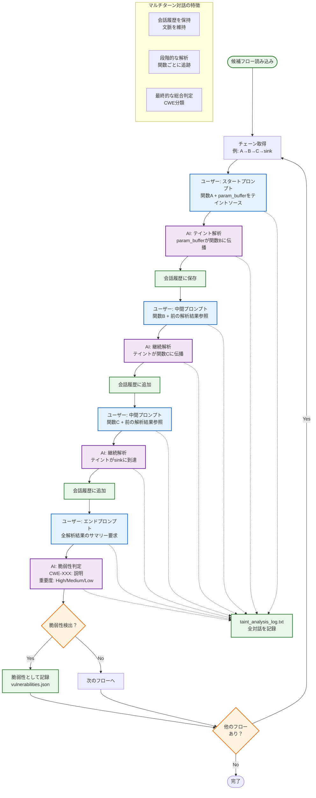

```mermaid
flowchart TD
    %% スタイル定義
    classDef user fill:#e3f2fd,stroke:#1565c0,stroke-width:2px
    classDef ai fill:#f3e5f5,stroke:#6a1b9a,stroke-width:2px
    classDef data fill:#e8f5e9,stroke:#2e7d32,stroke-width:2px
    classDef decision fill:#fff3e0,stroke:#ef6c00,stroke-width:2px

    %% 開始
    Start([候補フロー読み込み]):::data --> GetChain[チェーン取得<br/>例: A→B→C→sink]

    %% ターン1: エントリポイント
    GetChain --> Turn1U[ユーザー: スタートプロンプト<br/>関数A + param_bufferをテイントソース]:::user
    Turn1U --> Turn1A[AI: テイント解析<br/>param_bufferが関数Bに伝播]:::ai
    Turn1A --> Save1[会話履歴に保存]:::data

    %% ターン2: 中間関数
    Save1 --> Turn2U[ユーザー: 中間プロンプト<br/>関数B + 前の解析結果参照]:::user
    Turn2U --> Turn2A[AI: 継続解析<br/>テイントが関数Cに伝播]:::ai
    Turn2A --> Save2[会話履歴に追加]:::data

    %% ターン3: シンク関数
    Save2 --> Turn3U[ユーザー: 中間プロンプト<br/>関数C + 前の解析結果参照]:::user
    Turn3U --> Turn3A[AI: 継続解析<br/>テイントがsinkに到達]:::ai
    Turn3A --> Save3[会話履歴に追加]:::data

    %% ターン4: 脆弱性判定
    Save3 --> Turn4U[ユーザー: エンドプロンプト<br/>全解析結果のサマリー要求]:::user
    Turn4U --> Turn4A[AI: 脆弱性判定<br/>CWE-XXX: 説明<br/>重要度: High/Medium/Low]:::ai

    %% 判定
    Turn4A --> Check{脆弱性検出？}:::decision
    Check -->|Yes| Record[脆弱性として記録<br/>vulnerabilities.json]:::data
    Check -->|No| Skip[次のフローへ]

    %% ログ記録
    Turn1U -.-> Log[taint_analysis_log.txt<br/>全対話を記録]:::data
    Turn1A -.-> Log
    Turn2U -.-> Log
    Turn2A -.-> Log
    Turn3U -.-> Log
    Turn3A -.-> Log
    Turn4U -.-> Log
    Turn4A -.-> Log

    %% 次のフロー
    Record --> NextFlow{他のフロー<br/>あり？}:::decision
    Skip --> NextFlow
    NextFlow -->|Yes| GetChain
    NextFlow -->|No| End([完了])

    %% 特徴説明
    subgraph "マルチターン対話の特徴"
        F1[会話履歴を保持<br/>文脈を維持]
        F2[段階的な解析<br/>関数ごとに追跡]
        F3[最終的な総合判定<br/>CWE分類]
    end
```