# OP‑TEE TA LLMベース・テイント解析システム

OP‑TEEの**Trusted Application (TA)** を対象に、LLM・RAG・ルール（DITING/CodeQL）を組み合わせて **シンク特定→候補フロー抽出→テイント解析→HTMLレポート生成** までを自動化する研究用ツールです。

* 解析対象: C言語ベースの TA（`ta/` 配下）
* 目的: TA内の**危険シンク**に至るデータフローをLLMで精査し、**脆弱性候補**と根拠（コード抜粋・推論過程）を提示
* 付帯機能: RAG（OP‑TEE/TEE関連ドキュメントの近傍検索）、LLMプロバイダ切替、トークン計測、接頭辞キャッシュ

詳細設計は [Documents](Document/) を参照:

* [System_README.md](Document/System_README.md) … 各フェーズの内部処理・入出力契約・フロー
* [RAG.md](Document/RAG.md) … RAG のインデックス構築・検索戦略・コンテキスト生成
* [LLM.md](Document/LLM.md) … LLM設定レイヤ（CLI/プログラム利用/エラーハンドリング）

---

## アーキテクチャ概要（End‑to‑End）

```mermaid
flowchart LR
  A["Phase0 事前処理/DB生成\nsrc/build.py"] --> B["Phase1–2 抽出/分類\nsrc/classify/classifier.py"]
  B --> C1["Phase3.1 シンク同定\nidentify_sinks.py"]
  C1 --> C2["Phase3.2 シンク呼出抽出\nfind_sink_calls.py"]
  C2 --> C3["Phase3.3 呼出グラフ生成\ngenerate_call_graph.py"]
  C3 --> C4["Phase3.4–3.6 関数列チェーン生成\nfunction_call_chains.py"]
  C4 --> C5["Phase3.7 VDとチェーンを結合\nextract_sink_calls.py"]
  C5 --> D["Phase4 候補フロー (CDF) 生成\nidentify_flows/generate_candidate_flows.py"]
  D --> E["Phase5 LLMテイント解析/判定\nanalyze_vulnerabilities/taint_analyzer.py"]
  E --> F["Phase6 HTMLレポート生成\nreport/generate_report.py"]
```



### 主な出力

* `*_phase12.json`（ユーザ定義/外部宣言）
* `*_sinks.json`（シンク集合）
* `*_vulnerable_destinations.json`（VD；最終はチェーン付）
* `*_call_graph.json` / `*_chains.json`
* `*_candidate_flows.json`（ソース起点の最小候補フロー）
* `*_vulnerabilities.json`（脆弱性候補＋統計／途中Findings）
* `*_vulnerability_report.html`（ダッシュボード型レポート）

---

## かんたん実行フロー（Quick Run）

> **Docker利用を推奨**（依存は `docker/requirements.txt` に集約）。ローカル実行や詳細なLLM/RAG運用は `Document/LLM.md`, `Document/RAG.md` を参照。

1. **コンテナ準備**（必要なら）

```bash
chmod +x docker/entrypoint.sh
# （環境により）docker compose -f .devcontainer/docker-compose.yml build
```

2. **LLM初期設定（ラッパスクリプト）**

```bash
# 設定ガイド表示 → APIキー設定 → 接続テスト
llm-setup
llm_config status
llm_config configure openai
llm_config test
```

3. **解析実行（例: 単体/一括）**

```bash
# 単体
python3 ./src/main.py -p benchmark/acipher --verbose

# 一括（ログも保存）
python3 ./src/main.py \
  -p benchmark/acipher \
  -p benchmark/aes \
  -p benchmark/hotp \
  -p benchmark/random \
  -p benchmark/secure_storage \
  -p benchmark/secvideo_demo \
  -p benchmark/optee-fiovb \
  -p benchmark/optee-sdp \
  -p benchmark/Lenet5_in_OPTEE \
  --verbose 2>&1 | tee log.txt
```

> 解析完了後、`<TA>/ta/results/` にフェーズ毎の成果物、`*_vulnerability_report.html` が出力されます。LLM対話ログは `llm_logs/` に保持されます。

---

## 実行環境 / Docker イメージ（最小仕様）

> 解析の再現性に関わる **OS / ツールチェーン / LLM 周辺**の前提。実体は `docker/` 配下（`Dockerfile`, `requirements.txt`, `scripts/`）に準拠。

* **ベース**: Ubuntu 22.04（multi-arch; `--platform=${TARGETPLATFORM}`）
* **LLVM/Clang**: LLVM 18（`clang-18`, `clang-tools-18`, `llvm-18-dev`, `lld-18`, `libclang-18-dev`, `python3-clang-18`）

  * 互換リンク: `/usr/lib/llvm-18/lib/libclang.so` を作成
  * `LD_LIBRARY_PATH=/usr/lib/llvm-18/lib:$LD_LIBRARY_PATH`
* **交差コンパイル**: `gcc-arm-linux-gnueabihf`, `g++-arm-linux-gnueabihf`, `binutils-arm-linux-gnueabihf`, `libc6-dev-armhf-cross`, `libstdc++-11-dev-armhf-cross`

  * `TA_DEV_KIT_DIR=/workspace/optee_os/out/arm/export-ta_arm32`
  * `CROSS_COMPILE=arm-linux-gnueabihf-`, `CC=${CROSS_COMPILE}gcc`
* **ビルド支援**: `cmake`, `bear`, `pkg-config`
* **Python**: system Python3（`python-is-python3`）+ `pip`
  代表的 pip 依存（`docker/requirements.txt`）:
  `openai`, `anthropic`, `google-generativeai`, `ollama`, `langchain`, `langchain-community`, `chromadb`, `faiss-cpu`, `sentence-transformers`,
  `PyPDF2`, `pdfplumber`, `tiktoken`, `pandas`, `openpyxl`, `xlsxwriter`
  （ベース追加で `llvmlite`, `networkx` も導入）
* **作業ディレクトリ**: `/workspace`（`PYTHONPATH=/workspace/src:$PYTHONPATH` を設定）
* **エントリポイント**: `/usr/local/bin/entrypoint`

  * VS Code ラッパが付ける余計な引数を除去し、**引数なし時は待機**（`sleep infinity`）
* **LLM 操作用ラッパ**: `/usr/local/bin/llm_config`, `/usr/local/bin/llm_setup`

  * 内部で `python -m llm_settings.llm_cli` を呼び出し
* **ネットワーク前提**: 外部 LLM（OpenAI/Anthropic 等）を使う場合は**アウトバウンド通信**が必要。ローカル LLM（Ollama）は \`\`（コンテナ内）を想定。

### 主要な環境変数

* `TA_DEV_KIT_DIR=/workspace/optee_os/out/arm/export-ta_arm32`
* `CROSS_COMPILE=arm-linux-gnueabihf-`, `CC=${CROSS_COMPILE}gcc`
* `PYTHONPATH=/workspace/src:$PYTHONPATH`
* `LD_LIBRARY_PATH=/usr/lib/llvm-18/lib:$LD_LIBRARY_PATH`

### 備考

* **Phase0** では `bear` を利用して `compile_commands.json` を生成します（`src/build.py`）。
* RAG は既定で **CPU 推論**（`faiss-cpu`/`chromadb`、埋め込みは `sentence-transformers/all-MiniLM-L6-v2`）。GPU を使う場合は別途設定が必要です。

---

## LLM / RAG 概要

### LLM設定レイヤ（`src/llm_settings/`）

* **CLI**: `llm_config status|set|configure|test|export|import|migrate`
* **プロバイダ**: OpenAI / Claude / DeepSeek / Local(Ollama) / OpenRouter / Gemini
* **リトライ&診断**: 連続呼出しの最短間隔、指数バックオフ、空応答診断、詳細ログ
* **プログラム利用**: `UnifiedLLMClient.chat_completion(messages)`／OpenAI互換ラッパ

> 詳細は `Document/LLM.md` を参照（プロバイダごとの差異、システムメッセージの扱い、移行スクリプト など）。

### RAG（任意）

* **文書**: `src/rag/documents/`（例: GlobalPlatform/TEE API 仕様）
* **ストア**: Chroma（既定）/ FAISS、埋め込み: `all‑MiniLM‑L6‑v2`
* **用途**: Phase3のシンク同定、Phase5のテイント解析に **根拠片** を添付

> 詳細は `Document/RAG.md` を参照（インデックス構築、検索/再ランク、LLMコンテキスト生成）。

\--

## 出力ディレクトリ（例）

```
<TA>/ta/results/
├── <TA>_phase12.json
├── <TA>_sinks.json
├── <TA>_vulnerable_destinations.json
├── <TA>_call_graph.json
├── <TA>_chains.json
├── <TA>_candidate_flows.json
├── <TA>_vulnerabilities.json
├── <TA>_vulnerability_report.html
├── prompts_and_responses.txt      # Phase3 LLMログ（環境により）
└── taint_analysis_log.txt         # Phase5/6 LLMログ
```

---

## ディレクトリ構成（要点）

* `src/build.py` … 事前処理（TA限定 `compile_commands.json` 生成）
* `src/classify/` … Phase1–2（関数/マクロ抽出・分類）
* `src/identify_sinks/` … Phase3（シンク同定→呼出抽出→グラフ→チェーン→VD結合）
* `src/identify_flows/` … Phase4（ソース起点の候補フロー最小化）
* `src/analyze_vulnerabilities/` … Phase5（LLMテイント解析・判定）
* `src/report/` … Phase6（HTMLレポート）
* `src/rag/` … RAG（ドキュメント→チャンク→ベクトル化→検索）
* `rules/` … DITING/CodeQLルール、生成シンク定義
* `prompts/` … LLMプロンプト（Hybrid/LLM-only × with/without RAG）
* `docker/` … Dockerfile・依存・ラッパスクリプト（`llm-setup`/`llm_config`）
* `Document/` … 詳細設計（System/RAG/LLM）

---

## トラブルシューティング（抜粋）

* **APIキー/接続エラー**: `llm_config configure <provider>` → `llm_config test`
* **Rate Limit**: 連続実行間隔・リトライ設定を見直し（プロバイダ設定参照）
* **RAGエラー**: `src/rag/vector_stores/` を再構築、メタデータ型（文字列/数値）を確認
* **解析が進まない**: `ta/compile_commands.json` の有無、`ta` 以下の `.d`/`.o` を掃除（`src/build.py`）

---

## 参考: 実行上のヒント

* **接頭辞キャッシュ**で同一チェーン接頭部の再計算を回避（高速化）
* **`--no-rag`********/************\*\*\*\*****\*\*\*\*`--no-diting-rules`** で LLMのみ／Hybrid を切替（Phase5）
* **`--sources`**（Phase4）で起点関数を調整（例: `TA_InvokeCommandEntryPoint,TA_OpenSessionEntryPoint`）

---

本READMEは研究開発の進捗に合わせて更新します。運用・発展的な話題（評価指標、検知サンプル集、CI連携）は別紙として追加予定です。

