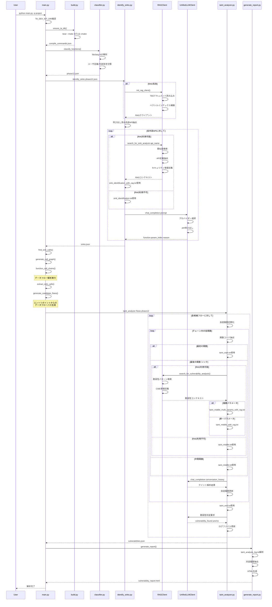

```mermaid
sequenceDiagram
    participant User
    participant Main as main.py
    participant Build as build.py
    participant Classify as classifier.py
    participant Sinks as identify_sinks.py
    participant RAG as RAGClient
    participant LLM as UnifiedLLMClient
    participant Taint as taint_analyzer.py
    participant Report as generate_report.py
    
    %% 初期化フェーズ
    User->>Main: python main.py -p project
    Main->>Main: TA_DEV_KIT_DIR確認
    Main->>Build: ensure_ta_db()
    Build->>Build: bear --make または cmake
    Build-->>Main: compile_commands.json
    
    %% Phase 1-2: 関数分類
    Main->>Classify: classify_functions()
    Classify->>Classify: libclang AST解析
    Classify->>Classify: ユーザ定義/外部宣言分類
    Classify-->>Main: phase12.json
    
    %% Phase 3: シンク識別 RAG連携
    Main->>Sinks: identify_sinks phase12.json
    
    alt RAG有効
        Sinks->>RAG: init_rag_client()
        RAG->>RAG: TEEドキュメント読み込み
        RAG->>RAG: ベクトルインデックス構築
        RAG-->>Sinks: RAGクライアント
    end
    
    Sinks->>Sinks: 呼び出し済み外部API抽出
    
    loop 各外部APIに対して
        alt RAG利用可能
            Sinks->>RAG: search_for_sink_analysis api_name
            RAG->>RAG: 類似度検索
            RAG->>RAG: API定義抽出
            RAG->>RAG: セキュリティ情報収集
            RAG-->>Sinks: RAGコンテキスト
            Sinks->>Sinks: sink_identification_with_rag.txt使用
        else RAG利用不可
            Sinks->>Sinks: sink_identification.txt使用
        end
        
        Sinks->>LLM: chat_completion prompt
        LLM->>LLM: プロバイダー選択
        LLM->>LLM: API呼び出し
        LLM-->>Sinks: function param_index reason
    end
    
    Sinks-->>Main: sinks.json
    
    %% Phase 3.1-3.4: 詳細解析
    Main->>Main: find_sink_calls()
    Main->>Main: generate_call_graph()
    Main->>Main: function_call_chains()
    Note over Main: データフロー解析実行
    Main->>Main: extract_sink_calls()
    
    %% Phase 5: 候補フロー生成
    Main->>Main: generate_candidate_flows()
    Note over Main: エントリポイントからの<br/>データフローパス生成
    
    %% Phase 6: 脆弱性解析 RAG連携
    Main->>Taint: taint_analyzer flows phase12
    
    loop 各候補フローに対して
        Taint->>Taint: 会話履歴初期化
        
        loop チェーン内の各関数
            Taint->>Taint: 関数コード抽出
            
            alt 最初の関数
                Taint->>Taint: taint_start.txt使用
            else 最後の関数 シンク
                alt RAG利用可能
                    Taint->>RAG: search_for_vulnerability_analysis()
                    RAG->>RAG: 脆弱性パターン検索
                    RAG->>RAG: CWE情報収集
                    RAG-->>Taint: 脆弱性コンテキスト
                    
                    alt 複数パラメータ
                        Taint->>Taint: taint_middle_multi_params_with_rag.txt
                    else 単一パラメータ
                        Taint->>Taint: taint_middle_with_rag.txt
                    end
                else RAG利用不可
                    Taint->>Taint: taint_middle.txt使用
                end
            else 中間関数
                Taint->>Taint: taint_middle.txt使用
            end
            
            Taint->>LLM: chat_completion conversation_history
            LLM-->>Taint: テイント解析結果
            Taint->>Taint: 会話履歴更新
        end
        
        Taint->>Taint: taint_end.txt使用
        Taint->>LLM: 脆弱性判定要求
        LLM-->>Taint: vulnerability_found yes/no
        
        Taint->>Taint: ログファイル更新
    end
    
    Taint-->>Main: vulnerabilities.json
    
    %% Phase 7: レポート生成
    Main->>Report: generate_report()
    Report->>Report: taint_analysis_log.txt解析
    Report->>Report: 対話履歴抽出
    Report->>Report: HTML生成
    Report-->>Main: vulnerability_report.html
    
    Main-->>User: 解析完了
```