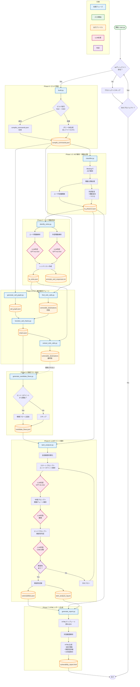

```mermaid
flowchart TB
    %% スタイル定義
    classDef phase fill:#e3f2fd,stroke:#1976d2,stroke-width:2px
    classDef input fill:#e8f5e9,stroke:#388e3c,stroke-width:2px
    classDef output fill:#fff3e0,stroke:#f57c00,stroke-width:2px
    classDef llm fill:#fce4ec,stroke:#c2185b,stroke-width:2px
    classDef decision fill:#f3e5f5,stroke:#7b1fa2,stroke-width:2px

    %% 開始
    Start([開始: main.py]):::input --> CheckTA{ta/ディレクトリ<br/>存在？}
    CheckTA -->|No| Skip[プロジェクトスキップ]
    CheckTA -->|Yes| Phase0

    %% Phase 0: ビルド
    subgraph "Phase 0: ビルド準備"
        Phase0[build.py]:::phase --> TryBuild{ビルド試行<br/>bear -- make}
        TryBuild -->|成功| GenDB[compile_commands.json<br/>生成]
        TryBuild -->|失敗| GenDummy[ダミーDB生成<br/>全.cファイルから]
        GenDB --> DB[(compile_commands.json)]:::output
        GenDummy --> DB
    end

    %% Phase 1-2: 関数分類
    DB --> Phase12
    subgraph "Phase 1-2: AST解析・関数分類"
        Phase12[classifier.py]:::phase --> ParseAST[libclangで<br/>AST解析]
        ParseAST --> ClassifyFunc[関数分類処理]
        ClassifyFunc --> UserFunc[ユーザ定義関数]
        ClassifyFunc --> ExtFunc[外部宣言<br/>・関数宣言<br/>・マクロ]
        UserFunc --> P12JSON[(ta_phase12.json)]:::output
        ExtFunc --> P12JSON
    end

    %% Phase 3: LLMシンク判定
    P12JSON --> Phase3
    subgraph "Phase 3: シンク関数特定"
        Phase3[identify_sinks.py]:::phase --> UserAnalysis[ユーザ関数解析]
        Phase3 --> ExtAnalysis[外部関数解析]
        
        UserAnalysis --> LLM1{LLM判定<br/>GPT-4o-mini}:::llm
        ExtAnalysis --> LLM2{LLM判定<br/>GPT-4o-mini}:::llm
        
        LLM1 --> SinkList[シンクリスト作成]
        LLM2 --> SinkList
        SinkList --> SJSON[(ta_sinks.json)]:::output
        SinkList --> PLOG[(prompts_and_responses.txt)]:::output
    end

    %% Phase 3.4-3.7: 静的解析
    SJSON --> Phase34
    DB --> Phase34
    subgraph "Phase 3.4-3.7: 静的解析チェーン"
        Phase34[find_sink_calls.py]:::phase --> VD1[(vulnerable_destinations<br/>初版)]:::output
        
        DB --> Phase35[generate_call_graph.py]:::phase
        Phase35 --> CG[(call_graph.json)]:::output
        
        CG --> Phase36[function_call_chains.py]:::phase
        VD1 --> Phase36
        Phase36 --> CHAINS[(chains.json)]:::output
        
        CHAINS --> Phase37[extract_sink_calls.py]:::phase
        SJSON --> Phase37
        Phase37 --> VD2[(vulnerable_destinations<br/>最終版)]:::output
    end

    %% Phase 5: 候補フロー生成
    CHAINS --> Phase5
    subgraph "Phase 5: 候補フロー抽出"
        Phase5[generate_candidate_flows.py]:::phase --> Filter{エントリポイント<br/>から開始？}
        Filter -->|Yes| AddFlow[候補フローに追加]
        Filter -->|No| SkipFlow[スキップ]
        AddFlow --> FLOWS[(candidate_flows.json)]:::output
        SkipFlow --> FLOWS
    end

    %% Phase 6: テイント解析
    FLOWS --> Phase6
    P12JSON --> Phase6
    subgraph "Phase 6: LLMテイント解析"
        Phase6[taint_analyzer.py]:::phase --> InitChat[会話履歴初期化]
        
        InitChat --> StartPrompt[スタートプロンプト<br/>エントリポイント解析]
        StartPrompt --> LLM3{LLM対話<br/>GPT-4o-mini}:::llm
        
        LLM3 --> MiddlePrompt[中間プロンプト<br/>関数チェーン解析]
        MiddlePrompt --> LLM4{LLM対話<br/>継続}:::llm
        
        LLM4 --> EndPrompt[エンドプロンプト<br/>脆弱性判定]
        EndPrompt --> LLM5{LLM対話<br/>CWE分類}:::llm
        
        LLM5 --> CheckVuln{脆弱性<br/>あり？}:::decision
        CheckVuln -->|Yes| RecordVuln[脆弱性記録]
        CheckVuln -->|No| NextFlow[次のフロー]
        
        RecordVuln --> VULN[(vulnerabilities.json)]:::output
        RecordVuln --> TLOG[(taint_analysis_log.txt)]:::output
        NextFlow --> StartPrompt
    end

    %% Phase 7: レポート生成
    VULN --> Phase7
    P12JSON --> Phase7
    TLOG --> Phase7
    subgraph "Phase 7: HTMLレポート生成"
        Phase7[generate_report.py]:::phase --> LoadTemplate[HTMLテンプレート<br/>読み込み]
        LoadTemplate --> ParseLog[対話履歴解析]
        ParseLog --> GenHTML[HTML生成<br/>・統計情報<br/>・脆弱性詳細<br/>・AI対話表示]
        GenHTML --> REPORT[(vulnerability_report.html)]:::output
    end

    %% 終了
    REPORT --> End([完了])
    Skip --> NextProject{次のプロジェクト？}
    NextProject -->|Yes| CheckTA
    NextProject -->|No| End

    %% 接続線のスタイル
    VD2 -.->|使用されない| Phase5
    
    %% 凡例
    subgraph "凡例"
        L1[処理フェーズ]:::phase
        L2[入力/開始]:::input
        L3[出力ファイル]:::output
        L4[LLM処理]:::llm
        L5[判定]:::decision
    end
```