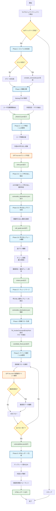

```mermaid
flowchart TD
    A[開始] --> B[TAプロジェクトディレクトリ検出]
    B --> C{ta/ディレクトリ存在？}
    C -->|No| D[スキップ]
    C -->|Yes| E[Phase 1: ビルド & DB生成]
    
    E --> F{ビルド成功？}
    F -->|No| G[ダミーDB生成]
    F -->|Yes| H[compile_commands.json生成]
    G --> I[Phase 2: 関数分類]
    H --> I
    
    I --> J[libclangでAST解析]
    J --> K[ユーザ定義関数抽出]
    J --> L[外部宣言・マクロ抽出]
    K --> M[phase12.json出力]
    L --> M
    
    M --> N[Phase 3: シンク特定<br/>🤖 LLM使用]
    N --> O[ユーザ関数走査]
    O --> P[外部API呼び出し収集]
    P --> Q[GPT-4o-miniでシンク判定]
    Q --> R[sinks.json出力]
    
    R --> S[Phase 3.4: シンク呼び出し抽出]
    S --> T[AST走査でシンク呼び出し箇所特定]
    T --> U[vulnerable_destinations.json出力]
    
    U --> V[Phase 3.5: 呼び出しグラフ生成]
    V --> W[関数呼び出し関係を解析]
    W --> X[call_graph.json出力]
    
    X --> Y[Phase 3.6: 呼び出しチェーン構築]
    Y --> Z[逆グラフ構築]
    Z --> AA[チェーン探索<br/>最大深度8]
    AA --> BB[重複除去・最長チェーン保持]
    BB --> CC[chains.json出力]
    
    CC --> DD[Phase 3.7: チェーンマージ]
    DD --> EE[呼び出し箇所とチェーンを統合]
    EE --> FF[vulnerable_destinations.json更新]
    
    FF --> GG[Phase 4: 候補フロー生成]
    GG --> HH[TA_InvokeCommandEntryPoint起点<br/>フローを抽出]
    HH --> II[candidate_flows.json出力]
    
    II --> JJ[Phase 5: テイント解析<br/>🤖 LLM使用]
    JJ --> KK[各候補フローを解析]
    KK --> LL[GPT-4o-miniで段階的テイント解析]
    LL --> MM{脆弱性発見？}
    MM -->|Yes| NN[脆弱性データ蓄積]
    MM -->|No| OO[次のフロー]
    NN --> OO
    OO --> PP{全フロー完了？}
    PP -->|No| KK
    PP -->|Yes| QQ[vulnerabilities.json出力]
    
    QQ --> RR[Phase 6: HTMLレポート生成]
    RR --> SS[テンプレート読み込み]
    SS --> TT[対話ログ解析]
    TT --> UU[脆弱性情報フォーマット]
    UU --> VV[HTMLレポート出力]
    
    VV --> WW[完了]
    D --> WW
    
    %% スタイル定義
    classDef phaseBox fill:#e1f5fe,stroke:#01579b,stroke-width:2px
    classDef llmBox fill:#fff3e0,stroke:#e65100,stroke-width:2px
    classDef outputBox fill:#e8f5e8,stroke:#2e7d32,stroke-width:2px
    classDef decision fill:#fff9c4,stroke:#f57f17,stroke-width:2px
    
    %% クラス適用
    class E,I,N,S,V,Y,DD,GG,JJ,RR phaseBox
    class Q,LL llmBox
    class M,R,U,X,CC,FF,II,QQ,VV outputBox
    class C,F,MM,PP decision
```