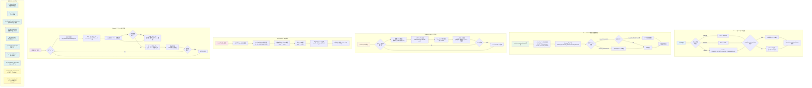

```mermaid
flowchart TB
    subgraph "Phase 0: ビルドとDB生成"
        B1[ta_dir確認] --> B2{ビルド方法<br/>検出}
        B2 -->|build.sh| B3[bear -- ./build.sh]
        B2 -->|Makefile| B4[bear -- make]
        B2 -->|CMake| B5[cmake -DCMAKE_EXPORT_COMPILE_COMMANDS=ON]
        B3 --> B6{compile_commands.json<br/>存在？}
        B4 --> B6
        B5 --> B6
        B6 -->|Yes| B7[TA関連エントリ抽出]
        B6 -->|No| B8[ダミーDB生成<br/>全.cファイルから]
        B7 --> B9[ta/compile_commands.json保存]
        B8 --> B9
    end
    
    subgraph "Phase 1-2: AST解析と関数分類"
        C1[compile_commands.json読込] --> C2[インクルードパス正規化<br/>- TAローカル: ta/include<br/>- devkit: export-ta_*/include]
        C2 --> C3[libclangでパース<br/>PARSE_DETAILED_PROCESSING_RECORD]
        C3 --> C4{各カーソル<br/>走査}
        C4 -->|FUNCTION_DECL| C5{定義あり？}
        C4 -->|MACRO_DEFINITION| C6[マクロパラメータ抽出]
        C5 -->|Yes & TAディレクトリ内| C7[ユーザ定義関数]
        C5 -->|No| C8[外部宣言]
        C6 --> C8
        C7 --> C9[分類結果保存]
        C8 --> C9
    end
    
    subgraph "Phase 3: LLMシンク判定"
        L1[phase12.json読込] --> L2{各ユーザ定義<br/>関数}
        L2 --> L3[関数コード抽出<br/>開始行から閉じ括弧まで]
        L3 --> L4[プロンプト生成<br/>'can function be used as sink?']
        L4 --> L5[OpenAI API呼び出し<br/>gpt-4o-mini]
        L5 --> L6[レスポンス解析<br/>正規表現: 関数名; パラメータ番号]
        L6 --> L7{シンク判定}
        L7 -->|Yes| L8[シンクリストに追加]
        L7 -->|No| L2
        L8 --> L2
    end
    
    subgraph "Phase 3.4-3.7: 静的解析"
        S1[シンクリスト読込] --> S2[ASTでCALL_EXPR検索]
        S2 --> S3[シンク呼び出し箇所記録<br/>file, line, sink, param_index]
        S3 --> S4[関数呼び出しグラフ構築<br/>caller → callee]
        S4 --> S5[逆グラフ構築<br/>callee → caller]
        S5 --> S6[DFSでチェーン生成<br/>シンク → エントリポイント]
        S6 --> S7[呼び出し箇所とチェーンマージ]
    end
    
    subgraph "Phase 6: テイント解析詳細"
        T1[候補フロー読込] --> T2{各チェーン}
        T2 --> T3[最初の関数<br/>TA_InvokeCommandEntryPoint]
        T3 --> T4[スタートプロンプト<br/>param_bufferをテイントソース]
        T4 --> T5[LLM解析: テイント伝播追跡]
        T5 --> T6{次の関数<br/>あり？}
        T6 -->|Yes| T7[中間プロンプト<br/>前の関数からのテイント継続]
        T7 --> T5
        T6 -->|No| T8[エンドプロンプト<br/>全テイント情報まとめ]
        T8 --> T9[脆弱性判定<br/>CWE分類・重要度]
        T9 --> T10{脆弱性<br/>検出？}
        T10 -->|Yes| T11[結果に追加]
        T10 -->|No| T2
        T11 --> T2
    end
    
    subgraph "出力ファイル一覧"
        F1[ta_phase12.json<br/>関数分類結果]
        F2[ta_sinks.json<br/>シンク候補]
        F3[ta_vulnerable_destinations.json<br/>脆弱な呼び出し箇所]
        F4[ta_call_graph.json<br/>関数呼び出しグラフ]
        F5[ta_chains.json<br/>呼び出しチェーン]
        F6[ta_candidate_flows.json<br/>候補フロー]
        F7[ta_vulnerabilities.json<br/>検出脆弱性]
        F8[ta_vulnerability_report.html<br/>HTMLレポート]
        F9[prompts_and_responses.txt<br/>LLMログ（Phase3）]
        F10[taint_analysis_log.txt<br/>テイント解析ログ（Phase6）]
    end
    
    style B1 fill:#e3f2fd
    style C1 fill:#e8f5e9
    style L1 fill:#fff3e0
    style S1 fill:#fce4ec
    style T1 fill:#f3e5f5
    style F1 fill:#e0f2f1
    style F2 fill:#e0f2f1
    style F3 fill:#e0f2f1
    style F4 fill:#e0f2f1
    style F5 fill:#e0f2f1
    style F6 fill:#e0f2f1
    style F7 fill:#e0f2f1
    style F8 fill:#e0f2f1
    style F9 fill:#fff9c4
    style F10 fill:#fff9c4
```